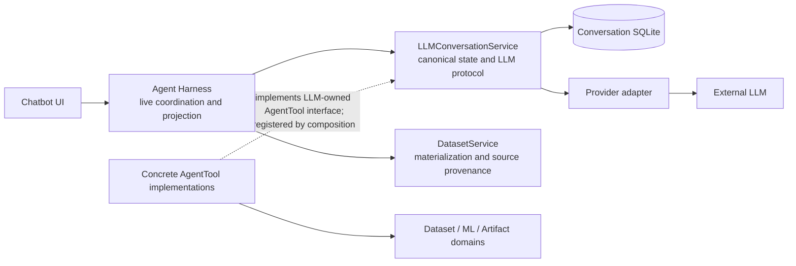
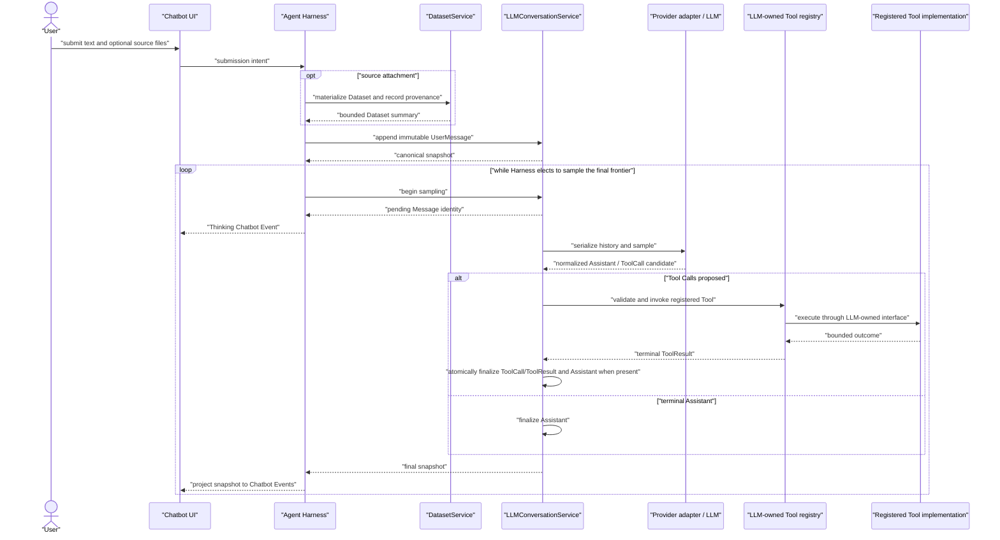
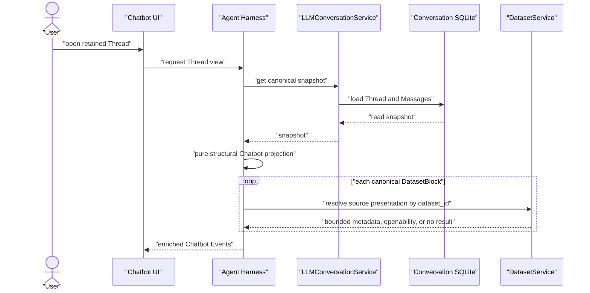

# LLM Conversation Boundary

## Admission

Chatbot UI, Agent Harness, `LLMConversationService`, provider adapters, and
AgentTool implementations share one authority and ordering boundary. Losing it
can recreate a second conversation writer, make a UI event authoritative, or
couple the LLM boundary back to Harness/domain code.

This contract owns cross-unit topology and sequence. Source, schemas, and tests
own exact records, payload fields, methods, limits, and adapter mechanics.

## Dependency and Authority Topology



The dotted line is dependency inversion, not a reverse LLM dependency: concrete
Tool implementations depend on the interface defined by the LLM boundary and
are registered at composition. `LLMConversationService` invokes registered
Tools through that interface; it does not import Harness or concrete/domain
Tool modules.

## Authority Rules

- `LLMConversationService` is the sole canonical Thread/Message writer. It
  owns the provider-facing transcript, pending/final Message lifecycle, and
  the `AgentTool` protocol, registry, scope validation, and invocation.
- A production AgentTool's strict typed input model is the single call-contract
  authority. The provider-facing JSON Schema is a bounded portable projection
  of that model, never a separately maintained definition; invocation validates
  the admitted arguments into that model before calling its typed
  implementation. Cross-field rules remain model validation rather than
  provider-schema combinators.
- Agent Harness owns transient application coordination only: source import,
  the decision to sample, Thread-pause requests, and snapshot-to-Chatbot-event
  projection. It does not directly write or mutate canonical Messages, dispatch
  a Tool, or serialize provider history. Pending-message cancellation remains
  internal cleanup/abandonment, not the product meaning of Stop.
- Chatbot UI submits intent and renders Chatbot Events. It neither accesses a
  conversation repository nor infers protocol state from storage rows or raw
  Tool payloads.
- Expected failures from local UI commands such as opening a link use transient operation feedback outside the timeline. Internal exception presentation is owned by [Unit TDD](../30-unit-tdd/application-composition.md#error-reporting). A terminal Harness submission failure uses a dismissible notification outside the timeline that remains until the next submission or Thread selection, while failures already represented by Chatbot Events, including connection retries and Tool failures, remain visible in the conversation UI.
- Final Messages are durable. A pending sampling Message is the sole
  provisional canonical state. There is no persistent `Turn`, `Run`,
  `ConversationStore`, execution ledger, or automatic cross-process recovery.
- Finalization atomically commits independent ToolCall/ToolResult Messages and
  an Assistant Message when the provider emitted one. A ToolResult directly
  identifies its ToolCall; neither Artifact nor observability becomes
  conversation provenance.
- Tool identity, scope, and typed arguments are validated at invocation. Invalid model arguments become a canonical failed ToolResult with field-level details, allowing the next sample to repair the call; they do not abort sampling before the ToolResult exists.
- Skill reading and Tool activation are independent operations. Skill reading returns domain guidance and a resource index without changing business Tool visibility; Tool activation changes visibility without loading Skill content. Each is projected from its own successful canonical ToolCall arguments and paired terminal status, independently of whether its result was paged. The built-in `result.page` remains available in every tool scope and returns the requested page directly without repaging its envelope.
- Completed training and tuning Tools associate each retained model with its evaluation facts and public Artifact handles, so delivering an evaluation report does not require a second status query. Pending work remains discoverable through `model.task.query`, which returns related evaluation status and result summaries; full persisted diagnostics are available on explicit request.
- A ToolResult stores one bounded direct JSON value. Tabular Tools choose XTT
  before returning; known and normalized failures use the typed `ToolFailure`
  value. Provider adapters only encode that value for their wire protocol, and
  Chatbot projection only copies/renders it; neither owns a raw-result fallback
  or a second semantic result representation.
- A ToolResult whose serialized JSON exceeds the canonical 64 KiB payload bound is materialized
  once into a filesystem-backed paged store (`state/paged_results/`) and the
  boundary returns a bounded paged handle (`result_id`, `total_chars`, `page_size`,
  `offset`, first page, `has_more`) instead of truncating or failing. The generic
  `result.page` Tool reads later pages by character range. The store is a bounded
  replay surface, not a second semantic authority or conversation record; it is
  cleaned on Thread deletion and by age-based GC at startup.
- The inline and exchange budgets apply to the returned value or page handle, not to the complete result before paging. Large successful results remain available through the page store without a separate raw-result byte cap.
- DatasetService owns materialized data and original-source provenance. After a
  snapshot is loaded, Harness may derive an ephemeral source attachment for
  Chatbot display. That presentation is not canonical content, provider input,
  or a recovery record; a missing original source is a soft display result.
- The LLM boundary passes the staged ToolCall Message identity into Tool execution.
  A Dataset-producing Tool may persist that stable reference with DatasetService
  derivation evidence before the ToolCall is finalized. Harness later resolves the
  evidence by that reference and projects it into the matching Tool event; it does
  not parse ToolResult content or create a second result authority. Agent-authored
  explanations are annotations, not system-verified evidence.
- The session Dataset view composes canonical Dataset attachments, persisted derivations associated with ToolCall identities, and ML outputs associated with public task handles returned in canonical ToolResults. Result handles determine membership only; Dataset/ML records determine names, inputs, operations and generations. Imported and legacy ML datasets do not need synthetic derivation rows or a migration to appear.
- Thinking, activity, connection, and usage are Chatbot Events. Observability
  may retain bounded diagnostics/usage but never restores, repairs, or replays
  conversation or Tool state.

## Live Submission and Sampling Sequence



The pending Message gives Harness a stable identity for Thinking and internal
cleanup without making either a canonical conversation concept. When a
ToolResult leaves the final frontier requiring another LLM sample, Harness
chooses the next loop iteration; Tool invocation itself remains inside the LLM
boundary.

## Thread Pause Sequence

```mermaid
sequenceDiagram
    actor U as "User"
    participant UI as "Chatbot UI"
    participant H as "Agent Harness"
    participant C as "LLMConversationService"
    participant P as "Provider adapter / LLM"
    participant T as "Registered Tool"

    U->>UI: "Stop"
    UI->>H: "pause_thread(thread_id)"
    H->>C: "pause_thread(thread_id)"
    Note over C: "process-local admission gate"
    alt "provider request has not been admitted"
        C-->>H: "discard provisional Message; stable snapshot"
    else "provider I/O is already in flight"
        P-->>C: "response may arrive"
        C->>C: "discard post-pause response"
    else "an admitted Tool exchange is executing"
        T-->>C: "complete its atomic result set"
        C-->>H: "final ToolResult snapshot"
    end
    Note over H,C: "no later provider request for this Thread"
    U->>UI: "new explicit UserMessage"
    UI->>H: "submission"
    H->>C: "append UserMessage"
    Note over C: "clear runtime pause; do not replay stale ToolResult"
```

Pause linearizes with each provider-attempt admission inside
`LLMConversationService`. Once an already admitted Tool-calling exchange has
started execution, it may settle its complete atomic result set rather than
splitting a durable ToolCall/ToolResult group; pause still prohibits its next
provider admission. Pause is runtime-only: it is not a durable Turn, Run, or
recovery record, and process restart does not restore it. A new explicit
UserMessage is the only resume command after a paused terminal ToolResult; it
never causes automatic replay of that old frontier.

## History Reopen and Source-Presentation Sequence



The UI opening target is a short-lived desktop capability, not ordinary event
content. A missing/malformed source therefore cannot prevent the snapshot from
opening or cause provider/canonical data to gain a local path.

The same post-snapshot seam may attach Dataset derivation evidence to a Tool event
by its ToolCall identity. Unlike source presentation, this evidence is persisted
Dataset authority; the Chatbot block remains only its read-only UI projection.

## Safety and Change Rules

- Application/runtime Thread deletion goes through `LLMConversationService`.
  It rejects deletion while sampling is pending; its storage path deletes
  dependent ToolResults before their ToolCalls and remaining Messages.
- Changes to a provider, Tool, pending lifecycle, source presentation, or
  Chatbot event must preserve the topology above. Do not add a convenience
  callback from LLM to Harness or a second state holder for presentation or
  execution recovery.
- Stop may not be reimplemented as cancellation keyed by a provisional pending
  Message. A Tool already executing is not promised cancellation, rollback,
  idempotency, or domain-side-effect compensation; the pause only closes later
  LLM admission for its Thread.
- The boundary intentionally accepts process loss of an incomplete exchange
  and possible domain side-effect orphans. A later user-driven sample may
  repeat semantic work; it must not infer a ToolResult from logs, Artifacts, or
  domain rows.

## Verification Routes

- Harness coordination, Tool sequencing, direct ToolResult/XTT continuity, and
  the command/snapshot boundary: `tests/agent/test_agent_harness_first_slice.py`.
- Skill reading, independent Tool activation and history reload: `tests/agent/test_agent_harness_first_slice.py`.
- ToolResult paging: `tests/llm/test_tool_result_pagination.py`.
- Chatbot projection of Dataset audit evidence: `tests/ui/test_chatbot_contract.py`.
- Knowledge retrieval and the lookup Tool:
  `tests/knowledge/test_knowledge_retrieval.py` and
  `tests/knowledge/test_knowledge_lookup_tool.py`.
- Canonical storage, deletion ordering, and migration/bootstrap:
  `tests/storage/test_migrations.py`,
  `tests/storage/test_storage_bootstrap.py`, and
  `tests/storage/test_storage_artifacts.py`.
- End-to-end Agent behavior (live, paid): `tests/e2e/agent_harness/`.
