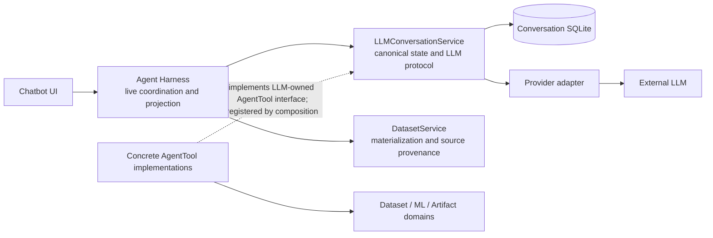
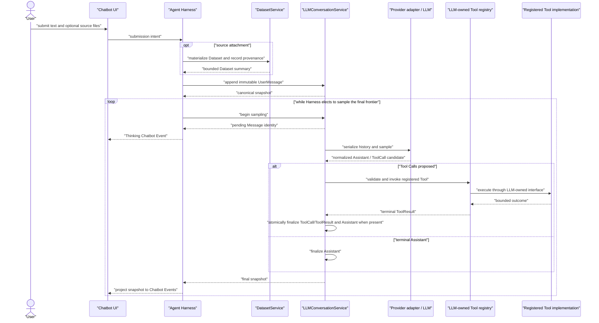
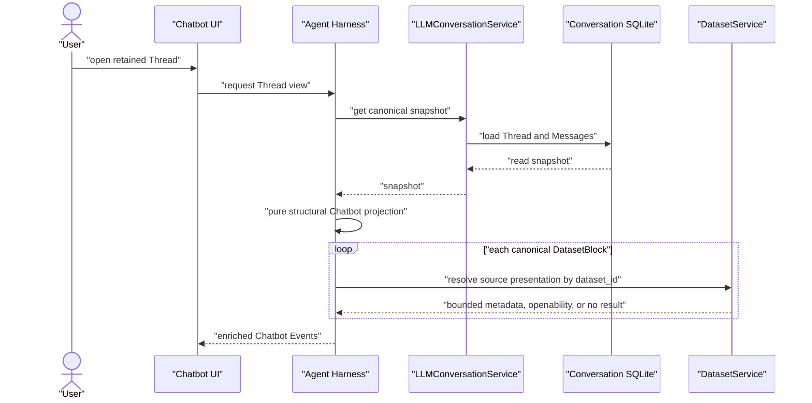

# LLM Conversation Boundary

## Admission

Chatbot UI, Agent Harness, `LLMConversationService`, provider adapters, and
AgentTool implementations share one authority and ordering boundary. Losing it
can recreate a second conversation writer, make a UI event authoritative, or
couple the LLM boundary back to Harness/domain code.

This contract owns cross-unit topology and sequence. Source, schemas, and tests
own exact records, payload fields, methods, limits, and adapter mechanics.

## Dependency and Authority Topology

The dotted line is dependency inversion, not a reverse LLM dependency: concrete
Tool implementations depend on the interface defined by the LLM boundary and
are registered at composition. `LLMConversationService` invokes registered
Tools through that interface; it does not import Harness or concrete/domain
Tool modules.

## Authority Rules

- `LLMConversationService` is the sole canonical Thread/Message writer. It
  owns the provider-facing transcript, pending/final Message lifecycle, and
  the `AgentTool` protocol, registry, scope validation, and invocation.
- Agent Harness owns transient application coordination only: source import,
  the decision to sample or cancel, and snapshot-to-Chatbot-event projection.
  It does not directly write or mutate canonical Messages, dispatch a Tool, or
  serialize provider history.
- Chatbot UI submits intent and renders Chatbot Events. It neither accesses a
  conversation repository nor infers protocol state from storage rows or raw
  Tool payloads.
- Final Messages are durable. A pending sampling Message is the sole
  provisional canonical state. There is no persistent `Turn`, `Run`,
  `ConversationStore`, execution ledger, or automatic cross-process recovery.
- Finalization atomically commits independent ToolCall/ToolResult Messages and
  an Assistant Message when the provider emitted one. A ToolResult directly
  identifies its ToolCall; neither Artifact nor observability becomes
  conversation provenance.
- DatasetService owns materialized data and original-source provenance. After a
  snapshot is loaded, Harness may derive an ephemeral source attachment for
  Chatbot display. That presentation is not canonical content, provider input,
  or a recovery record; a missing original source is a soft display result.
- Thinking, activity, connection, and usage are Chatbot Events. Observability
  may retain bounded diagnostics/usage but never restores, repairs, or replays
  conversation or Tool state.

## Live Submission and Sampling Sequence

The pending Message gives Harness a stable identity for Thinking and
cancellation without making either a canonical conversation concept. When a
ToolResult leaves the final frontier requiring another LLM sample, Harness
chooses the next loop iteration; Tool invocation itself remains inside the LLM
boundary.

## History Reopen and Source-Presentation Sequence

The UI opening target is a short-lived desktop capability, not ordinary event
content. A missing/malformed source therefore cannot prevent the snapshot from
opening or cause provider/canonical data to gain a local path.

## Safety and Change Rules

- Application/runtime Thread deletion goes through `LLMConversationService`.
  It rejects deletion while sampling is pending; its storage path deletes
  dependent ToolResults before their ToolCalls and remaining Messages.
- Changes to a provider, Tool, pending lifecycle, source presentation, or
  Chatbot event must preserve the topology above. Do not add a convenience
  callback from LLM to Harness or a second state holder for presentation or
  execution recovery.
- The boundary intentionally accepts process loss of an incomplete exchange
  and possible domain side-effect orphans. A later user-driven sample may
  repeat semantic work; it must not infer a ToolResult from logs, Artifacts, or
  domain rows.

## Verification Routes

- Conversation lifecycle, pending/cancellation, titles, usage, message algebra,
  and retry: `tests/test_llm_conversation_lifecycle.py`,
  `tests/test_llm_conversation_titles.py`, `tests/test_llm_message_blocks.py`,
  `tests/test_llm_usage_observability.py`, and `tests/test_llm_service_retry.py`.
- Harness projection, Tool sequencing, Dataset source presentation, and UI
  convergence: `tests/test_agent_harness_foundation.py`,
  `tests/test_agent_harness_first_slice.py`,
  `tests/test_agent_harness_streaming.py`,
  `tests/test_dataset_service_source_presentation.py`, and `tests/test_main.py`.
- Canonical storage, deletion ordering, and migration/bootstrap:
  `tests/test_repositories.py`, `tests/test_migrations.py`, and
  `tests/test_storage_bootstrap.py`.
