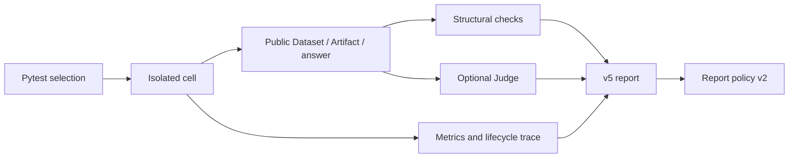

# Agent Harness Benchmark

This document owns benchmark evaluation and interpretation. The [LLM conversation boundary](../20-prd-tdd/llm-conversation-boundary.md) owns production behavior; benchmark changes do not change the product's conversation or Tool contracts.

## Execution and ownership

`tests/e2e/agent_harness/` contains the live cases and their fixtures. Each `test_*.py` module owns one business task, submission, public-state oracle, and optional Judge rubric. Shared execution and report interpretation live in `_infra/`; pytest controls selection and lifecycle.

A cell is one `AgentHarness × subject model × case × execution mode × repetition`. Omitting `--model` selects the configured default; one override is allowed. Headless mode submits through the Harness service, and headed mode drives the visible desktop. Both use a fresh temporary runtime home and the real provider path.

Subject and Embedding settings are loaded once and copied into the cell. Their hashes describe the configuration used; changing an external settings file later does not invalidate an already running snapshot. A case may prepare public Knowledge state before subject timing starts.

## What the benchmark measures

Cases verify meaningful public outcomes, such as an exact cleaned Dataset, linked output Artifact, ranking results, or a statistical evaluation on disjoint training and holdout data. Source immutability remains a measurement check. Headed cases also record actual UI submission, rendering, Knowledge task completion, and shutdown facts.

Cases do not repeat service validation of tokenizer fingerprints, prepared-text digests, report field whitelists, or serialization sizes. Isolation is established when constructing the cell; every case need not rescan all registered paths. Output locators still verify that the referenced Artifact is readable and belongs to the cell.

A Judge evaluates explanations against case facts and the rubric. It receives the terminal answer, not a precomputed claim that the answer passed keyword checks. Phrasing, long answers, comma-separated numbers, and additional report metadata do not invalidate business evidence. SVG projection uses visible text and accessibility labels and excludes hidden elements; it does not treat comma counts as proof of raw-row disclosure.

Judge inputs consist of case facts and requested final output, never settings, credentials, full transcripts, or intermediate Tool exchanges. Final-output text may itself contain public links or local locators; it is not scanned as a substitute for evaluating the requested outcome. Evidence is delimited as data. The Judge has no Tools, uses explicitly configured settings, and records latency, retries, and usage separately from the subject.

Judge responses need usable verdicts, rubric scores, and reason codes. Markdown JSON fences, additional fields, and repeated valid reason codes are tolerated. Missing scores or invalid verdicts remain an evaluation error. Same-model judging is recorded as `same_model`; it does not prevent measurement or acceptance.

## Resource limits and failures

Each live cell runs in a killable spawn child with a 900-second deadline, at most 12 subject sampling rounds, and two provider attempts per round. Optional title and completion-guard models are disabled in the effective settings so their requests do not escape subject accounting.

Reported subject tokens are limited to 500,000 per cell and 4,000,000 per pytest invocation. Token enforcement happens at response boundaries: count the completed response and stop before a later request. Missing usage stops further cells because invocation cost cannot be counted; round and time limits remain independent.

A runtime error, failed integrity check, or exhausted cell does not automatically cancel unrelated remaining cases. Pytest `-x` and `--maxfail` control that choice. The invocation stops when its aggregate token limit is reached, accounting is unavailable, output cannot be persisted, or the user interrupts it.

## Reports and acceptance

Schema v5 retains separate execution status, integrity, structural outcome, Judge status/verdict, subject metrics, Judge metrics, budget, identity, and trace. Structural success alone does not imply that a Judge-required answer passed. Provider errors and malformed judgements remain Judge states; they are not converted into semantic success or failure.

The report reader validates only fields consumed by policy, preserves additional metadata, and leaves diagnostics readable as they evolve. It does not demand exact keys throughout the report, recompute stored projection flags, compare independent token counters, cap trace sizes, or require a clean working tree. Schema v4 remains diagnostic-only.

`agent-harness-report-policy-v2` characterizes one headless measurement without creating a gate. Formal acceptance uses three headless repetitions and one headed repetition. Structural prerequisites and integrity must pass in all four. For Judge-required cases, at least two headless Judge verdicts must pass, the third may be partial, and the headed Judge verdict must pass. A required Judge must complete; for cases without a Judge, all structural verdicts must pass.

Comparable reports retain the same case, subject model, fixture, effective settings, optional Embedding/Judge settings, resource policy, and Judge rubric/model. A cohort also shares its Harness variant. Commit, dirty state, case source hash, runtime hash, original settings-file hash, and invocation ID remain diagnostic identity; they do not block developer comparisons. When intentionally changing evaluation semantics, describe that change alongside any comparison: a relaxed oracle is not evidence of a better model.

Calibration is optional. When supplied through `--calibration`, a passing report must match the Judge model, settings, subject, and rubric. The calibration command runs at most four hand-labelled packets three times with per-request process deadlines and normal provider retries. Suite names are independent labels; notes and extra fields are allowed, and only the selected rubric is imported. An inconclusive example may contain incomplete evidence. Derived calibration pass flags are computed from observations; duplicate or missing repetitions cannot count as complete calibration.

Each cell's trace preserves lifecycle spans, timings, paths, attributes, exception chains, and stack traces needed for diagnosis. CLI summaries print the trace ID and absolute JSON report path. Traces remain diagnostic evidence and never determine a semantic score merely because their format changed.

## Contributor commands

- `pdm run benchmark-agent-harness-check -q` runs the dedicated offline infrastructure tests; use normal pytest options, for example `-k report_policy`.
- `pdm run benchmark-agent-harness -- --collect-only -q` and `pdm run benchmark-agent-harness-headed -- --collect-only -q` verify discovery without provider calls.
- `pdm run benchmark-agent-harness -- <case selector> --llm-settings <path>` runs an explicit paid series. Add Judge settings when its rubric requires judgement; the headed command selects visible execution.
- `pdm run benchmark-agent-harness-evaluate characterize <report>` reads one measurement. `formal <reports...>` and `compare --baseline <reports...> --candidate <reports...>` apply the acceptance/comparison policy; calibration arguments are optional.
- `pdm run benchmark-agent-harness-calibrate-judge` evaluates an explicit calibration suite when Judge agreement needs investigation.

The ordinary service portfolio stays offline and does not collect these cases. Service tests and Agent cases share no executable helpers, fixture data, or reports. Run the affected service checks before paid acceptance and broaden verification only when impact warrants it; CI may enforce its own service-job ordering.
