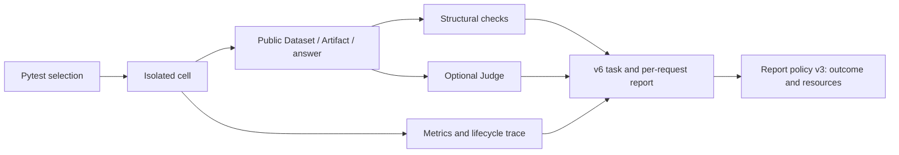

# Agent Harness Benchmark

This document owns benchmark evaluation and interpretation. The [LLM conversation boundary](../20-prd-tdd/llm-conversation-boundary.md) owns production behavior; benchmark changes do not change the product's conversation or Tool contracts.

## Execution and ownership

`tests/e2e/agent_harness/` contains live tasks and their fixtures. Each case module owns a complete business task, its user requests, public-outcome oracle, and optional Judge rubric. Shared execution and report interpretation live in `_infra/`; pytest controls selection and lifecycle.

A cell is one `AgentHarness × subject model × case × execution mode × repetition`. Omitting `--model` selects the configured default; one override is allowed. Headless mode submits through the Harness service, and headed mode drives the visible desktop. Both use a fresh temporary runtime home and the real provider path.

Subject and Embedding settings are loaded once and copied into the cell. Their hashes describe the configuration used; changing an external settings file later does not invalidate an already running snapshot. A case may prepare public Knowledge state before subject timing starts.

One task may contain several sequential user requests in the same thread and runtime. `build_submissions` supplies that sequence; existing single-request cases retain `build_submission`. The runner saves a snapshot, incremental metrics, and case-owned delivery evidence after each request. Later requests contain only the next business input, never evaluator-supplied answers to earlier requests. The provider budget belongs to the whole task, while UI completion flags belong to each submission.

## What the benchmark measures

The default portfolio selects the four representative tasks below. Each `test_business_*.py` module has a representative function with the same name as the file stem; default discovery selects that node so adding explicit contrast tests does not expand every ordinary run. Their organization follows business work, not a catalog of Tool capabilities. Each business family has one vote; user-request count, scenarios and repetitions do not increase its business weight. The previous 13 cases remain available through explicit file/node selectors for historical diagnosis; explicitly selecting the whole directory collects them too. Keeping them available is a migration choice, not a commitment to expand or retain every old task indefinitely.

| Task | Business judgment | Delivery and acceptance |
| --- | --- | --- |
| `business.revenue.v1` | Month-specific accounting across orders, refunds and store relationships; revise prior results after corrections | Two requests. Each delivered regional table must contain the correct net receipts, including negative and no-refund regions. The second explanation must describe changes from the first and the ranking. Refund corrections replace the same business ID. |
| `business.campaign.v1` | Select the policy effective on the requested date and apply limited exceptions | One request. Knowledge contains dated policies; the delivered customer list must have exactly the eligible identities. Judge checks the effective rule and material exceptions, without requiring a particular retrieval trace. |
| `business.routing.v1` | Establish a reusable analyzer, assess adoption evidence, then handle a new batch | Two requests. The first delivery identifies a persisted analyzer through public model/report associations. The later delivered predictions must reuse that saved object and reach the explicitly requested 90% accuracy on all new ticket IDs. Judge checks adoption evidence, the correction estimate and which analyzer was selected. |
| `business.restock.v1` | Choose purchases under budget, capacity, arrival and supplier constraints | One request. Any feasible combination reaching the stated optimal planned margin is acceptable. If nothing can be purchased, a grounded no-purchase decision is complete without an empty artifact. Judge confirms the recommended plan and explanation. |

Fixtures live in `fixtures/business_tasks/`; `authoring.py` reproduces them but is never a runner or Subject dependency. `standard` is the default variation; `--business-variant confirmation` changes business conditions, policy applicability, or ticket intent. Confirmation inputs are reserved for checks after the ordinary development run, rather than repeatedly adapting the Subject to those answers. These authored scenarios are initial coverage, not evidence of production representativeness. Row shuffles and renaming probe equivalence; they do not substitute for different business conditions. Detailed data rationale is in the [fixture guide](../../tests/e2e/agent_harness/fixtures/business_tasks/README.md).

Named contrast nodes change one business condition and record its expected effect in the family guide. Restock contrasts vary budget, arrival or margin; campaign contrasts vary spending threshold or contact interval separately. A combined confirmation scenario still matters, but its result alone cannot attribute failure to one condition. Explicit file/node selection runs these contrasts; `--business-variant` only changes representative tasks. Case IDs retain family and scenario, and reports retain outcome checks and cost. Read scenario results together as business contrasts without merging them into the report policy's same-scenario comparison cohorts; no weighted portfolio score is implied.

Business notes are submitted as ordinary user text because the product attachment surface imports tables. CSV files remain real attachments; Knowledge policies enter through the public import/index services. Author-side truth is not submitted. Prompts specify goals, business semantics and deliverables without prescribing how to discover or invoke Tools.

New task oracles freeze the contents of artifacts actually linked in each final answer before another request can modify them. They do not search all generated datasets for a correct intermediate result. Table identity columns may be renamed or reordered and extra descriptive columns are allowed. Monetary checks locate each required region once and tolerate ordinary numeric formatting, explicit yuan/ten-thousand-yuan units, and additional totals. A filtered eligible list and a full audit table with explicit eligibility flags are equivalent. Judge confirms the recommended column and any extra aggregates or contradictory outputs. Model provenance follows public Dataset audit inputs so a formatted export of predictions remains acceptable. Unexpected service/read failures remain measurement errors; an invalid or unavailable user-facing link is a failed delivery.

Ticket IDs do not encode their queue. Prediction checks retain existing business label meanings and measure candidate alternative encodings. Judge must select the actual suggested-queue column and verify the user was given any alternative mapping; a coincidentally correlated input column or an unexplained best permutation cannot establish prediction quality.

Deterministic checks establish amounts, eligibility, prediction quality and saved-object reuse. Case-specific Judge scoring guidance evaluates explanations, contradictory deliveries and the selected analyzer. Correct outputs with omitted requested explanations are partial; material contradictions are failures. A stored training score cannot establish future accuracy, and F1 is not a misrouting rate. No algorithm, Tool sequence or generic operational warning is a hidden acceptance requirement.

The restock task compares achieved value with an independently authored optimum, rather than matching one reference SKU list. It preserves feasibility and objective diagnostics, and requires the actual chosen quantity column to support the decision. A no-purchase candidate is only offered when the author-side optimum is zero; Judge must still confirm that the answer made that grounded decision. Empty tables, when delivered, retain column names in evidence. This does not relax other tasks' requirements to deliver a saved analyzer or usable result.

Revenue Judge facts include the user-provided source records, so claims about refund amounts, affected regions or corrections can be assessed even when net totals are correct. `fixtures/business_tasks/revenue/judge_calibration.json` contains four labelled examples: a corrected explanation with preserved real tables, equivalent totals, missing revision explanation and the unchanged materially false real delivery. Author-edited examples are identified as such; none becomes a new Subject run. Calibration tests verdict severity, not exact wording.

Subject prompts supply business goals, input semantics, necessary business rules, and deliverables. They do not reveal activation sequences, Tool names, model keys, schema-reading steps, or parameter recipes. Business-specific values such as a forecast horizon, rating threshold, or output column names remain legitimate constraints. The September 2026 goal-oriented revision removes those procedural hints; its outcomes are not directly comparable to earlier guided runs. Topic discovery requires one usable assignment output and evaluation, not two copies produced by prescribed FIT/APPLY calls; forecasting no longer requires a preselected winning model or exactly three backtest windows.

Cases verify meaningful public outcomes, such as an exact cleaned Dataset, linked output Artifact, ranking results, or a statistical evaluation on disjoint training and holdout data. Source immutability remains a measurement check. Headed cases also record actual UI submission, rendering, Knowledge task completion, and shutdown facts.

The historical two-segment clustering and item-similarity recommendation cases read the tables linked in the final answer, rather than searching registered Dataset descendants. Their requested rows, original clustering features, partition and recommendation order remain outcome requirements; extra explanatory columns are allowed. A native recommendation produced from inline apply input is a valid delivery without a Dataset parent. An unlinked correct intermediate table cannot establish success, and a linked chart or other non-table artifact cannot substitute for the requested table. Missing links fail delivery; unexpected service or table-reading errors remain measurement failures.

The April sales case excludes the export's grand-total row from business records and compares losslessly normalized dates, quantities, amounts, and header punctuation; it still rejects changed or missing business rows. Keyword frequency preserves the required business-word counts while permitting neutral words to be retained or treated as stopwords. Neither case silently requires a particular cleaning or tokenizer implementation.

Cases do not repeat service validation of tokenizer fingerprints, prepared-text digests, report field whitelists, or serialization sizes. Isolation is established when constructing the cell; every case need not rescan all registered paths. Output locators still verify that the referenced Artifact is readable and belongs to the cell.

A Judge evaluates explanations against case facts and the rubric. It receives the terminal answer, not a precomputed claim that the answer passed keyword checks. Phrasing, long answers, comma-separated numbers, and additional report metadata do not invalidate business evidence. SVG projection uses visible text and accessibility labels and excludes hidden elements; it does not treat comma counts as proof of raw-row disclosure.

Judge inputs consist of case facts and requested final output, never settings, credentials, full transcripts, or intermediate Tool exchanges. Final-output text may itself contain public links or local locators; it is not scanned as a substitute for evaluating the requested outcome. Evidence is delimited as data. The Judge has no Tools, uses explicitly configured settings, and records latency, retries, and usage separately from the subject.

Judge responses need usable verdicts, rubric scores, and reason codes. Markdown JSON fences, additional fields, and repeated valid reason codes are tolerated. Missing scores or invalid verdicts remain an evaluation error. Same-model judging is recorded as `same_model`; it does not prevent measurement or acceptance.

## Resource limits and failures

Sampling follows the production Harness, which currently has no sampling-round cap. Provider retries follow the supplied production LLMSettings for both Subject and Judge. Benchmark counts rounds and dispatched attempts without imposing another limit, including across consecutive user requests; it does not reserve rounds for a future request. Optional title and completion-guard models are disabled in the effective settings so their requests do not escape subject accounting.

Resource policy `agent-harness-budget-v2` retains external cost and time limits: each live cell runs in a killable spawn child with a 900-second deadline. These are benchmark runner limits, not production Harness quotas. Older v1 reports remain readable but are not comparable with v2 as the same resource policy.

An isolated call writes its result to a temporary file before exiting; the parent reads it after the child settles. Reports can exceed an IPC pipe's buffer, so waiting for child exit before draining a result pipe can deadlock and misreport completed work as a timeout. The temporary transport is removed after consumption, failure or termination; durable reports and trace journals retain their existing owners.

Reported Subject tokens are counted after every response; there is no benchmark token cap on an executing task. The 4,000,000-token invocation allowance gates only subsequent cells. Missing or invalid usage marks accounting unavailable without interrupting production sampling; after the current user request settles it prevents further benchmark execution because invocation cost cannot be counted. The process deadline remains independent.

Stopping because provider usage is missing is a measurement error, not proof that the Agent exhausted its task allowance. Conversely, an observed wall timeout is still a failed execution even when the interrupted response has unknown usage; scoring and accounting coverage answer different questions.

A runtime error, failed integrity check, or exhausted cell does not automatically cancel unrelated remaining cases. Pytest `-x` and `--maxfail` control that choice. The invocation stops when its aggregate token limit is reached, accounting is unavailable, output cannot be persisted, or the user interrupts it.

The invocation token cap controls admission of subsequent cells. A cell admitted before that cap retains its own execution status, budget and Judge result even when its returned usage takes the invocation total past the cap; results must not depend on the cost of earlier tasks. The report retains the aggregate consumption. A direct call attempted after the cap produces an unexecuted result, not evidence of an Agent failing the business task.

## Reports and acceptance

Schema v6 retains separate execution status, integrity, structural outcome, Judge status/verdict, subject metrics, Judge metrics, budget, identity, and trace. `planned_turn_count` describes the task and remains unknown if setup failed before constructing its requests; `turns` records attempted submissions with status, failure, incremental metrics, checks and case-owned delivery evidence. New sequence tasks also retain submitted request text and attachment names. `subject_metrics` and `budget` describe the whole task. A later success cannot erase an earlier missing delivery. Structural success alone does not imply that a Judge-required answer passed. Provider errors and malformed judgements remain Judge states; they are not converted into semantic success or failure.

Integrity reflects the checks actually observed, independently of execution completion. A budget-exceeded run whose inputs were preserved can have passing integrity while remaining an unsuccessful execution; no integrity evidence remains a non-pass. Do not interpret budget exhaustion as source mutation.

The report reader validates only fields consumed by policy, preserves additional metadata, and leaves diagnostics readable as they evolve. It does not demand exact keys throughout the report, recompute stored projection flags, compare independent token counters, cap trace sizes, or require a clean working tree. Schema v4 remains diagnostic-only; v5 reports remain readable and usable in their own cohorts. Cohorts and comparisons must share report schema, so a v6 task score cannot silently become a continuation of a v5 single-request trend.

`agent-harness-report-policy-v3` separates descriptive measurement from acceptance. `characterize` accepts any nonempty cohort for the same task, mode and configuration; `compare` accepts equally shaped cohorts, including failed runs. Every explicitly supplied attempt remains visible, with no selection of the best retry. `qualified` describes whether the cohort can be interpreted together, and descriptive comparison `passed` means the comparison was produced, not that task performance improved. Mixed cases, duplicate runs and incompatible identities have no aggregate summary. Three headless repetitions plus one headed repetition retain the existing formal gate: structural prerequisites, integrity and budgets must pass in all four; Judge-required cases need at least two headless passes, at most one headless partial, and a headed pass. Other cases need all structural verdicts to pass.

Policy decisions (payload schema v2) add per-run observations and cohort summaries without rewriting the cell report. Single-cell outcome is `fail` for exhausted execution, runtime failure or a failed deterministic outcome check; an available required Judge supplies pass/partial/fail after structural prerequisites pass. Invalid setup, measurement failure, unavailable/inconclusive Judge, missing evidence and unresolved integrity are `unscored`. Runtime failure records unsuccessful execution, not a claim about the root cause or an automatically diagnosed platform outage. Historical reports affected by the invocation cap remain unscored because their original terminal status was overwritten. These distinctions do not modify Judge verdicts or silently repair old reports.

Summaries retain pass/partial/fail/unscored counts and show the denominator of the scored pass rate. A rate over supplied repetitions is descriptive, not a production estimate or a weighted portfolio score. The policy does not pool separate task families or scenarios. Changes to source/runtime identity remain visible per attempt; authors must identify implementation phases instead of pooling known different revisions just because their diagnostic identity fields are not comparison gates.

Resource summaries include failed and unscored attempts' observed Subject tokens, token coverage, and medians across all attempts. Token totals are complete only when every admitted sampling round has reported usage and accounting is usable; otherwise observed tokens remain a lower bound and complete totals stay null. Total Subject tokens divided by successful tasks is reported only with complete accounting, no unscored attempts and at least one pass. Missing time or round measurements leave the corresponding median null. Comparisons suppress pass-rate deltas when any attempt is unscored. Tokens are a resource measure, not a currency estimate; Judge usage remains separate in cell reports. Zero successes have no finite cost-per-success estimate.

Comparable reports retain the same schema, case and input variation, subject model, fixture, effective settings, optional Embedding/Judge settings, resource policy, and Judge rubric/model. A cohort also shares its Harness variant. Commit, dirty state, case source hash, runtime hash, original settings-file hash, and invocation ID remain diagnostic identity; they do not block developer comparisons. Scoring guidance participates in rubric identity. When intentionally changing evaluation semantics, describe that change alongside any comparison: a relaxed oracle is not evidence of a better model.

Calibration is optional. When supplied through `--calibration`, a passing report must match the Judge model, settings, subject, and rubric. The calibration command runs at most four hand-labelled packets three times with per-request process deadlines and normal provider retries. Suite names are independent labels; notes and extra fields are allowed, and only the selected rubric is imported. An inconclusive example may contain incomplete evidence. Derived calibration pass flags are computed from observations; duplicate or missing repetitions cannot count as complete calibration.

Each cell's trace preserves lifecycle spans, timings, paths, attributes, exception chains, and stack traces needed for diagnosis. CLI summaries print the trace ID and absolute JSON report path. Traces remain diagnostic evidence and never determine a semantic score merely because their format changed.

The local `benchmark.subject.outcome` trace records the final text, Tool calls and arguments, failed results, response-to-tool-call grouping via provider call IDs, per-response reported tokens, completion handles and result sizes, and output Dataset identities before the temporary runtime closes. Completed training also retains the compact per-model feedback, so selected IDs can be traced to actual parameters and evaluation evidence. This makes incomplete delivery and repair attempts reviewable; those diagnostic exchanges are not added to Judge inputs.

Per-request checkpoints and provider budget observations are journaled during execution. Usage is aggregated from actual provider responses, including a user request that never reaches a terminal answer. If the child process times out or dies, the parent recovers completed deliveries and observed cost, identifies the interrupted request, and leaves unavailable measurements unknown. An interrupted provider response cannot be assigned zero tokens. New synthetic business tasks retain complete linked delivery tables/reports locally; this does not change legacy cases' evidence content policy. Neither snapshots nor intermediate Tool exchanges are sent to Judge; it receives the case's final deliveries from both requests when applicable.

## Contributor commands

- Benchmark infrastructure has no dedicated automated test suite. Changes use static checks, collection, saved-report inspection, and explicit live measurement or manual Judge calibration according to the affected behavior.
- `pdm run benchmark-agent-harness -- --collect-only -q` and `pdm run benchmark-agent-harness-headed -- --collect-only -q` collect the same four default representative tasks without provider calls.
- `pdm run benchmark-agent-harness -- tests/e2e/agent_harness/test_business_restock_decision.py::test_restock_contrast --llm-settings <path> --judge-llm-settings <path>` selects the restock contrasts. Add `[budget_tight]` to select just that scenario; campaign uses `test_campaign_contrast` with `spending_threshold` and `contact_interval`.
- `pdm run benchmark-agent-harness -- <case selector> --llm-settings <path>` runs an explicit paid series. Add Judge settings when its rubric requires judgement; the headed command selects visible execution.
- `pdm run benchmark-agent-harness-evaluate characterize <reports...>` describes one same-mode cohort, including failures. `formal <reports...>` and `compare --baseline <reports...> --candidate <reports...>` apply the acceptance/comparison policy; calibration arguments are optional. Re-evaluating saved reports uses no Subject or Judge calls and leaves the originals unchanged.
- `pdm run benchmark-agent-harness-calibrate-judge` evaluates an explicit calibration suite when Judge agreement needs investigation.

The ordinary service portfolio stays offline and does not collect these cases. Service tests and Agent cases share no executable helpers, fixture data, or reports. Run the affected service checks before paid acceptance and broaden verification only when impact warrants it; CI may enforce its own service-job ordering.
