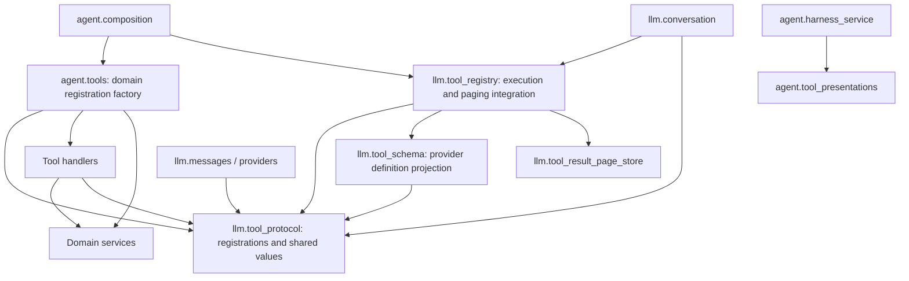

# Agent Tool Boundaries

The [Conversation boundary](../20-prd-tdd/llm-conversation-boundary.md) owns cross-unit authority and execution sequences; this page records the local dependency choices that keep registration, definition visibility, invocation and presentation independent.

## Module Dependencies

Arrows below denote source dependencies; domain invocation happens through handlers injected at composition, so the Registry does not import concrete tools.

`tool_protocol` owns typed registrations, call/result values and their JSON serialization rules; it imports neither schema projection nor the executor, Conversation, or result storage. The LLM package facade loads exports on demand, with explicit type-checking exports, so importing protocol or message values does not eagerly load the service graph.

`tool_schema` derives portable provider definitions from a Tool's Pydantic input model. `tool_registry` holds the only name index, validates calls against that model, invokes injected handlers and integrates result paging. Definitions are derived and cached when requested for display; registration and invocation do not require projection to succeed. A provider-incompatible input shape can therefore remain executable, while requesting its unsupported definition produces a schema error at the display boundary.

Registration accepts typed AgentTool values only. There is no separate raw-JSON-Schema invocation branch, concrete-domain execute method, or compatibility dispatcher; development fixtures and service tests use the same registration API as production.

## Composition and Presentation

The domain Tool factory returns registrations binding the declared inputs to domain handlers. It has no execution index or presentation ownership. The composition root adds domain, Knowledge and Skill registrations to the same LLM Registry, then derives the Tool catalog; Harness obtains presentation metadata directly from the existing presentation mapping.

Tool registrations are assembled immediately. Domain services may still use injected lazy factories, but no Lazy Tool wrapper resolves eagerly during registration while pretending to defer execution-time loading. The unused Agent adapter for analysis.lambda is removed; its standalone analysis service remains independent.

Tool selection only changes the definitions sent on subsequent requests. Invocation resolves against all registered tools, including known tools omitted from the current advertised set; model argument mistakes reach the canonical failed ToolResult boundary for repair.

## Skill Resources and Conversation State

Skill guidance and resource readers depend on the static catalog, not on a Conversation snapshot. A known Skill/resource pair can be read directly, before or after a guidance read, including within the same model response. Missing resources still produce ordinary Tool failures.

Successful guidance reads remain useful as a history projection for the next prompt; they do not grant the right to read resources. Conversation commits a response's complete ToolCall/ToolResult set together, so making resource access depend on already committed guidance would falsely reject a same-response read even after the guidance handler succeeded. Removing that dependency resolves the defect without pending activation state or forced extra model rounds.

## Agent Choice and Retained Execution

The Agent owns task-dependent choices; domain services own executing those choices and retaining the state needed to reuse them. A Tool should expose coherent strategies rather than silently making business choices inside a fixed workflow. Defaults are conveniences whose meaning is discoverable, not substitutes for caller control. Optional strategy details belong in on-demand metadata, not every initial Tool definition.

Reusable objects must carry their declared execution recipe. A text analyzer retains the selected segmentation/feature strategy, filtering options, explicit resources, learned vocabulary and classifier, so applying it to another batch does not depend on the Agent reconstructing earlier steps. The service fits learned transformations within each training partition. The Agent can still use `data.transform` for separate business cleaning; that SQL is not implicitly captured as part of a trained analyzer, and its output is an explicit model input.

Feedback should explain the effective choice, outcome and limitations in terms the Agent can act on. A prediction with no recognized features should expose that fact alongside its output; it should not silently look like a supported prediction, disappear from the result, or terminate the tool call. Similarly, repeated validation on the same rows should be identifiable as reused evidence. Internal records, raw digests and mandatory inspection rituals are not substitutes for these decision facts.

This separates choice, execution and evidence without requiring the Agent to manually assemble the service's implementation. When behavior depends on a hidden default or a remembered sequence, first ask whether the missing concept should be an explicit strategy, retained state or clear result feedback. Fix that owner before adding procedural Skill instructions or extra validation gates. Text classification applies this principle in [its unit design](text-classification.md).

## Maintenance Rationale

Unnecessary architecture dependencies can become functional defects: a resource reader tied to transcript commit order gains an accidental workflow requirement, and duplicate dispatch paths gain different validation, error and paging behavior. When fixing such failures, remove the incorrect dependency or competing owner rather than encoding a workaround in prompts, another state store, or more caller-side checks.

Existing Harness, paging, Knowledge and ML service verification exercises these boundaries; import isolation and same-response resource scenarios can be checked with manual probes. Benchmark infrastructure does not gain automated tests from this refactor.
