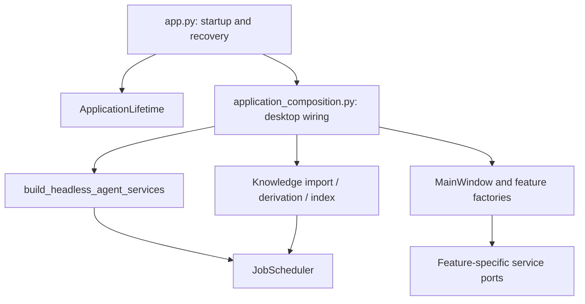

# Application Composition

This document owns local assembly and cleanup guidance. Domain authority remains in [Product TDD](../20-prd-tdd/README.md); startup recovery and runtime homes remain in [Deployment](../40-deployment/README.md).

`app.py` creates QApplication, translations, splash, logging/observability, and storage, then delegates service and window wiring. Heavy imports stay on the application thread, with progress/event processing between prewarm boundaries. Prewarming returns no dynamic service namespace; actual dependencies are ordinary imports in the composition root. Keep the Qt Quick Animator splash behavior described in the UI instructions.

The headless Agent factory constructs the common graph. Its typed lazy factories delay domain implementations without string-based module/class lookup. A lazy service forwards ordinary method/property access and is unsuitable for Python special methods or `isinstance` checks. Register implementations in composition; do not add imports from a domain back into the application.

Desktop assembly requests a stopped scheduler, registers every Knowledge kind, constructs the window, then starts recovery and dispatch once. Headless callers normally receive a started scheduler. No handler may be replaced or added after start; this makes the full recovery graph and routing table stable for the process lifetime. See [Job Feed Contract](../20-prd-tdd/job-feed-contract.md) for kind routing and domain concurrency.

Register each acquired resource with `ApplicationLifetime` immediately. Release order is the window and its feature work, scheduler, Knowledge services, database engine, observability flush, then logging. Startup failure uses this same owner; repeated window/application close releases resources once, and a cleanup exception is logged without preventing later cleanup. Scheduler shutdown stops admission and has a bounded worker wait; a warning reports workers still running after that deadline, rather than claiming every domain has drained.

`ApplicationServices` is an observer callback payload for diagnostics and headed benchmarks. It is not a widget dependency bag. Window factories close over the exact service ports each feature needs; `MainWindow` continues to own shell navigation rather than feature-service construction.

Verification: `tests/runtime/test_application_lifetime.py`, `tests/runtime/test_lazy_services.py`, and the scheduler/Knowledge integration routes in the Job contract prove the local invariants. `tests/runtime/test_application_composition.py` starts the actual desktop graph in a separate Qt process and follows a local text file through scheduled import, derivation, index building, and retrieval. `pdm run smoke --isolated` exercises the broader desktop integration; after changing import paths, run the packaged gate to cover frozen discovery and worker imports.
