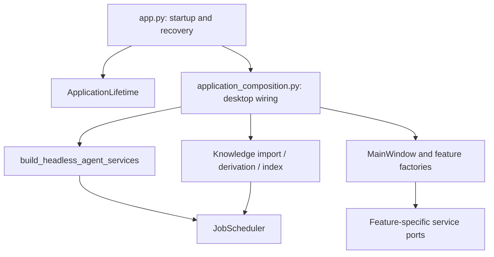

# Application Composition

This document owns local assembly, cleanup, desktop rendering seams, and application error-reporting guidance. Domain authority remains in [Product TDD](../20-prd-tdd/README.md); startup recovery and runtime homes remain in [Deployment](../40-deployment/README.md).

`app.py` creates QApplication, translations, splash, logging/observability, and storage, then delegates service and window wiring. Heavy imports stay on the application thread, with progress/event processing between prewarm boundaries. Prewarming returns no dynamic service namespace; actual dependencies are ordinary imports in the composition root. The desktop rendering seams below explain the Qt Quick splash constraints.

The headless Agent factory constructs the common graph. Its typed lazy factories delay domain implementations without string-based module/class lookup. A lazy service forwards ordinary method/property access and is unsuitable for Python special methods or `isinstance` checks. Register implementations in composition; do not add imports from a domain back into the application.

Desktop assembly requests a stopped scheduler, registers every Knowledge kind, constructs the window, then starts recovery and dispatch once. Headless callers normally receive a started scheduler. No handler may be replaced or added after start; this makes the full recovery graph and routing table stable for the process lifetime. See [Job Feed Contract](../20-prd-tdd/job-feed-contract.md) for kind routing and domain concurrency.

Register each acquired resource with `ApplicationLifetime` immediately. Release order is the window and its feature work, scheduler, Knowledge services, database engine, observability flush, then logging. Startup failure uses this same owner; repeated window/application close releases resources once, and a cleanup exception is logged without preventing later cleanup. Scheduler shutdown stops admission and has a bounded worker wait; a warning reports workers still running after that deadline, rather than claiming every domain has drained.

`ApplicationServices` is an observer callback payload for diagnostics and headed benchmarks. It is not a widget dependency bag. Window factories close over the exact service ports each feature needs; `MainWindow` continues to own shell navigation rather than feature-service construction.

## Desktop Rendering Seams

The bootstrap path performs process-global Python and C-extension imports on the application thread because importing them concurrently with PySide has caused native aborts. Keep the splash as a top-level `QQuickView` and keep its continuous motion in Qt Quick `Animator` types so the scene-graph render thread can present frames while the application thread is blocked. Do not replace it with a `QWidget` timer, a regular QML animation, or `QQuickWidget`; those all depend on the application thread. Stage text may continue to update at bootstrap boundaries.

The black user-message bubble deliberately uses `UserMessageCard` plus `UserMessageBody` custom painting. Do not reintroduce a `QFrame.StyledPanel`, `QTextBrowser`, or `QAbstractScrollArea` background stack: on Windows their independent repaint paths can cover the black card or text during updates. Keep the card/body styles transparent and verify the black user-message bubble after changing this path.

Splash resource collection belongs to [Packaging](../40-deployment/packaging.md).

## Error Reporting

Internal exceptions must remain observable without turning a failed GUI operation into an application exit. Retain the original traceback and distinguish failed reads from successful empty results; do not manufacture zero counts, successful states, or unexplained defaults after an internal failure.

`xenix.exceptions.report_exception` records the traceback and queues presentation on the GUI thread. Background workers carry their failure back to the UI or report it through this entry point; they never construct Qt dialogs themselves. The presenter serializes dialogs and coalesces identical reports while they are pending or visible. The application installs its Python and threading exception hooks after creating QApplication; a splash must not obscure an error dialog. Headless processes retain diagnostics in logs.

A GUI boundary settles the failed operation and stops its failed automatic polling before reporting, so the user can dismiss the error and retry. Stale background results may be excluded from the current view, but their failures still need logging. Optional enrichment may preserve the main view after reporting an internal failure; that continuation must not erase the failure.

Expected validation, cancellation, and unavailable optional resources retain their explicit domain feedback. Canonical Tool and task failures remain in their existing result surfaces with diagnostic logging. A failure after successful domain work does not undo that work merely because notification or presentation failed. Capture diagnostics before clearing exception frames that retain native resources.

## Verification

Existing verification includes `tests/ui/test_exception_dialog.py` and the background-loading routes in `tests/ui/test_knowledge_background_loading.py`; source owns exact signatures and callback mechanics.

Verification: `tests/runtime/test_application_lifetime.py`, `tests/runtime/test_lazy_services.py`, and the scheduler/Knowledge integration routes in the Job contract prove the local invariants. `tests/runtime/test_application_composition.py` starts the actual desktop graph in a separate Qt process and follows a local text file through scheduled import, derivation, index building, and retrieval. `pdm run smoke --isolated` exercises the broader desktop integration; after changing import paths, run the packaged gate to cover frozen discovery and worker imports.

审计中心由 Application Composition 注入 AuditQueryService，任务中心接收 JobQueryService、调度器及 ML 日志查询能力；AuxiliaryWindowCoordinator 连接任务、产出、来源会话与 Artifact URI 导航。ChatWorkspace 发出会话变化，主窗口只转发上下文和导航，不读取审计存储。
