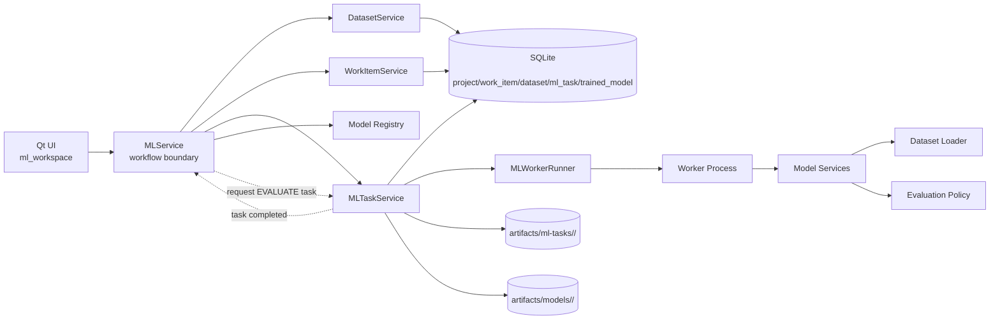

# ML Service Topology

This diagram reflects the current L2/L3 planning direction for issue `#72`.

## Reading Notes

- `MLService` is the workflow-facing boundary used by the UI.
- `MLTaskService` owns atomic task queueing, dispatch, lifecycle, and artifact registration.
- `MLWorkerRunner` is a pure process helper.
- the worker process runs the already-resolved operation entrypoint directly.
- `FIT` and `HYPERPARAMETER_TUNING` can trigger workflow-owned follow-up `EVALUATE` task requests through `MLService`.
- worker processes never mutate SQLite directly.
- task-scoped artifacts live under `artifacts/ml-tasks/<task-id>/`.
- canonical persisted model artifacts live under `artifacts/models/<work-item-id>/`.
