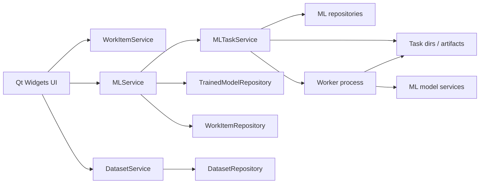

# L1 Plan 01: Architecture

## Scope Boundary

Issue `#73` should deliver the first usable native inference capability, not a generic post-training workflow engine.

In scope:

- selecting a trained model for inference, defaulting to the work item's current best model
- manual row entry for one or more inference rows
- batch inference from supported local tabular files
- background inference task execution with visible status, logs, summary, and failure state
- persisted tabular inference outputs and open/export actions
- high-level work-item flow changes needed to make dataset and feature binding immutable

Out of scope:

- training logic itself
- a generic data-pipeline orchestration layer
- arbitrary external model-file loading
- cloud or multi-user workflows
- advanced preprocessing or feature-engineering UI beyond what current trained models already expect

## Native Product Flow

The intended native business flow is:

1. user imports and inspects a source dataset
2. user creates a work item from that dataset and selected feature columns
3. app locks that dataset/feature binding on the work item
4. user trains one or more models under that stable work item contract
5. inference workspace opens the work item
6. app resolves the default model:
   - `best_trained_model_id` first
   - otherwise one of the other trained models on the same work item
7. user chooses an inference input mode:
   - manual row entry
   - batch file input
8. app normalizes the chosen input into one or more files and submits one atomic `INFERENCE` task
9. task execution loads the chosen trained model, runs prediction against the normalized input file set, and writes canonical outputs
10. main process persists task metadata, generated dataset metadata, and result references
11. UI renders result summary and supports open/export of the canonical output

Important interpretation:

- inference is downstream of a stable work-item contract, not a free-form ad hoc prediction screen
- issue `#73` therefore includes a small but important ownership correction to the work-item flow

## Layer Strategy

Use the existing native boundary model:

- `UI`
  - Qt Widgets view state
  - no direct model loading
  - no direct SQLite or path-policy logic
- `WorkItemService`
  - owns immutable work-item creation and validation
- `DatasetService`
  - owns dataset registration, inspection, and generated-dataset registration rules
- `MLService`
  - owns workflow-facing inference submission and model selection metadata
  - resolves trained models and validates requests against work-item state
- `MLTaskService`
  - owns atomic task queueing, execution dispatch, status transitions, and final artifact registration
- `ML model services`
  - load the persisted estimator
  - read normalized input files
  - produce prediction output files and summaries
- `persistence + filesystem`
  - SQLite stores metadata and links
  - filesystem stores canonical outputs, exports, and task working files

Allowed dependency direction:

`UI -> WorkItemService / DatasetService / MLService -> MLTaskService + repositories + filesystem + ML model services`

## Topology

## Execution Strategy

Use the existing task-scoped background execution model introduced by issue `#72`.

Preferred L1 direction:

- inference runs as a separate atomic `INFERENCE` task
- the main process writes request state and enqueues the task
- a worker process executes the prediction operation against normalized file input
- the main process remains authoritative for success/failure finalization and persistence

This choice fits the current branch because:

- it preserves one ML execution pattern across fit, tuning, evaluation, and inference
- it keeps UI responsiveness and task atomicity consistent
- it lets manual entry and batch inference converge before worker dispatch
- it keeps canonical result-file registration centralized in the main process

## Service Boundary Decision

Issue `#73` should not introduce a standalone `InferenceService`.

Chosen direction:

- keep inference workflow methods on `MLService`
- keep atomic execution on `MLTaskService`
- keep work-item immutability and creation semantics on `WorkItemService`

Reasoning:

- the branch already uses `MLService` as the workflow-facing boundary for ML operations
- inference is another ML workflow on trained models, not a separate product subsystem
- splitting inference into another top-level workflow service would create avoidable duplicate task and model-resolution logic

## Work-Item Ownership Correction

The current branch lets a work item be created first and have dataset/feature selection attached later. That is no longer the right ownership model for issue `#73`.

High-level L1 direction:

- new work-item creation should require:
  - project id
  - work-item name
  - dataset id
  - selected feature columns
  - selected target columns when relevant to the dataset setup flow
- after creation, the dataset and selected columns on that work item are immutable

This does not require L1 to make the SQLite columns non-null for historical data.

Preferred compatibility rule:

- preserve database compatibility for existing rows created before issue `#73`
- enforce the stricter rule through new service methods and updated UI flows
- treat old incomplete work items as legacy records that can be listed but are not the target flow going forward

That keeps migration pressure low while still making the forward path correct.
