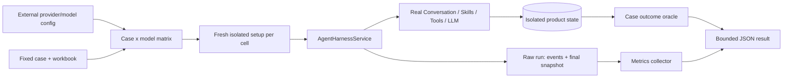

# Minimal Agent Harness Benchmark Design

The current scope lives in [packet.md](packet.md).

## Topology



The application and benchmark consume one shared headless composition function.
This is the only production abstraction introduced for benchmark fidelity. Its
inputs make lifecycle and configuration ownership explicit:

```python
def build_headless_agent_services(
    *,
    paths: AppPaths,
    session_factory: sessionmaker,
    llm: LLMService,
    ml_worker_settings: MLWorkerSettingsService,
    usage_observability: LLMUsageObservability,
) -> HeadlessAgentServices: ...
```

The exact static types may remain protocols/lazy proxies where production
startup requires them. Semantically, the caller owns every supplied object.

```python
@dataclass(frozen=True)
class HeadlessAgentServices:
    harness: AgentHarnessService
    datasets: DatasetService
    artifacts: ArtifactService
    ml: MLService
    llm: LLMService
```

Storage bootstrap/disposal, provider settings, worker-process policy, logging,
observability lifecycle, and Qt remain outside the builder. Conversation,
concrete preprocessing services, export support, and Tool registries remain
private graph details. The builder imports neither `xenix.app` nor PySide.

## Minimal Result Model

```python
@dataclass(frozen=True)
class OutcomeCheck:
    name: str
    passed: bool
    summary: str


@dataclass(frozen=True)
class BenchmarkMetrics:
    turn_seconds: float
    oracle_seconds: float | None
    sampling_round_count: int
    usage_reported_primary_response_count: int | None
    token_usage: TokenUsage | None
    message_counts: dict[str, int]
    tool_call_counts_by_name: dict[str, int]
    tool_result_counts_by_status: dict[str, int]
    provider_retry_count: int
    derived_dataset_count: int
    terminal_shape: tuple[int, int] | None


@dataclass(frozen=True)
class AgentHarnessBenchmarkResult:
    schema_version: int
    case_id: str
    run_id: str
    provider_model: str
    run_status: Literal[
        "completed", "invalid_setup", "runtime_error", "measurement_error"
    ]
    outcome_checks: tuple[OutcomeCheck, ...]
    metrics: BenchmarkMetrics

    @property
    def outcome_passed(self) -> bool: ...
```

This is not a generic scorer framework. The cleaning case owns a plain Python
oracle returning named checks. The runner owns common timing/counting and JSON
serialization. Missing provider usage stays `null`, not a misleading zero.

## Run Sequence

1. Resolve the external provider settings path from
   `XENIX_AGENT_BENCHMARK_LLM_SETTINGS_PATH` or `--llm-settings`, parse it
   through the existing `LLMSettings`
   schema, freeze one in-memory snapshot, and expand every `providers[].models`
   entry to an explicit fully qualified model key.
2. Validate the case input once. For each case × model cell, create a fresh
   temporary app home, caller-owned storage context, and production-equivalent
   service graph using the real `LLMService` with that frozen settings source.
3. Create the Thread first with a bounded title derived from case id, model key,
   UTC test time, and run id. A non-empty title makes initial-title eligibility
   false, so no title model/fallback side task runs.
4. Start timing and submit the source attachment/user turn only through
   `submit_user_turn_stream()` with `provider=None`, the pre-created Thread id,
   and the cell's explicit `fq_model_key`.
5. Fold live events immediately into bounded sampling/retry counters; retain
   only the thread id and latest public snapshot, never the raw transcript.
6. Record `turn_seconds` after the complete stream. Re-read partial/final public
   state after an exception when possible, then derive usage, message, and Tool
   aggregates from public Harness projections.
7. Delegate terminal-product selection to the case. The April case scans
   successful canonical Tool Results from newest to oldest and selects the
   first referenced, readable Dataset id that was created in this isolated run
   and is not one of the attached source datasets.
8. Run the cleaning oracle after the turn timer, recording its own elapsed time.
9. Verify source/config identity and state confinement, then atomically write
   one sanitized JSON result for the cell.
10. Dispose the cell's caller-owned engine/runtime in `finally`, continue to the
    next cell, then return a suite status only after every cell result has been
    attempted.

## Preflight State Machine

| Branch | Classification | Evidence retained | Command result |
| --- | --- | --- | --- |
| fixture/config missing, model invalid, credential unavailable, or fixture hash differs | `invalid_setup` | bounded cell/preflight diagnostics | persist cell, continue |
| provider/network/tool orchestration raises | `runtime_error` | partial time/event/snapshot aggregates | persist cell, continue |
| canonical turn completes but output is absent/bad | `completed` + failed outcome | full metrics and named checks | persist cell, continue |
| oracle or metric collector itself fails | `measurement_error` | completed-run metrics available before the failed measurement | persist cell, continue |
| outcome passes | `completed` | full metrics and checks | persist cell, continue |
| result file cannot be written | no durable result claim | safe stderr summary only | continue; suite fails |

The result is written under ignored `build/agent-harness-benchmarks/` by
default, with an explicit path override. Absolute source/config/temp paths,
thread/message ids, prompts, Tool arguments/results, provider payloads, dataset
values, endpoints, API keys, and raw exception text are never serialized.

## Rehearsed Ambiguities

- `usage.request_count` means successful primary responses with accepted usage;
  it is not relabeled as total HTTP requests. Unique pending ids are sampling
  rounds and connection events are retries.
- `provider=None` is the production gateway selection, not a model selection.
  Every cell supplies an explicit `fq_model_key`; no default model silently
  enters the comparison.
- Thread-title generation is excluded without adding a test-only Harness mode:
  the benchmark pre-creates a titled Thread through the public Harness API.
- Output identity is a case concern, not a universal Dataset-graph inference.
  The April locator uses the latest run-created Dataset referenced by a
  successful canonical Tool Result. It does not inspect Tool arguments, assume
  a Tool name, traverse lineage, or sort Dataset timestamps.
- The large oracle can dominate CPU/memory. Its timing is excluded from Agent
  latency, uses Polars/shared tabular loading, and compares compact row
  fingerprints rather than retaining Python row objects.
- Provider settings are intentionally not copied into the temporary home. The
  runner reads one external file once into the existing typed model, freezes it
  for the suite, and reports only a secret-free settings identity.
- Windows preprocessing workers receive serialized `AppPaths`; no global
  `XENIX_APP_HOME` mutation is required. The dedicated command remains a clean
  process and always disposes the temporary storage engine.

## Comparison Semantics

A result characterizes one run. Meaningful before/after comparison holds fixed:

- case input and oracle version;
- fully qualified provider/model and effective sampling settings;
- Tool/Skill catalog inputs;
- machine/runtime class where latency is compared.

The report records repository commit/dirty state and these identities. V1 does
not decide whether a token or latency difference is statistically significant;
it makes the measurements available without hiding outcome quality.

Two comparisons are legitimate but answer different questions:

- **Harness benchmark:** same case and model across Harness commits.
- **LLM adaptation benchmark:** same case and Harness commit across configured
  provider/models.

Cells run sequentially so concurrent local CPU/network work introduced by the
benchmark itself does not contaminate latency. Provider-reported token counts
are recorded as given and are not assumed to share one tokenizer.

## Report Privacy

The JSON result contains identities, named boolean outcomes, aggregate metrics,
Tool names/status counts, and sanitized error summaries. It excludes API keys,
provider endpoints, prompt/source contents, absolute source paths, raw provider
payloads, full snapshots, Tool arguments/results, and generated data values.

## Impact Handshake Draft

- **Address and Object:** add
  `src/xenix/services/agent/composition.py`; make `src/xenix/app.py` consume it;
  add a small benchmark package under `tests/`, an explicit script/PDM command,
  an external settings-path seam/read-only snapshot, and focused offline tests;
  then remove tracked AIMock settings/UI/config/fixtures/tests and synchronize
  translations.
- **State Diff:** scripted Harness replay -> repeatable measurement of the real
  Harness/model/tool system across a configured case × model matrix.
- **Blast Radius:** application composition, benchmark support/result output,
  isolated storage/observability, Windows preprocessing workers, settings UI
  and compatibility imports, translations, explicit live command, and AIMock
  files. Ignored local editor tasks and unrelated dirty files do not move.
- **Invariants:** production provider behavior and canonical authority remain;
  default tests stay offline; lower-level deterministic fault coverage remains;
  storage/settings/process lifecycle remains caller-owned; benchmark data and
  credentials do not leak into reports.
- **Verification:** composition parity/import proof, deterministic metric/
  oracle/serializer/branch tests, one valid live cleaning report, source and
  settings isolation, scoped AIMock absence, translation checks, and default
  regression.
