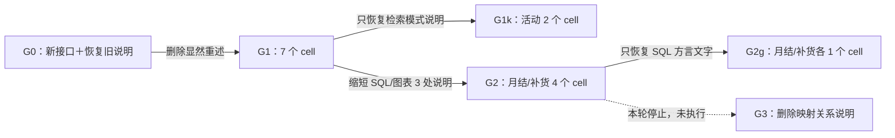

# 工具参数说明：渐进消融

2026-09-13～14 完成本轮渐进实验：22 个有效完成 cell，另有 2 个中断单列保留。执行基线为 41adb2f，逐项干预与初始样本顺序见 [progressive-plan.json](progressive-plan.json)，自适应拆分决定见 [progressive-gates.json](progressive-gates.json)，全部完成报告见 [progressive-results.json](progressive-results.json)，匹配 cohort 的汇总见 [progressive-summary.json](progressive-summary.json)。历史 full/no-parameter-descriptions/layered 结果不并入新实验。

## 结果与决策

本轮支持保留字段名、类型等显然重述的精简，但不支持把“剩余重复信息”继续整批删除。第一层总体工具错误没有增加，第二层只有很小的定义收益，行为波动却足以盖过它；对检索模式和 SQL 方言的局部复原提供了定位证据，未建立稳定因果结论。当前不推进 datasets 映射语义的 G3，不将任何实验 arm 宣布为经过全题库验收的生产候选。

| 相邻比较（使用相同任务与重复集合） | 报告 pass | 轮次 | ToolFailure | Subject tokens |
| --- | ---: | ---: | ---: | ---: |
| G0：四任务，月结/补货/活动各两次、分流一次 | 5/7 | 77 | 9 | 1,399,228 |
| G1：同上，仅显然重复层 | 6/7 | 76 | 6 | 1,218,461 |
| G1：仅月结/补货，各两次 | 3/4 | 34 | 4 | 310,653 |
| G2：同上，进一步缩短 SQL/图表三处说明 | 1/4 | 38 | 6 | 367,575 |

G0→G1 的全激活定义缩小 5.07%；G1→G2 只再缩小 0.54%。表中 tokens 是实际样本合计，不能把合计差额当作稳定节省率。每个业务家族最多两次重复、分流仅一次有效配对，不能用本表估计总体通过率；第二层也不能与第一层七个 cell 的总数直接比较。两次定点恢复的匹配结果在下文与 progressive-summary.json 中单列。

G1 是运行前的分类，不代表 21 处说明事后全部获准删除。特别是 knowledge.lookup.mode 的枚举名称只给出可选值，解释 keyword/semantic/hybrid 的行为差别并不只是重述类型；本轮将其单独还原定位并列为待定，不把它纳入“已证实冗余”的清单。

22 个完成 cell 的程序 outcome 检查都通过，综合 oracle/Judge 报告为 16 pass、6 fail；人工又发现部分 pass 漏掉了错误解释，故绝不等同于 16 个完全正确的交付。累计 221 轮、23 次被恢复的工具错误、3,321,446 Subject tokens（包含缓存输入），Judge 另用 260,820 tokens；两次中断的实际 usage 未保存，不计入这些完成样本总量。

## 固定条件与测量

各组只改变 Subject 工具参数的 description；字段、类型、required、默认值、执行逻辑、工具简介、懒加载机制、Skill、系统提示词、Subject/Embedding/Judge 配置及原业务题目固定。G0/G1 都使用必填 datasets 映射，G0 只恢复仍存在字段的历史说明。每个 cell 重新创建会话与 runtime；最多两个并行，不比较运行时间。实际 tokens 采用报告中的 Subject input + output，包含缓存输入，不含 Judge。

按生产 Provider 的 19 个全激活工具封装计算，G0 为 15,946 字符，G1 为 15,138（相邻减少 808，5.07%），G2 为 15,056（减少 82，0.54%），G3 为 14,942（减少 114，0.76%）。这些是紧凑 JSON 的 Unicode 字符；任务实际暴露的工具会变化，不能直接把此比例当作会话 token 或费用下降。包含未暴露 model.task.stop 的全 schema 字典会多算第一层的 39 字符节省，因此不用那个分母报告生产定义缩减率。

当前生产定义仍是 15,062 字符；G1 因控制变量保留旧图表例子与转换说明的证据性质限定，比当前生产多 76 字符。因此上面的实验相邻差额不是直接可套用的生产增量。各范围与脚本指纹在 [progressive-measurements.json](progressive-measurements.json)。

## 执行中断的处置

首批 G0/G1 routing-r1 分别保存 16/19 次 Subject 请求与响应，但在恢复工作时已没有 Python 进程，未留下 cell 完成报告或进程退出码；确切退出原因未知。这两次尝试记录在 [progressive-interruptions.json](progressive-interruptions.json)，不计为业务失败或有效完成样本，也不估算缺失的实际 tokens。保留所有捕获内容，以 routing-r2 新会话补齐原配对，其他尚未开始的样本仍使用原编号；这是补齐中断的执行，不是用重跑筛选通过结果。

## G0/G1 首对月结的轨迹复核

G0 revenue-r1 的机器报告为 fail（incorrect_business_claim），G1 revenue-r1 为 pass；轮次分别 11/12，Subject tokens 为 124,496/126,848，去重 ToolFailure 为 1/2。两组均交付了正确的主表，单次结果不支持“删减后模型更聪明”或“说明越多越正确”。

两组在图表 spec 中都内嵌 data，第二次作图均引用绑定 Dataset 中没有的“版本”字段，随后保存对比 Dataset 并恢复。G0/G1 对 spec 保留完全相同的旧说明（含 Xenix supplies data; omit data and datasets），因此这不是移除该提示后出现的错误；生产图表实现使用绑定 Dataset 的列并注入数据，内嵌数据不能创建新列。G1 另外为 transform 臆造 database_name 参数，收到 extra-input 验证错误后删除；该参数在任何组都不存在，先作为一次参数误用保留，等待重复样本，不能因其发生在精简组就直接归因。

G0 第一次解释称误计 7 月的 O09（东区 11,000）和 O19（西区 4,100）会改变东/西排名，实际两区会成为 51,750 / 37,000，仍为东区领先；Judge 判错与公开事实一致。G1 第二次解释“本区退款未被本次文件触及”措辞不准确：更新含西区 R11，只是发生在 7 月，不影响 6 月；同一回答后文确实列出 R11 的跨月排除。保留这种表格正确但解释精度不足的观察，不改写既有机器判题，也不在实验中修改 prompt 或 Judge。

## 分流与活动的复核及追加决定

分流有效配对 routing-r2 均 pass，G0/G1 分别 28/26 轮、867,474/777,706 tokens、2/1 次 ToolFailure；两边均训练 5 次，G0 另建三折验证并产生更多查询。G0 的错误是 SQL 保留字 rows 和引用已投影掉的 message 列，G1 是图表绑定缺少 flag 的 Dataset；没有出现训练角色或模型参数说明删除后可明确定位的契约误用。

直接读取第二轮实际交付表的 suggested_queue 列，两边都是 28/30（93.3%），错单均为 T-ADB30E47、T-60CF1C49；保存分析器复用成立。报告的 complete_batch_quality 显示 accuracy=1.0，这是当前 oracle 枚举候选列后取的最高值，Judge 另选实际预测列；本次不把候选列最高值当模型准确率。两者均超过 90%，故此测量说明不改变本对照的 pass。

活动 campaign-r1 两组均 pass、无 ToolFailure，但 G0 仅 5 轮/33,589 tokens、1 次知识查询，G1 为 9 轮/78,555 tokens、6 次知识查询。两组第一次检索的有效模式都为 hybrid，并已返回完整的六月/七月规则；G1 后续继续查“在营”“VIP”和间隔定义，额外调用没有补足缺失的规则。不能以“没有报错”忽略这项成本信号，也不能从一次样本就断定删掉 mode 的枚举重述导致扩张。

在运行下一层之前追加 campaign-r2 的 G1/G0 相邻对照，保持原任务、配置和说明不变；先检查多次查找是否复现，若复现再在第一层内还原 knowledge.lookup.mode 定位。此决定在追加样本启动前记录，原 campaign-r1 全部保留；不修改最初登记的 12 个 cell 或用新结果替换旧结果。

## 补货解释：同类错误被 Judge 不一致地识别

restock-r1 两组实际采购表均达到最优毛利 1,845、成本 2,920、箱数 18。G1 被 Judge 判 fail（business_explanation=0），G0 却为 pass；两组都从“还余 80 元”推断“仓容而非预算限制毛利”。独立对原报价做 23,328 种组合枚举表明：保持 18 箱和到货条件、取消预算限制，Q102×1、Q203×2、Q305×1、Q509×1、Q510×1 可以取得毛利 1,865、成本 3,010。这证明预算确实排除了更高毛利的组合，最优点预算有余量不能推出约束无影响。

因此该错误在对照组与精简组均存在；人工判读需对称记录，不能把机器 pass/fail 差异直接归为描述删减造成的质量差异。G1 还把未采购批次的每箱毛利一概称为低于入选批次，然而 Q510 的 97.5 高于已选 Q204 的 78.33；这些均属计算未覆盖解释的既有问题。本实验保留原 Judge verdict 并另列人工发现，不更改 rubric 或生产提示词。

## 第一层内定位与 SQL/图表分支的推进

追加 campaign-r2 后，G0/G1 均 pass，检索次数为 3/4、轮次 5/7、tokens 为 36,566/51,547；G1 多一次 DATE/VARCHAR 运算错误。随后增加 G1k：只把 knowledge.lookup.mode 恢复为 G0，其余仍为 G1。G1k 两次均 pass，检索为 2/3 次、轮次 7/6、tokens 为 67,913/44,522，分别有 1/0 次错误（错误为图表引用不存在的字段）。六次活动对照显示出成本信号，但无法把额外检索稳定归因于 mode 说明：有效检索模式均正常，恢复后仍会主动寻找已有规则之外的定义和例外。该字段暂列待定，不继续删除 Knowledge 信息；不据小样本宣称 G1 或 G1k 全局胜出。

阶段判断在 [progressive-gates.json](progressive-gates.json) 按发生顺序保留。G0/G1 的 14 个有效完成 cell 里，工具错误为 9/6，没有 SQL 源别名映射误用；同时有两组共有的解释错误和 Judge 漏判。允许只推进 SQL/图表重复说明分支 G2，与既有 G1 SQL/图表样本比较，Knowledge.mode 在这些相邻组保持完全相同。该分支不能证明 Knowledge 删减无损，也不等于已经验证一个合并后的生产候选。G2 首先只运行月结与补货各一次，复核之后才决定重复与 G3。

第一层实际字段覆盖见 [progressive-coverage.json](progressive-coverage.json)。本组没有调用 data.tokenize 或 model.hyper_train，也没有使用 wordcloud_spec；model.task.stop 根本未暴露。profile 的几个可选数量参数也均未显式提供。对这些条目，只能给出定义体积，不用本轮任务通过证明其说明可以删除。

## 第二层的拆分复原

G2 首对月结与补货均被 Judge 判 fail，但主表/采购最优解的程序检查仍通过；月结没有工具错误，补货有 6 次错误，集中在递归 CTE、日期转换、列表拼接、递归数值宽度和缺列。按预先约定先拆分定位：G2g 只恢复 query.sql 与 transform.sql 的方言文字，保留 graph.spec 的短说明；同时保留一个原 G2 补货重复样本，不以恢复后的成功替换失败。

结果为 G2 restock-r2 零错误、5 轮、37,041 tokens；G2g restock-r1 有 1 次缺列错误、7 轮、84,630 tokens。原 G2 的六次错误没有复现，恢复方言说明也未消除错误；当前证据不足以把它们归因于省掉 DuckDB 名称。G2g 的补货没有调用图表，故不能验证 graph.spec 的删减。补齐 G2 revenue-r2，以及会实际作图的 G2g revenue-r1 后结束本轮，不把阶段推进变成必须删到某个深度的目标。

G2 restock-r1 的相同保存请求上，参数说明相对 G1 一共少发送 820 字符；六条 ToolFailure 内容去重为 2,956 字符，随历史在后续请求中累计发送 11,173 字符。该计算固定已发生轨迹，只描述体积量级，不证明说明删减导致恢复成本。错误反馈仍包含候选函数长列表与内部 Python traceback，显示进一步节省几十字符的定义收益很容易被一次恢复放大所淹没；本轮只记录，不修改错误输出或 Harness。

G3（删除 datasets 映射语义说明）在本轮明确不执行：第二层的额外静态收益不足 1%，局部复原又未确认稳定的因果收益，继续深入删语义不符合本次高杠杆筛选的停止条件。这里的未执行不是通过，也不是证明这些语义永远不能删。

## 最后的覆盖确认与解释边界

G2 revenue-r2 为 fail、11 轮、123,431 tokens、零工具错误；表格金额正确，但解释把西区“剔除旧订单退款”的结果写成 30,900，而原 32,900 加回 2,000 应为 34,900，又把东区称为唯一发生实质变化的区域，尽管南区同时改善 300。G2g revenue-r1 为 pass、10 轮、139,117 tokens、零工具错误，实际调用图表两次，补齐了此前 G2g 补货没有调用图表的覆盖缺口。

G2g 的机器 pass 仍不能当作无损证据：第一轮解释称误计南区 cancelled 订单 2,700 会把 −1,200 降至 −3,900，实际应升至 +1,500。这是另一例明确的 Judge 漏判。G2g 两个 r1 样本合计 17 轮、223,747 tokens、1 次错误，虽比原 G2 同两题的 22 轮/6 次错误少，tokens 却高于原 G2 的 207,103；单看恢复后的 pass 或工具错误数会得到不完整的结论。

现有证据的合理取舍是：保留有类型/字段名支撑的精简，不把工具定义当成唯一的信息成本来源；knowledge.lookup.mode 的行为解释和简短 SQL 方言提示不继续扩大删除，graph.spec 的重复格式名/例子仅保留为局部候选。未覆盖的分词、词云、超参搜索等不下有效性结论。图表内嵌数据与绑定 Dataset 混用、长错误反馈、计算未覆盖解释、Judge 漏判均另列为已观察问题，本轮没有借实验修改它们。

收尾核对确认：385 份生产/用例文件的指纹未变，各业务任务的 fixture、Subject/Embedding/Judge 配置和 case 定义指纹一致，每份捕获只改变参数 description，请求数与报告采样轮次相同，按 call ID 去重的 ToolFailure 与报告失败状态数一致。没有新增自动化测试，没有修改生产代码、case、oracle 或 Judge，也没有提交。所有恢复/重跑均保留原尝试，原任务之外的工作区改动未纳入本 packet。
