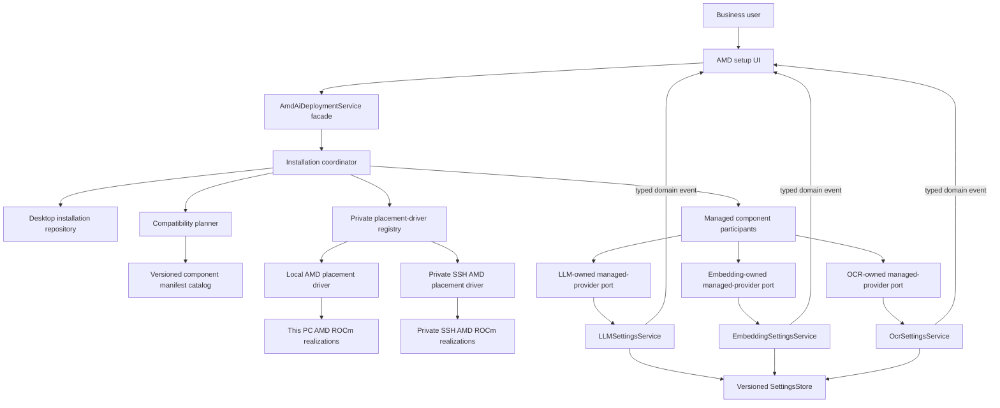
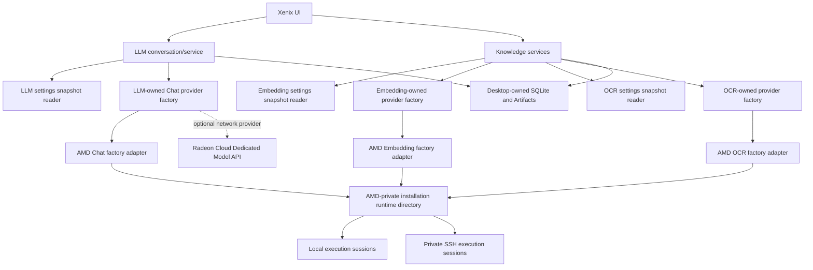

# Candidate AMD Adapter Product Architecture

> Current-placement correction (2026-07-29): the Windows product exposes only
> Private SSH Radeon for new deployment. The Local controller remains
> composition-private solely to clean historical `local_linux` generations;
> new Local intent is rejected. References below to a Local Linux desktop
> placement preserve earlier design exploration and are superseded by
> [TP-20A](implementation/subtasks/TP-20A-guided-amd-ui-repair.md), the accepted
> ADR, and the current product direction.

This file owns the candidate topology and repository mapping. It incorporates the
[scheme review](scheme-review.md), but remains design material rather than an
accepted technical contract or implementation plan.

## Product Topology

### Control plane



### Inference plane



There is one managed AMD ROCm product concept with two placements: Local Radeon on
this machine and Private SSH Radeon on a user-controlled remote target. Desktop
Xenix remains authoritative in both. Execution targets hold only app-owned
generation realizations—files, caches, inference processes, listeners, and bounded
transient request material. The desktop installation record owns normative
generation identity and lifecycle. Neither target owns conversations, Knowledge,
indexes, tasks, Datasets, or final Artifacts.

`AmdAiDeploymentService` is a control-plane facade, not an inference gateway. It
delegates to an internal installation coordinator. That coordinator owns the
state-machine mutation path, asks a compatibility planner to evaluate target
observations against immutable manifests, invokes a placement driver, and projects
verified components through capability-owned managed-provider ports. Registration
does not select that provider.

Capability-owned factory ports remain the inference composition points. Their
AMD-owned implementations are sibling composition components, not children or
methods of the deployment facade. They use an AMD-private runtime directory to find
the exact installation session and return an ordinary capability provider. Neither
the facade nor a deployment coordinator enters the request path.

Each placement-specific execution session is the sole live authority for its
realization: local process/runtime state for Local Radeon, or SSH/remote
process/local-forward state for Private SSH. Composition registers available
drivers; the immutable installation target selects exactly one. Changing placement
creates a new installation, never merely a new component generation. Local and SSH
share narrow control and binding views without forcing unlike state and recovery
into one universal transport. A custom app-lifetime gateway is excluded from the
baseline.

The Dedicated Model API edge is an optional remote provider, not a Xenix-managed
execution target and not a fallback for either managed placement.

The complete ownership and extension audit is in
[architecture boundary review](evidence/architecture-boundary-review.md).

## Orthogonal Axes

| Axis | Question | Current or candidate examples |
| --- | --- | --- |
| Semantic port | What capability does Xenix need? | `AgentProvider`, Embedding, engine-neutral OCR |
| Wire/result adapter | How are requests/results encoded? | OpenAI-compatible Chat/Embedding; KServe V2 Binary Tensor plus pinned PAGE |
| Model backend | Which engine performs inference? | vLLM, PyTorch OCR, Paddle Inference |
| Accelerator runtime | Which GPU stack backs the engine? | ROCm/HIP, CUDA |
| Component manifest | What exact artifacts/runtime/model/protocol/self-test are admitted? | Versioned, digest-pinned release recipe |
| Deployment | How does an app-owned generation change desired state? | stage/verify/publish/repair/retire/remove |
| Placement/transport | Where is it and how is it reached? | local native or admitted WSL process, SSH/SFTP/local forwarding, external HTTPS |
| Hardware evidence | What ran the neural workload? | ROCm identity, Radeon device, correlated utilization |

ROCm and CUDA are peers on the accelerator-runtime axis; neither is a Chat,
Embedding, or OCR adapter. AMD-specific product work belongs to target
qualification, immutable component manifests, deployment lifecycle, private
transport, and provenance. The provider configurations remain ordinary
capability-owned instances. A placement driver answers where/how; a component
manifest answers what exact service is realized; a capability adapter answers how
Xenix calls and interprets it. No one of those layers may branch on the other two
axes' semantics.

## Existing Seams

- `src/xenix/services/llm/service.py` and
  `src/xenix/services/llm/providers.py` already select and invoke multiple
  OpenAI-compatible Chat providers, but `LLMService` still constructs the concrete
  provider directly from static endpoint settings. LLM needs to own a real provider
  factory port and a tagged static-versus-managed target. An AMD reference must not
  be hidden inside `dialect_config`, and AMD must not become a second provider
  authority.
- LLM settings use whole-file load/modify/save, and the settings UI can save an
  older full snapshot. App composition already creates one service instance, proving
  singleton identity alone is insufficient. Automatic registration requires one
  physical settings writer, per-document revisions, typed domain commands, and
  post-commit notification.
- The current LLM settings source exposes `save` to `LLMService`, and `LLMService`
  forwards it. Inference should receive a read-only snapshot port; UI and AMD should
  receive separate typed command views implemented by the same domain settings
  owner.
- LLM conversations also persist `selected_fq_model_key`; removal policy must not
  reduce “in use” to the current default model. The current validator can silently
  select the first provider when the default disappears, so managed retirement must
  prohibit that implicit selection change.
- `src/xenix/services/embedding_service.py` owns one OpenAI-compatible provider.
  It needs a provider-instance migration plus active selection. Its vector-space
  fingerprint must use the embedding component generation and model/tokenizer
  identity, never a local forward URL or aggregate profile revision.
- Embedding `freeze()` is also used for configuration/profile inspection. It must
  remain resource-free; a managed adapter acquires one generation permit inside
  each `embed_texts` and holds it across all batches.
- `src/xenix/services/paddle_ocr_service.py` is the precedent for verified
  download, manifest validation, self-test, final-path publication, repair, and
  runtime provenance. Its local child-process ownership is also a useful Local
  Radeon controller precedent, though its accepted runtime remains Paddle/CPU.
- `src/xenix/services/knowledge_pipeline.py` and the import worker still construct
  and name Paddle-specific execution. OCR needs an engine-neutral facade/result,
  provider settings/factory, routing, status, spawn-safe composition, and
  provenance before AMD registration. Injecting a main-process session does not
  reach the production spawned worker.
- Current OCR failure handling can collapse broad validation/provider errors into
  unavailable/no-text behavior. A remote transport or protocol failure must remain
  typed; only the Knowledge owner decides page/document partial-result policy.
- OCR has no broadly adopted end-to-end service protocol. KServe V2 is the leading
  transport candidate, and one version-pinned PAGE document per input image is the
  leading semantic output. The local spike is wire/schema evidence only.
- `src/xenix/services/ml/worker_pool.py` owns batch ML placement. Its SSH workers do
  not own reusable inference-process or tunnel lifecycle and must not absorb this
  design.

## Authority and Data Shape

`AmdAiDeploymentService` is the proposed deep public module for one-click AMD
deployment. Its public responsibilities are deliberately smaller than its product
sentence: accept guided install/repair/upgrade/retire commands and return a
read-only status projection. It delegates rather than becoming the implementation
owner of every step.

Inside the AMD module:

- an installation coordinator is the only mutation path for desired presence and
  per-component generation lifecycle;
- a desktop installation repository durably stores that authority;
- a compatibility planner evaluates placement-driver observations against the
  versioned component-manifest catalog;
- a private driver registry selects Local or SSH I/O from the installation's
  immutable tagged target;
- each driver/session owns only target realization and live observations;
- a private managed-component participant collection submits projection/status
  commands through capability-owned ports;
- a status projector derives product status without persisting a second truth;
- the three AMD capability factory adapters are sibling composition components,
  never methods or children of the deployment service object.

The data chain is one-way:

```text
AmdDeploymentIntent
  -> immutable InstallationSpec
      -> ComponentManifest digests
          -> ComponentGenerationRecord
              -> target GenerationRealization
                  -> RuntimeAttestation
                      -> capability-owned provenance projection
```

`InstallationSpec` fixes `installation_id`, exactly one Local/SSH tagged target, and
the selected immutable execution profile. Changing placement creates a new
installation. A component manifest is the technical authority for exact
artifacts/model/runtime/protocol/self-test requirements; a generation record pins
its digest and owns lifecycle. A placement driver observes and realizes those
instructions but cannot create or change normative generation identity.

If the name `AmdExecutionProfile` is retained, it means only the immutable resolved
profile referenced by `InstallationSpec`. It is not a service, target reference,
live status object, or compatibility authority. It contains no connection, observed
mutable status, or credential. Private SSH target data contains an opaque
credential/trust reference, never private-key material.

Keep state dimensions separate:

| Dimension | Sole owner |
| --- | --- |
| Desired presence and generation lifecycle | AMD installation authority |
| Exact installed technical descriptor | Component manifest pinned by generation |
| Local/SSH realization and live health | Placement-specific execution session |
| Provider catalog and selection | Capability settings owner |
| Generation admission and scoped use count | Private per-generation AMD runtime gate |
| Product `installed/operational/blocked/degraded` status | Read-only derived projection |

There is no shared public `ManagedEndpointRef`. Each capability owns a managed
provider reference whose component is implicit:

```python
@dataclass(frozen=True, slots=True)
class ManagedLlmProviderRef:
    manager_id: str
    installation_id: str
    component_generation_id: str
```

Embedding and OCR serialize the same three fields under their own domain types.
`manager_id` is an opaque capability-owned dispatch key, not an AMD enum. These
references contain no URL, port, token, credential, health, connection, or release
lifecycle. Parallel serialization is cheaper and clearer than a global provider
registry or a cross-domain reference type.

Every managed provider instance ID is immutable and includes or is
deterministically derived from `(owner, installation_id,
component_generation_id)`. Registering G2 creates a new entry and may never
redirect a selected G1 entry behind an unchanged provider/model key. Display names
may remain stable.

The managed entry also contains capability-normalized immutable display and
compatibility metadata plus the manifest digest. Those fields are explicitly a
projection of the component manifest. They let LLM list models, Embedding identify
its vector space, and OCR name its result profile without making settings the
technical descriptor authority.

### Settings mutation boundary

One app-lifetime `SettingsStore` is the only physical writer for the versioned
capability settings documents in this design. It owns serialization/CAS, atomic
replace, per-document revision, and opaque post-commit revision notification; it
knows no LLM, Embedding, OCR, provider, secret, or AMD semantics. It is injected
only into domain settings services, never into `AmdAiDeploymentService`, UI, or
inference services.

The domain settings service implements separate narrow views:

- a snapshot reader for inference;
- revision-bound user commands and typed/redacted events for UI;
- idempotent ensure/mark-retiring/remove/status commands for AMD-managed entries.

The domain service alone loads current state from `SettingsStore`,
validates/merges the command, and asks the store to commit. It translates opaque
store revision notification into a typed redacted domain event; `SettingsStore`
does not notify UI directly. Neither UI nor AMD supplies a whole shared document.
Managed entries are read-only in the user-edit form, and a stale revision causes an
explicit refresh/rebase rather than silent overwrite.

If a manager contribution is removed, the owner-neutral managed reference remains
parseable and becomes `provider_implementation_unavailable`. No selection is
rewritten and no fallback occurs. The capability owner may explicitly delete the
unavailable entry only after its normal selection/reference blockers are resolved.

There is no global settings revision or LLM+Embedding+OCR transaction. The detailed
authority and failure model is in
[settings mutation authority](evidence/settings-authority.md).

## Forward-Only Lifecycle

### Prepare and register

Each component progresses through a monotonic preparation path such as
`STAGING -> VERIFIED`, or to `FAILED/REPAIR_REQUIRED`; retirement later moves
through `RETIRING -> REMOVED`. The placement driver returns artifact, process,
protocol self-test, and ROCm workload evidence. The installation coordinator alone
evaluates that evidence and records the lifecycle transition.

Registration is an idempotent projection:

1. deployment submits an idempotent owner-scoped command with the installation and
   exact component generation, immutable provider-instance identity,
   capability-normalized metadata, and manifest digest;
2. the capability settings owner validates identity, owner tag, and descriptor
   consistency;
3. inside one settings-store commit boundary, the owner reads the latest document,
   merges only the matching AMD-owned entry, validates, and atomically publishes;
4. an idempotent no-op changes neither revision nor event stream;
5. after restart, deployment continues any missing forward command from
   authoritative installation state.

The deployment domain stores neither previous nor desired whole-settings snapshots.
It performs no compensating write and no rollback. Deployment never reads settings,
constructs full documents, or touches unrelated providers/secrets/selections.

The following are deliberately distinct:

- component generation verified;
- managed provider entry present;
- runtime currently reachable;
- capability provider selected;
- the derived AMD product status.

Automatic registration does not imply automatic selection or “profile activation”.
Capability settings remain the sole authority for their default/active selections.
A successful ensure result is not a second durable presence flag; aggregate status
queries each capability owner by exact reference. `Installed` may mean generations
are verified and projections exist. `Operational` additionally requires current
runtime evidence. Neither status implies that the user selected AMD.

### Operation binding

The capability operation service resolves one immutable catalog snapshot and asks
its own process-local provider factory for a provider. Static and optional network
targets use their ordinary adapters. A managed target reaches an AMD-owned factory
adapter, which uses the AMD-private runtime directory to find the exact
installation/session. That directory supports multiple Local and SSH installations;
the adapter does not close over one global session and does not call
`AmdAiDeploymentService`.

The current protocols are HTTP, so the private snapshot is named
`LoopbackHttpBinding`, not a falsely generic `OperationBinding`. It includes
installation, component generation, runtime incarnation, loopback URL, and a
memory-only credential. The placement session owns the listener/process facts but
does not interpret OpenAI, KServe, PAGE, or capability results.

Before materializing the binding, the AMD adapter obtains a private
per-generation permit. It returns an ordinary domain provider whose wrapper hides
the permit:

- Chat pins one component generation for the complete/stream operation, including
  its internal retries, and releases in `finally` if a stream is abandoned;
- Embedding `freeze()` remains resource-free; one `embed_texts` pins a generation
  and permit for all of its batches;
- OCR parent pins one component generation from spawn preparation through child
  exit and supplies only a redacted memory-only spawn specification.

The gate atomically checks that the generation is not retiring and increments its
scoped use count. Every binding publication verifies target process identity. A
reconnect or local process restart may change the local port, but never the
generation inside an active operation. Binding loss fails the current operation;
the next operation rematerializes. Capability code receives no resolver, permit,
runtime directory, gateway, or placement type and has no transport release
obligation.

### Upgrade and recovery

A new generation is staged and self-tested without changing the selected old
generation. G2 registration creates a new provider-instance identity; it never
rewrites G1 behind an existing selection. If VRAM, disk, or process constraints
prevent safe coexistence, upgrade stays blocked/not-ready. It does not stop the
known-good selection and then rely on rollback.

Failed generations remain failed or repair-required. Repair/recovery is an explicit
new forward command evaluated against current authority. An older immutable
generation may remain a candidate, but no journal restores provider settings or
silently changes selections.

### Removal

Removal is monotonic desired absence:

1. the user accepts that removal is a retirement request, and the installation
   authority records desired absence plus `RETIRING`;
2. the same installation-runtime command closes the generation admission gate;
   permits already issued remain counted until their semantic scopes end;
3. forward reconcile asks each settings owner to mark only the exact managed
   projection retiring and unavailable for new selection, without changing any
   existing selection;
4. active/default selection or an LLM-owned durable-reference policy may leave the
   installation `REMOVAL_BLOCKED`; the user resolves that domain-owned blocker while
   new AMD operations remain closed;
5. each settings owner atomically removes only its exact entry once its own blockers
   are clear;
6. after all entries are absent and scoped use is zero, stop placement-owned
   bindings/processes, remove the target realization, and mark `REMOVED`;
7. after crash, continue only toward absence; normal registration reconcile cannot
   resurrect the retiring generation.

The retirement command holds the generation gate against new admission while it
durably commits `RETIRING`, then reports success. If the commit fails, no retirement
was accepted. After a crash following commit, restart reconstructs the gate closed,
fences the old runtime incarnation, and applies a bounded placement-specific
orphan-drain/owned-process termination policy before physical removal; an empty new
in-process counter does not prove old remote work ended. This is one
installation-authority transition, not a cross-domain transaction.

The earlier promise to preflight every domain and mutate nothing when busy is
rejected: a new selection can race after preflight, and making all domains reserve
atomically would recreate a two-phase cross-domain transaction. A selection racing
with retirement either becomes a visible blocker before the owner command or is
rejected by that command. The already-closed AMD gate prevents unsafe execution.

Normal live removal drains issued permits and does not cancel semantic operations.
Crash-orphan cleanup follows the separately admitted bounded policy above.
Deployment never selects fallbacks or rewrites conversation references.
Multi-client management of one installation also requires placement-appropriate
owner/incarnation fencing.

## Local AMD ROCm Target

Local Radeon is a required product placement, even though the current development
machine cannot supply its acceptance evidence.

1. Detect the exact local OS, GPU/gfx, driver, ROCm, runtime, and capacity cell.
2. Select only an admitted native or WSL execution driver; do not treat them as the
   same environment.
3. Stage app-owned immutable generations in bounded local runtime directories.
4. Supervise local process trees and loopback-only service listeners without SSH.
5. Register the same placement-free provider references and use the same capability
   adapters as Private SSH.
6. Fail with an unsupported-cell diagnosis when all three OCR/LLM/Embedding
   components cannot run; never fall back silently to CPU, external API, or SSH.

Native Windows currently has a narrower ROCm surface than Linux. An optional WSL
driver may become the Windows-local complete-service path, but requires independent
GPU, filesystem, networking, process, packaging, shutdown, and recovery evidence.
Architecture support is not yet a product compatibility claim.

The detailed comparison is in
[execution placement options](evidence/execution-placement-options.md).

## Private SSH ROCm Target

Under ADR 0007 this is a remote execution adapter, not a remote application
authority. The optional Dedicated Model API is the sibling outbound provider
adapter.

1. Reuse accepted key/agent SSH configuration and host-verification principles.
2. Stage immutable runtime/model generations and run target-side self-tests.
3. Supervise reusable services through the private runtime session.
4. Prefer loopback-bound SSH local forwarding. Treat public `rc-tunnel` as a
   separate authenticated experiment rather than the default.
5. Send bounded capability inputs and finalize all canonical results locally.
6. On disconnect, return a typed capability failure; never switch placement or
   backend silently.

“Private” means a user-controlled dedicated target, SSH authentication,
loopback-bound services, no external inference API in the core path, explicit
remote retention, and local canonical authority. It does not mean offline.

TP-00 records the persistent remote-backend ADR defining process ownership,
credentials, host trust, port binding, reconnect, shutdown, cleanup, logging,
privacy, remote controller fencing, local finalization, and hard cut-off.

## OCR Transition Boundary

The existing Paddle deployment remains the compatibility implementation. ROCm is
an implementation/provenance fact of the deployed service, local or remote, not a
reason to add a `RocmOcrAdapter`.

The leading product profile is:

1. use KServe V2 health, metadata, readiness, and inference endpoints;
2. use Binary Tensor Data Extension for one bounded decoded logical image per
   request;
3. return exactly one version-pinned PAGE `PcGts/Page`;
4. normalize detected text lines, with `TextLine/TextEquiv index=1` nested under
   `TextRegion` and an explicit region reading order;
5. express coordinates in exact request-image pixel space after inverse mapping
   server-side crop/rotation/deskew/dewarp transforms;
6. define bounded integer quantization for PAGE, while Xenix's engine-neutral
   polygon may retain at least three finite float points;
7. let Xenix own PDF/TIFF splitting, page identity/order, page-level failure
   assembly, and atomic canonical document-generation publication;
8. treat ALTO as comparison/compatibility evidence, not a required parallel output;
9. pin the profile, PAGE namespace, model generation, and provenance in the
   deployment manifest/self-test rather than a non-standard KServe extension token;
10. quantify decode, response, XML-structure, deadline, concurrency, and in-flight
    memory bounds.

KServe V2 does not define server-side cancellation. Client cancellation stops the
local attempt; remote work may continue until a bounded server deadline. Hard
remote cancellation would require a separately admitted extension.

The protocol can enter product implementation only after a real ROCm OCR runtime
proves correctness, resource bounds, typed transport failures, parser hardening,
coordinate error bounds, and device/workload provenance. Until a new durable
decision amends ADR 0009, Paddle remains the accepted compatibility path.

## Bounded Extension Model

The design is extensible along known independent axes, not a general plugin system:

| Change | Expected change zone | Must remain unchanged |
| --- | --- | --- |
| New managed placement | Tagged target, driver, diagnostics, and acceptance evidence | Capability settings, request semantics, results |
| New engine/model on an admitted protocol | Component manifest/recipe and evidence | Placement lifecycle and settings store |
| New protocol for one capability | That capability's target variant/factory plus manifest self-test | Other capabilities and placement drivers |
| New managed capability | Its settings owner, factory adapter, manifest, and one managed-component participant | Existing capability domains and lifecycle algorithm |
| New accelerator vendor | Separate deployment module implementing capability-owned ports | Do not generalize AMD lifecycle prematurely |
| Remove AMD one-click | Delete the AMD slice and bounded composition/resource/UI anchors after decommission | Generic settings, capability, Knowledge, Agent, Paddle/KServe, storage bootstrap |

`AmdAiDeploymentService` coordinates a private collection of managed-component
participants rather than importing three concrete settings services into its state
machine. The initial collection is explicitly LLM, Embedding, and OCR. A
participant exposes only control-plane projection/status behavior; it contains no
provider document, selection, protocol client, or result semantics and is not a
global provider registry.

## Hard Cut-off Boundary

AMD one-click is a removable leaf in app composition. Generic LLM, Embedding, OCR,
Knowledge, Agent composition, SettingsStore, storage bootstrap, diagnostics, and
smoke never import AMD, depend on AMD status/errors, or discover AMD through
ambient entry points. Capability registries are explicit app-scoped instances;
the AMD slice contributes factories through one build-owned app anchor.

The source/resource/UI inventory, inert released-migration rule, old managed-ref
behavior, release-N retirement followed by release-N+1 removal, and negative-build
proof are fixed in [the implementation hard cut-off
contract](implementation/hard-cutoff.md). Removal that requires deleting the
generic TP-03–07 substrate is an architecture failure.

## Rejected Candidate Topologies

- Reusing the SSH ML worker pool solely because development also uses SSH.
- Letting the current no-AMD development machine erase Local Radeon from product
  topology.
- Collapsing Local process management, WSL, and SSH into one SSH-shaped transport.
- Moving canonical Xenix state into an execution target.
- Treating the optional Dedicated Model API as the private core or fallback.
- Agent/per-request selection of AMD placement; settings-level provider selection
  remains legitimate.
- Encoding `amd_rocm` as a protocol dialect or adding a local `RocmOcrAdapter`.
- Routing inference through `AmdAiDeploymentService`.
- Letting the public facade object directly own installation persistence,
  compatibility rules, placement I/O, status, and request-time adapters.
- Exposing `AmdRuntimeBindings`, `EndpointLeaseResolver`, endpoint leases, runtime
  handles, or cleanup duties to capability services.
- Closing a managed adapter over one global execution session; multiple
  installations use the private exact-reference runtime directory.
- Persisting local forward ports or live credentials as ordinary `base_url`.
- Hiding a managed provider reference in a protocol `dialect_config`.
- Replacing G1 behind an unchanged provider-instance identity when G2 is registered.
- A shared cross-domain endpoint-reference type or global provider registry.
- Core-to-AMD imports, import-time factory registration, ambient entry-point
  discovery, or unconditional AMD packaging.
- A global semantic settings service or arbitrary JSON patch API; the shared
  settings store owns commit mechanics only.
- A direct `SettingsStore -> UI` event edge or store-owned secret redaction.
- Any direct settings file write or full-document shared `save(settings)` path from
  UI, AMD deployment, or a worker.
- A custom transport gateway without a measured continuity requirement.
- Full settings snapshots, compensation, rollback, or aggregate selection
  transactions.
- Cross-domain all-or-none removal preflight or a private two-phase retirement
  reservation.
- Persisting one `READY` flag that mixes verification, registration, health,
  selection, and aggregate UI status.
- Silent CPU fallback reported as AMD acceleration.
- Replacing accepted Paddle OCR before an evidence-backed durable decision.
