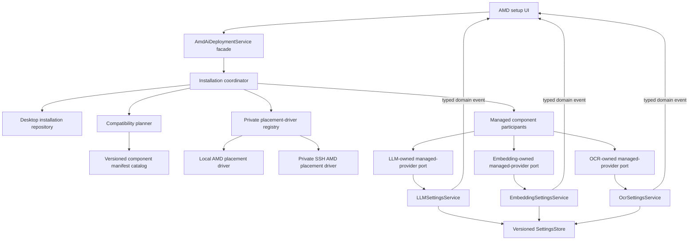
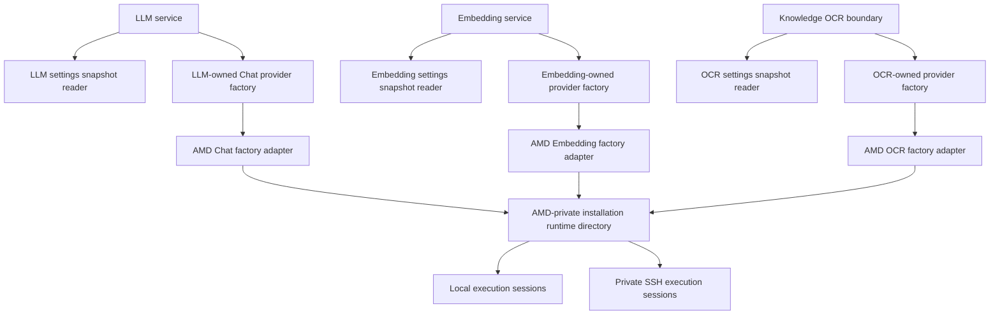

# Architecture Boundary Review

This file owns the second scheme review for complexity isolation, extensibility,
boundary cleanliness, and state ownership. It is design evidence, not an
implementation plan or an accepted durable contract.

## Verdict

The product direction remains sound:

- one placement-neutral `AmdAiDeploymentService` is the guided control-plane
  facade;
- Local Radeon and Private SSH are peer managed placements;
- LLM, Embedding, and OCR retain their own settings, selection, protocol, and
  result semantics;
- runtime endpoints remain memory-only;
- provider registration is forward-only and never changes selection.

The facade may stay broad in product language while remaining narrow in code. The
packet must not imply that the facade object itself owns installation storage,
compatibility decisions, Local/SSH I/O, provider factories, and live bindings.
Those responsibilities have different authorities and change for different
reasons.

The review therefore adopts **one authority with several narrow views**, not one
class per noun and not an open-ended plugin framework.

## Corrected Topology

### Control plane



`AmdAiDeploymentService` exposes use cases and read-only status. The installation
coordinator owns the state machine. The compatibility planner decides whether
observed target facts satisfy a pinned manifest. A placement driver only performs
Local or SSH realization I/O and returns observations/evidence. Managed component
participants call capability-owned ports; they contain no provider document or
selection logic.

### Inference plane



The three factory ports belong to their consuming capability domains. AMD-owned
adapters implement those ports and are siblings of the deployment facade; the
facade is never called from an inference request. The private runtime directory
only finds the exact installation session for an AMD adapter. It is not a public
`AmdRuntimeBindings` aggregate, is not persisted, and never crosses into a
capability domain.

## Ownership Ledger

| Fact | Sole authority | Projection or executor |
| --- | --- | --- |
| Installation identity, immutable placement, desired presence, generation lifecycle | Desktop AMD installation record mutated by the installation coordinator | Target manifests and UI status are projections |
| Exact artifacts, runtime, model, protocol, self-test requirements | Versioned component manifest | Installation generation pins its digest |
| Local/SSH files, processes, forwards, runtime incarnation, observed target facts | Placement-specific execution session | Coordinator consumes evidence; it does not copy live state |
| Generation realization on a target | Placement driver/session | It realizes an app-owned generation ID; it does not create normative generation identity |
| Managed provider catalog, selection eligibility, active/default selection | Matching capability settings owner | AMD entry is an owner-tagged projection |
| Settings document revision and atomic commit order | `SettingsStore`, per document | Domain service validates commands and emits typed events |
| Provider factory selection | Capability-local process registry | AMD contributes one implementation; deployment does not register factories dynamically |
| Admission to one AMD generation and scoped use count | Private per-generation admission gate in the AMD installation runtime | Capability-specific adapter holds the permit for the semantic operation scope |
| Conversation references, vector-space identity, OCR page/result semantics | LLM, Embedding, and OCR/Knowledge domains respectively | AMD supplies exact generation/provenance references only |
| Private SSH credential and host trust | Placement credential/trust owner | Installation stores opaque references only |

The execution target owns realization, not the normative generation. A target-side
manifest is evidence of what is materialized; the desktop installation record
remains the desired-state and lifecycle authority.

## Data Chain

The previous `AmdExecutionProfile` wording overloaded user intent, resolved
software identity, runtime observation, and status. The accepted one-way chain is:

```text
AmdDeploymentIntent
  -> immutable InstallationSpec with one placement
      -> ComponentManifest digests
          -> ComponentGenerationRecord
              -> target GenerationRealization
                  -> RuntimeAttestation
                      -> capability-owned provenance projection
```

- `AmdDeploymentIntent` is a command value, not durable runtime truth.
- `InstallationSpec` fixes `installation_id`, exactly one tagged Local/SSH target,
  and the chosen profile. Changing placement creates a new installation.
- a component manifest is the sole technical descriptor for artifacts, model,
  runtime, protocol, compatibility requirements, and self-test;
- a generation record owns lifecycle and references one manifest digest;
- the driver observes the target and materializes the requested generation;
- runtime attestation is immutable evidence linked to generation and runtime
  incarnation, not a mutable health flag;
- live health remains an ephemeral session observation.

If the name `AmdExecutionProfile` is retained, it denotes only the immutable
resolved profile referenced by `InstallationSpec`. It is not a service, target
reference, live status object, or compatibility authority.

## Provider and Factory Boundaries

`ProviderCatalog` and `ProviderFactoryRegistry` are different:

- the catalog is durable capability state: provider instances, exact managed
  targets, display metadata, and selections;
- the factory registry is process-local composition: provider target variant or
  protocol to a factory implementation. It owns no provider instance or selection.

A managed provider target is an explicit domain variant, not data hidden in a wire
dialect bag:

```text
StaticEndpointTarget | ManagedLlmProviderRef
StaticEndpointTarget | ManagedEmbeddingProviderRef
LocalPaddleTarget | ManagedOcrProviderRef
```

ROCm is not one of these wire variants. It remains deployment/runtime/provenance.

Each capability-owned managed reference includes an opaque `manager_id` plus the
installation and component-generation IDs. Capability code dispatches through its
app-scoped explicit factory registry and never imports or branches on an AMD type.
An unknown manager remains a typed unavailable projection rather than invalid
settings or an automatic fallback.

Every managed provider instance ID is immutable and contains or is
deterministically derived from `(owner, installation_id,
component_generation_id)`. Registering G2 creates a new catalog entry. It may never
replace G1 behind an unchanged provider key or model selection. A stable display
name may be reused, but selection always identifies the exact instance.

The managed projection also carries capability-normalized, immutable display and
compatibility metadata plus the component-manifest digest. That data is explicitly
a projection of the installed manifest. It contains no URL, port, token, health,
placement, or runtime incarnation.

## State Dimensions

`READY` must not be a persisted generation state. Keep independent time scales:

| Dimension | Example values | Owner |
| --- | --- | --- |
| Desired lifecycle | present, retiring, absent | AMD installation |
| Materialization | staging, verified, failed, repair-required, removed | AMD generation record |
| Registration | absent, active projection, retiring projection | Capability settings owner |
| Runtime availability | stopped, starting, healthy, unreachable | Execution session |
| Selection/reference | selected, referenced, unreferenced | Capability domain |
| Product status | installed, operational, blocked, degraded | Read-only derived status |

The UI may say operational only when its required current facts support that
statement, with reasons and observation time. It may not persist an aggregate
`READY` boolean. A successful registration command is an observation, not a second
durable registration-presence flag; status queries the capability owner by exact
reference.

## Removal Without a Cross-Domain Transaction

The prior “preflight every owner, then accept removal with zero mutation” promise is
not race-free. A selection or durable reference can appear after preflight, and
making three domains reserve atomically would recreate a private two-phase
transaction.

Removal instead means an explicit, monotonic retirement request:

1. the installation authority commits desired absence and `RETIRING`;
2. the same per-generation gate closes new AMD operation admission; permits
   obtained earlier remain counted until their semantic scopes end;
3. forward reconcile asks each capability owner to mark the exact managed
   projection retiring and unavailable for new selection, without changing an
   existing selection;
4. current selection or durable-reference policy may leave the installation in
   `REMOVAL_BLOCKED`; the UI asks the user to select another provider or resolve the
   LLM-owned reference policy;
5. each capability owner atomically removes only its exact entry once its own
   blockers are clear;
6. after all projections are absent and scoped use is zero, the placement driver
   removes the realization and the installation reaches absent;
7. crash recovery resumes only forward. Canceling retirement is not rollback;
   reinstallation creates a new generation or installation.

Linearization is local to the installation authority: while holding the generation
gate lock, the command prevents new admission and durably commits `RETIRING` before
reporting success. A failed durable commit reports failure and publishes no accepted
retirement. A process crash after commit destroys local permit accounting and
consumers, but remote compute may still run. Restart reconstructs the gate closed
from durable `RETIRING`, fences the old runtime incarnation, and applies a
placement-specific orphan-drain policy: wait through the bounded maximum request
deadline plus grace, or terminate the owned process when that policy permits.
Physical removal cannot treat the empty new-process counter as proof that old remote
work ended. This is one authority transition, not a transaction across capability
settings.

A selection racing before the retiring projection is published is safe: the AMD
gate already refuses new operations, and the capability removal command observes
the selection and blocks deletion. A selection racing with the capability command
either commits first and becomes a blocker or loses against removal/retirement and
is rejected by that domain. No global lock is required.

The admission gate counts access to the AMD generation, not HTTP connections. AMD
adapters hide the permit:

- Chat holds it across retries and the full stream, releasing it in `finally` even
  if the consumer abandons the generator;
- Embedding `freeze()` remains resource-free; each `embed_texts` holds one permit
  across every batch;
- the OCR parent holds it from spawn preparation until child exit.

The capability owns the meaning and boundary of its operation. The AMD runtime owns
whether its retiring generation may be used and whether all issued permits have
returned.

## Placement and Component Isolation

A placement driver answers **where and how**. A component manifest/recipe answers
**what exact service is installed and how it proves itself**. Capability adapters
answer **how Xenix calls and interprets it**.

- Local/SSH branches appear only in the private driver registry and
  placement-specific diagnostics.
- LLM/Embedding/OCR branches appear only in component manifests, capability
  participants, and capability factories.
- placement drivers do not parse OpenAI, KServe, PAGE, or model semantics;
  component verification may invoke a pinned protocol-specific self-test and return
  evidence for the coordinator to judge.
- the current baseline is HTTP. The private binding should therefore be named
  `LoopbackHttpBinding`, not the falsely generic `OperationBinding`. A future
  non-HTTP transport would add a private tagged transport variant.

Composition registers available drivers. The immutable installation target chooses
one. A generation upgrade cannot change placement; a Local-to-SSH or SSH-to-Local
move creates a new installation.

## Bounded Extension Points

| Change | Expected change zone | Must remain unchanged |
| --- | --- | --- |
| New Local/SSH-like placement | New driver, target variant, compatibility/acceptance evidence | Capability settings, provider factories, results |
| New engine/model using an admitted protocol | Manifest/recipe and evidence | Placement lifecycle, settings store, capability semantics |
| New protocol for one capability | That capability's target variant/factory adapter plus manifest/self-test | Other capabilities and placement drivers |
| New managed capability | Its settings owner, factory port/adapter, manifest, and one private managed-component participant | Existing capability domains and core lifecycle algorithm |
| New accelerator vendor | A separate deployment module may implement the same capability-owned ports | Do not generalize AMD lifecycle prematurely |
| Remove AMD one-click | Delete the AMD slice plus bounded app/UI/spec anchors after decommission | SettingsStore, capability/Knowledge/Agent/Paddle paths, released migrations |

The deployment coordinator iterates a private collection of managed-component
participants rather than hard-coding three settings services into its state
machine. The product profile still explicitly requires LLM, Embedding, and OCR.
This collection is not a global provider registry: it contains only control-plane
projection/status functions and no provider configuration or request client.

## Hard Cut-off Boundary

AMD depends inward on owner-neutral capability ports and primitive storage
contracts. Generic LLM, Embedding, OCR, Knowledge, Agent composition, SettingsStore,
storage bootstrap, diagnostics, and smoke do not import AMD or discover it through
entry points. AMD factories register only through one build-owned app composition
anchor; generic built-ins remain deterministic when that contribution is absent.

The removable slice and negative-build proof are defined in
[the hard cut-off contract](../implementation/hard-cutoff.md). Released AMD tables
remain inert forward-migration history. Old managed refs load as
`provider_implementation_unavailable` without fallback or selection rewrite. A
released feature is first retired by a build that still owns cleanup; only a later
build removes the owner code.

## Repository Falsification Evidence

- `LLMService` currently builds `OpenAICompatibleChatProvider` directly from a
  static `base_url`/API key. A real LLM-owned factory port is required; an AMD
  reference must not be hidden in `dialect_config`.
- `LLMSettingsSource` exposes `save`, and `LLMService` forwards it. Inference must
  receive a read-only snapshot port, while UI and AMD receive separate command
  views of the same domain settings owner.
- `LLMSettings` currently auto-selects the first provider when the default
  disappears. Managed-provider removal must not use that validator behavior to
  silently change selection.
- Embedding `freeze()` is used for profile inspection and must not acquire a live
  binding. Its current fingerprint includes `base_url`; the managed profile must
  instead bind vector-space identity to exact model/tokenizer/component generation.
- production Knowledge import constructs Paddle OCR inside a spawned child.
  AMD OCR needs an engine-neutral, spawn-safe OCR specification/factory; injecting
  a main-process session does not reach that path.
- current OCR routing, runtime descriptors, Workspace status, UI, logs, and
  provenance name Paddle. The neutral seam includes provider/session/result/status
  and spawn composition, not only one new HTTP adapter.
- current OCR code can collapse broad validation/provider failures into an
  unavailable/no-text path. A managed transport/protocol failure must remain typed;
  only the Knowledge owner decides page/document partial-result policy.
- the existing ML worker pool owns bounded batch execution, not reusable inference
  processes or tunnels. Reusing its policy would merge incompatible lifecycles.
- an in-process generation permit cannot survive a controller crash while remote
  inference may continue. Request deadlines, runtime-incarnation fencing, and
  placement-specific orphan drain/termination are required before physical removal.

## Resolved Decisions and External Admission Facts

The packet now fixes the LLM stale-reference policy, SQLite installation authority,
cross-platform settings writer fence, PAGE profile/failure semantics, strict
public-key SSH trust model, owner/incarnation fencing, authenticated runtime
services, fixed three-component profile, and hard cut-off topology.

Capacity bytes, exact deadlines/resource ceilings, artifact availability, target
reachability, host key, GPU/OS/ROCm facts, and fresh-cell evidence are measured
external admission facts. A manifest cannot be admitted until they are quantified;
the product does not turn them into model/fallback/continue-anyway choices.
