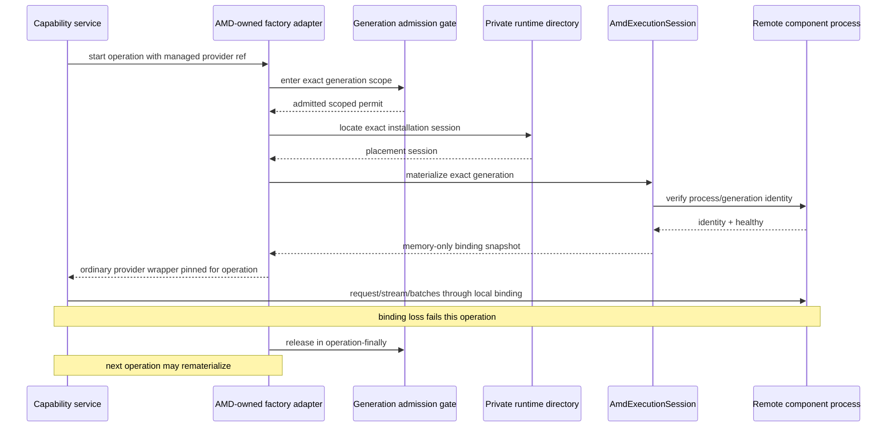

# Dynamic Managed Endpoint Options

This file owns design evidence for presenting managed Local Radeon or Private SSH
services to ordinary capability clients. It incorporates the no-rollback
[scheme review](../scheme-review.md) and is not an accepted runtime contract.

## Problem

A local service listener or SSH forward is a live runtime binding. It can change
after a disconnect, process crash, port collision, app restart, or installation
repair. Persisting it as provider `base_url` makes capability settings stale.

A public endpoint resolver or lease avoids stale persistence but leaks transport
ownership, cleanup, and failure semantics into Chat, Embedding, and OCR. A custom
app-lifetime gateway hides port changes, but adds a proxy lifecycle and still cannot
turn a lost in-flight operation into a safe replay.

The required property is smaller: each capability operation needs a verified,
memory-only binding to one exact immutable component generation.

## Compared Options

| Option | Benefit | Structural cost | Result |
| --- | --- | --- | --- |
| Public per-operation `EndpointLeaseResolver` | Dynamic port/credential never persist | AMD transport and release contract leak into three capability domains | Reject |
| Persist fixed local `ssh -L` ports as `base_url` | Ordinary clients need no composition seam | Live state becomes settings authority; restart/repair causes cross-settings churn | Reject |
| Provider-owned SSH transport | Natural for one provider | Repeats target/process ownership and does not fit Embedding freeze or OCR spawn uniformly | Reject as common topology |
| App-lifetime loopback gateway | Can keep a stable process-local URL across upstream changes | Adds proxy security, streaming, buffering, drain, and double-authority complexity; cannot safely replay semantic operations | Optional only for a measured continuity SLO |
| Private operation-bound binding projection | No live state persists; capability receives an ordinary client; current operation has explicit failure semantics | Composition adapters and exact operation fencing are required | Preferred baseline |

## Preferred Baseline

`AmdAiDeploymentService` remains the placement-neutral public control-plane facade.
It is not called by inference. At composition, the AMD module owns a private
process-local installation runtime directory keyed by exact installation identity.
That directory supports multiple Local and SSH installations and locates the
installation's placement-specific `AmdExecutionSession`, which is the sole owner
of:

- local process or SSH control and deployment-owner incarnation;
- target generation realizations and their observed identity;
- runtime availability and health observations;
- loopback-bound local forwards;
- memory-only HTTP binding publication.

The desktop installation record remains the normative owner of generation identity
and lifecycle. The session only realizes and observes the exact generation it was
commanded to run.

At application composition, the AMD module contributes separate Chat, Embedding,
and OCR factory adapters behind capability-owned factory ports. Each adapter uses
the private runtime directory; it does not close over one global session and does
not expose the directory to capability code. Capability settings persist only
their own stable reference:

```python
@dataclass(frozen=True, slots=True)
class ManagedEmbeddingProviderRef:
    installation_id: str
    component_generation_id: str
```

LLM and OCR own parallel domain types; a common `component` discriminator and
shared public `ManagedEndpointRef` are unnecessary. These references contain no
URL, port, token, health, runtime incarnation, connection, or release obligation.

The current admitted protocols are HTTP, so the private process-local projection is
named precisely:

```python
@dataclass(frozen=True, slots=True)
class LoopbackHttpBinding:
    installation_id: str
    component_generation_id: str
    runtime_incarnation: str
    base_url: str
    bearer_token: str = field(repr=False)
```

These sketches describe the proof shape, not approved APIs.

The runtime directory is not the rejected public `AmdRuntimeBindings` aggregate:
it is an AMD-internal multi-installation lookup used only by AMD adapter
implementations, has no persisted endpoint data, and returns no capability-visible
resolver or lease.

## Sequence



## Operation and Fencing Invariants

- One operation pins `(installation, component generation, runtime incarnation)`
  from start to finish.
- Chat operation scope includes the complete request or entire stream and its
  internal retries; abandoned streams release the permit in `finally`.
- Embedding `freeze()` remains resource-free. Its operation scope is one
  `embed_texts`, including every batch.
- OCR scope includes parent preparation, spawn, child inference, and child exit.
- A reconnect or changed local port never changes the component generation inside
  an operation.
- A late callback from an older runtime incarnation cannot publish or overwrite a
  newer binding.
- Before publishing any binding, the runtime verifies that the target process
  belongs to the requested generation; local port reuse conveys no identity.
- Disconnect fails the current operation. Neither the runtime nor adapter replays a
  partially sent semantic request. The next operation may bind again.
- `EmbeddingService.freeze()` remains resource-free. Vector-space identity uses
  model/tokenizer/component-generation identity, not URL, local port, runtime
  incarnation, or aggregate profile revision.
- The OCR parent holds the generation permit and passes a redacted memory-only spawn
  specification. The child uses an ordinary protocol client and imports no AMD
  runtime type.
- Every listener binds loopback only. Tokens are memory-only, redacted, absent from
  URLs/logs, and scoped to one runtime incarnation/generation.
- Binding success is not ROCm evidence; backend/device/workload correlation is
  still required remotely.

## Removal Admission

Removal correctness depends on scoped generation use, not transport connections.
It must also avoid an impossible cross-domain zero-mutation preflight:

1. accepting the user's request durably establishes desired absence and
   `RETIRING`;
2. the same AMD installation-runtime command closes the private per-generation
   admission gate, while already-issued permits remain counted;
3. forward reconcile asks every capability owner to mark the exact provider
   projection retiring/unselectable without changing an existing selection;
4. selected/durable references are reported as `REMOVAL_BLOCKED`; the relevant
   capability owns how the user clears them;
5. each domain atomically removes its exact managed entry after its blockers clear;
6. after scoped use reaches zero and all projections are absent, stop and remove
   the target realization;
7. after crash, continue toward absence and never resurrect the generation.

The gate check and permit increment are one linearized AMD-runtime boundary. The
retirement command holds that gate against new admission while it durably commits
`RETIRING`, then reports success. A failed commit publishes no accepted retirement;
a process crash after commit reconstructs the gate closed on restart. Because
remote compute may outlive the lost local permit counter, restart also fences the
old runtime incarnation and waits through a bounded maximum request deadline plus
grace, or applies an admitted owned-process termination policy. It never treats a
fresh zero counter as proof that old remote work ended.
Capability-specific wrappers define and hold the semantic duration, so the gate does
not infer quiescence from zero HTTP connections. Normal live retirement does not
cancel or interpret capability operations; post-crash orphan cleanup follows the
bounded placement policy because the original local consumer no longer exists.

The former “preflight all domains, then return busy with zero mutation” rule is
rejected. A new selection can appear after preflight; atomically reserving three
settings domains would recreate a private two-phase transaction. With monotonic
retirement, a racing selection either commits first and becomes a visible blocker
or is rejected by the domain retirement/removal command. The already-closed AMD
gate prevents it from starting a new operation.

Persisted LLM conversation model references require an LLM-owned classification:
either they block removal, or they later produce an explicit stale-reference
failure/migration. Deployment must not rewrite conversations.

## Multi-Controller Constraint

Process-local fencing is insufficient if two desktop clients target the same
installation. Before product admission, the placement must enforce one current
deployment owner/incarnation for publication and deletion: a local lock/process
authority for Local Radeon and remote owner fencing for Private SSH. Stale
controllers and callbacks must fail closed.

## Optional Gateway Reconsideration

A byte-transparent loopback gateway may be revisited only if measured product
requirements demand a stable process-local URL across binding changes. It is not a
correctness prerequisite. Admission would separately require OpenAI JSON/SSE and
KServe binary transparency, bounded buffering/backpressure, authentication,
half-close, abrupt disconnect, generation fencing, and deterministic shutdown.

Even then, an in-flight disconnect still fails the semantic operation unless the
capability protocol itself proves safe replay. Gateway connection counts still
cannot authorize removal.

## Admission Evidence

The preferred baseline must prove:

- operation boundary pinning for Chat stream/retry, Embedding multi-batch, and OCR
  parent/child lifecycle;
- two simultaneous Local/SSH installations resolve through the private runtime
  directory without a global current session or a deployment-service call;
- target process identity and runtime-incarnation fencing under reconnect/restart,
  port reuse, late callbacks, and app restart;
- loopback bind, token redaction, bounded timeouts, orphan cleanup, and deterministic
  shutdown;
- atomic `RETIRING` plus generation-gate closure, operation-finally release, and
  monotonic blocked-removal reconcile without cross-domain preflight;
- controller-crash orphan work bounded by server deadlines plus
  placement-specific drain/termination before physical realization removal;
- placement-appropriate deployment-owner fencing across two client processes;
- settings contain only immutable capability-owned references and never live
  bindings.
