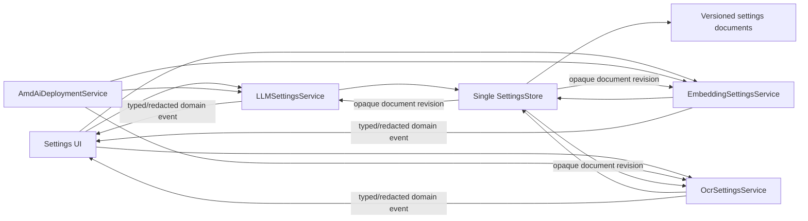

# Settings Mutation Authority

This file owns the scheme review for settings persistence and concurrent mutation.
It is task evidence, not an approved public API or storage migration.

## Finding

The lost-update risk is architectural, not an AMD-specific retry problem.

The current app composition creates one `LLMSettingsService` and one
`EmbeddingSettingsService` instance, but their persistence APIs still load and save
complete documents. `SettingsDialog` keeps mutable snapshots and later writes newly
constructed full LLM and Embedding settings. If AMD registration changes a provider
entry while the dialog is open, a later UI save can overwrite that change even when
both calls pass through the same Python object.

A singleton mutex would only serialize two stale writes. It would not prevent the
later stale snapshot from winning.

## Accepted Task-plan Authority Model

Use one app-lifetime `SettingsStore` instance as the sole physical persistence
writer for the versioned capability settings documents participating in this
design. Keep domain semantics in app-lifetime
`LLMSettingsService`, `EmbeddingSettingsService`, and `OcrSettingsService`
facades built over that store:



The split preserves one authority without creating a global settings god service:

- `SettingsStore` owns persistence mechanics only: current document revision,
  serialized mutation, compare-and-swap, atomic durable replace, recovery from an
  interrupted write, and opaque per-document revision notification;
- each domain settings service owns its schema, validation, provider identity,
  selection invariants, secret policy, legal commands, and typed/redacted events;
- UI and AMD deployment call only the relevant domain settings service;
- only capability domain settings services receive `SettingsStore`; UI, AMD
  deployment, and inference services never receive it or call a generic “save
  arbitrary JSON” API;
- capability inference services receive only an immutable snapshot-reader view;
  UI receives user-command and event views; AMD receives only the managed-provider
  projection port. The same domain service may implement all three narrow views.

Storage may remain versioned files or later move to SQLite; the authority and
command contracts do not depend on that choice. No transaction across LLM,
Embedding, and OCR is required.

## Command Semantics

Full-document `save(settings)` is not an acceptable shared mutation boundary.
Commands are domain-specific:

- replace or patch user-owned provider fields with an `expected_revision`;
- set a capability-owned active/default model reference;
- upsert one manager-owned provider identified by opaque `manager_id`,
  installation, and component generation;
- mark that exact managed provider retiring/unavailable for new selection;
- remove that exact managed provider if the capability's reference policy allows;
- update non-provider preferences owned by the capability.

The AMD dependency direction is strictly:

```text
AmdAiDeploymentService
  -> LLMSettingsService / EmbeddingSettingsService / OcrSettingsService
      -> SettingsStore
```

The AMD deployment command contains only its desired managed projection. It cannot
read or write unrelated provider credentials, user provider fields, or active
selection. It does not load from or commit to `SettingsStore`. The matching domain
service applies the command to the latest authoritative document under the store's
serialization boundary.

Every managed provider instance identity includes or is deterministically derived
from `(owner, installation_id, component_generation_id)`. An ensure for G2 creates
a new entry; it cannot replace G1 behind an unchanged provider key or selection.
The command includes capability-normalized immutable display/compatibility metadata
and the component-manifest digest. These are read-only projections; URL, port,
token, health, placement, and runtime incarnation remain excluded.

The domain configuration uses an explicit tagged static-versus-managed provider
target. A managed reference is not placed in a protocol `dialect_config`, because
deployment identity and wire dialect are orthogonal.

`Managed*ProviderRef` belongs to the capability domain and treats `manager_id` as
opaque. It imports no AMD type. If the corresponding factory contribution is
absent, the entry remains parseable and read-only, inference fails typed
`provider_implementation_unavailable` before dispatch, and no selection or
fallback changes. Explicit removal still follows that capability's blockers.

The Settings UI does not resubmit managed entries copied when the dialog opened.
It submits only user-editable changes plus the revision they were based on. Managed
entries are read-only projections in that form. A revision conflict causes an
explicit refresh/rebase flow; it never silently overwrites the newer state.

## Revision and Notification

Every successful document mutation:

1. reads the current document and revision inside the writer boundary;
2. validates the domain command and ownership preconditions;
3. derives the next immutable document;
4. atomically persists it with the next revision;
5. lets the domain owner publish a typed/redacted change event after durability
   succeeds.

The UI subscribes to the relevant domain projection. If AMD registration occurs
while the settings dialog is open, the dialog can refresh managed entries and mark
conflicting user edits instead of holding an invisible stale snapshot.

Snapshot plus subscription must have no missed-update window, for example through
`watch(after_revision)`. The store may expose only an opaque
`(document_id, revision)` notification; it lacks the domain knowledge to redact
secrets or name changed provider identities. Domain events are ordered by document
revision, emitted after durability succeeds and outside the writer lock, and
contain only typed redacted cause and changed identities. A clean dialog may
refresh; a dirty dialog records an external conflict and preserves unsaved controls
until the user explicitly reloads/rebases.

Inference operations may read snapshots without taking the writer lock. A snapshot
is immutable and revisioned; the next natural operation boundary sees a later
revision.

## Process Boundary

One in-process instance is sufficient only if no other process can write settings.
Current Windows GUI startup has a `SingleInstanceGuard`, while non-Windows startup
does not establish the same mutex and spawned workers must not become settings
writers.

The accepted mechanism is an app-lifetime settings-root OS file fence, using a
small injectable standard-library Windows/POSIX adapter. Child workers are
read-only. It does not depend on the Windows-only app single-instance guard and
fails closed before a second process can become a writer.

## Failure Semantics

- A failed mutation changes no document revision.
- A successful mutation is never compensated by restoring an older document.
- Marking a manager-owned entry retiring does not change any active/default
  selection. A
  selection racing with that command either commits first and remains an explicit
  removal blocker or is rejected because the entry is retiring/absent.
- A multi-domain UI action may report that one independent domain succeeded while
  another failed; it does not manufacture cross-domain atomicity with rollback.
- Embedding compatibility/rebuild confirmation is bound to the same expected
  revision as the mutation. A conflict requires reloading and recalculating it.
- A composed manager reads current durable documents and resumes only its missing
  forward projections. With that manager absent, old refs remain typed unavailable
  and no forward reconcile runs.
- Corrupt or unsupported documents fail closed with bounded recovery; a writer
  never replaces them using a stale UI snapshot.

## Repository Evidence

- `src/xenix/app.py` constructs one LLM and one Embedding settings service and
  injects them into the app graph.
- `src/xenix/services/llm/service.py` exposes `load()` plus full-document
  `save(settings)` and writes the JSON path directly. `LLMService` also receives
  that mutating source and forwards `save_settings`, so read and mutation ports are
  not yet separated.
- the current LLM validator silently chooses the first provider if the configured
  default disappears; a managed-provider removal must replace that behavior with an
  explicit domain blocker/policy rather than an implicit selection change.
- `src/xenix/services/embedding_service.py` does the same for Embedding.
- `src/xenix/ui/settings_dialog.py` loads snapshots, constructs both complete
  settings values, and saves LLM followed by Embedding.
- `src/xenix/single_instance.py` uses a Windows named mutex and is a no-op on other
  platforms.
- OCR has no provider settings owner yet.

## Admission Evidence

- all production writers for these capability settings documents are routed
  through one `SettingsStore` instance;
- no UI, deployment service, child worker, or capability service writes settings
  files directly;
- stale-revision UI save versus AMD upsert produces an explicit conflict or correct
  merge, never lost data;
- AMD commands cannot change unrelated providers, secrets, or selections;
- manager-owned settings commands and schemas import no AMD module/type and old
  refs remain readable with the AMD contribution absent;
- G2 ensure cannot redirect a G1 provider instance or selection;
- atomic-write failure and app termination preserve the previous valid revision;
- opaque store notifications are translated by the domain owner before a
  typed/redacted event reaches an already-open Settings UI;
- multi-process behavior is fail-closed on every supported desktop OS;
- restart continues forward reconcile without snapshots, compensation, or rollback.
