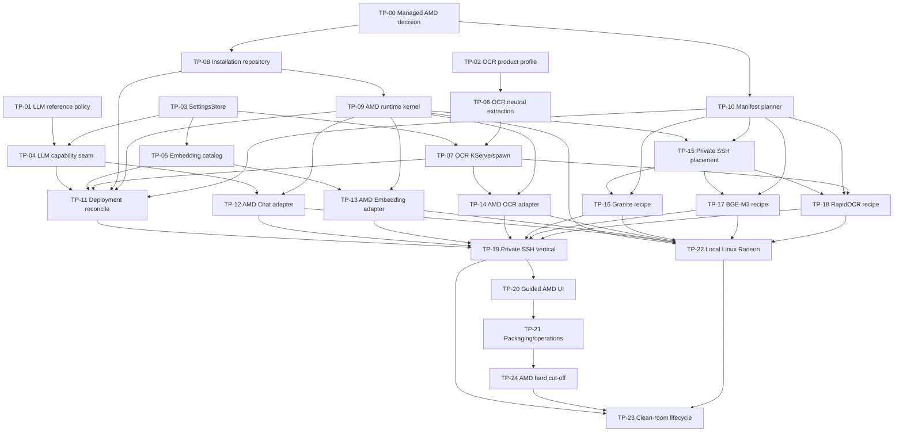
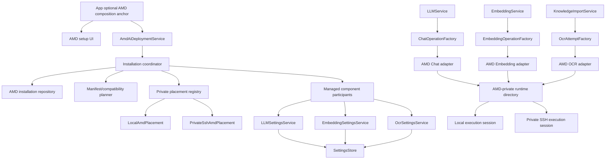
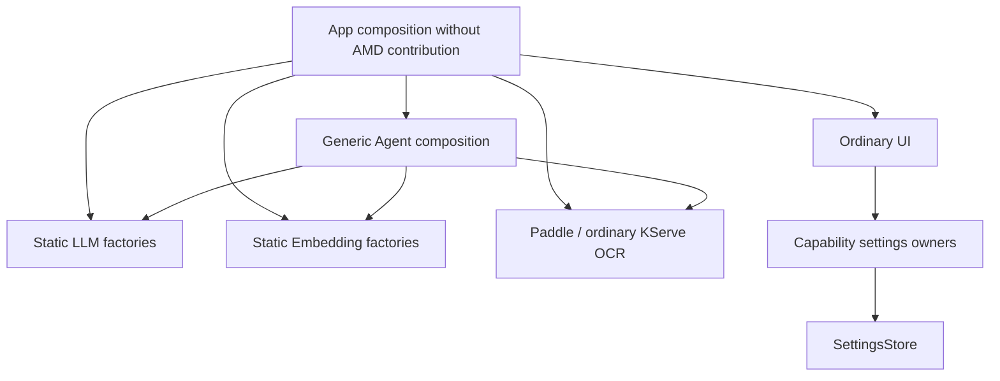

# Implementation Dependency Graph

This graph is the execution order, not the runtime topology.

## Runtime Topology Produced by the Plan

The deployment facade never appears in the inference path. The settings store
never emits domain payloads to UI. A spawned OCR worker receives an ephemeral
ordinary OCR spec and never imports the AMD module.

## AMD-absent Topology

Only the bounded app composition anchor points toward AMD. Capability registries
are explicit app-scoped instances; capability modules, Agent composition, generic
startup/shutdown/diagnostics, and spawned OCR workers never import AMD or discover
it through ambient entry points. Removing the AMD contribution therefore removes a
leaf slice rather than breaking the graph.

## Shared Edit Hotspots

| Hotspot | Sole task owner |
| --- | --- |
| SQLite model/migration edge | TP-08 |
| `knowledge_pipeline.py` Paddle-neutral extraction | TP-06 |
| `knowledge_import_worker.py` ephemeral provider spawn | TP-07 after TP-06 |
| `llm/service.py` retry/stream scope | TP-04 |
| `embedding_service.py` schema/fingerprint | TP-05 |
| `app.py` composition | TP-19 |
| `settings_dialog.py` AMD/conflict UI | TP-20 |
| packaging and operational runbooks | TP-21 |
| cutoff verifier and negative build | TP-24 |

The existing `services/ml/worker_pool.py`, `ml/execution.py`, and
`ml/ssh_worker_setup.py` are outside ownership. They may be read for OpenSSH
experience but may not become dependencies of the long-lived AMD inference
lifecycle.
