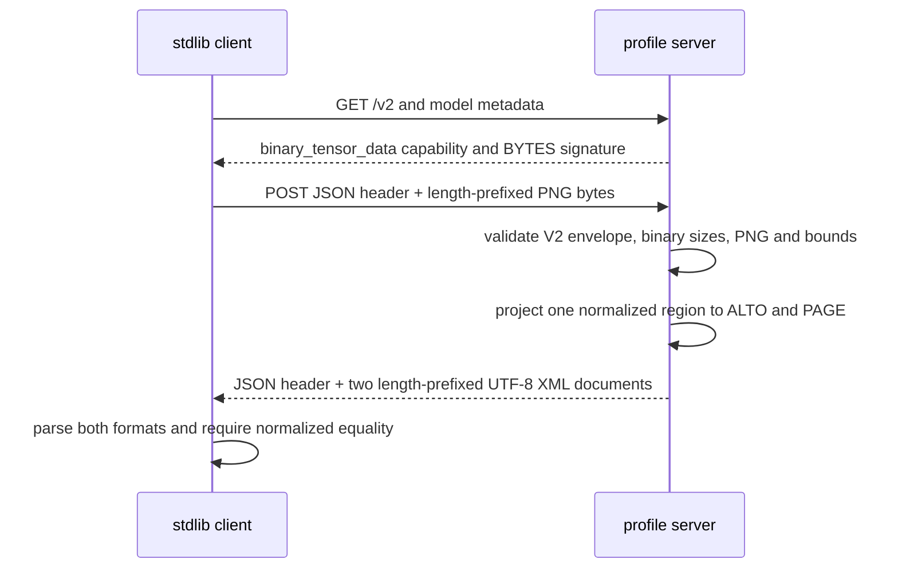

# KServe V2 Structured OCR Protocol Spike

**Status:** verified isolated spike

**Scope:** Python standard library only for the server, client, and black-box tests;
no product code, project dependency, database, or remote runtime is changed.

## Outcome

This spike demonstrates one concrete composition rather than a new OCR API:

- KServe V2 / Open Inference Protocol HTTP/REST supplies health, metadata,
  model version, inference envelopes, typed tensors, and error envelopes.
- The optional Binary Tensor Data Extension carries the real PNG bytes and both
  UTF-8 XML outputs. It is optional for general V2 compliance, but **required by
  this profile** because base V2 JSON does not define arbitrary image bytes as
  base64.
- One deterministic normalized Chinese region is projected to both ALTO XML 4.4
  and PRImA PAGE XML 2024-07-15, then parsed back and compared.

The server is intentionally a fixture generator, not an OCR engine. This keeps
wire-format feasibility separate from model accuracy or ROCm execution.

The separation is now exercised: the follow-on
[Radeon Cloud spike](../radeon-cloud/README.md) runs real RapidOCR Det/Cls/Rec on
ROCm and serves the leading PAGE-only profile through KServe V2. Its generated PAGE
document passed the same pinned official XSD. This directory remains the
dependency-free protocol fixture and ALTO comparison; it does not become the
runtime server.

## Review Interpretation

The 2026-07-28 [scheme review](../../scheme-review.md) keeps this directory as
historical executable evidence; it does not silently revise the spike into the
proposed product profile.

- The spike's dual PAGE+ALTO output proves selected-field equality for one fixture,
  not general semantic equivalence. The leading product profile is PAGE-only; ALTO
  remains comparison/compatibility evidence.
- `TextEquiv/@index=0` is valid under the downloaded PAGE XSD, but the proposed
  OCR-D-aligned product profile uses preferred `index=1` and still needs an
  unambiguous TextRegion/TextLine/reading-order contract.
- The self-client/self-server exchange is not independent KServe conformance.
  Custom metadata values used by the fixture server are not standard capability
  negotiation tokens.
- KServe V2 has no standard server-side cancellation endpoint. This spike proves
  neither hard cancellation nor bounded remote work after a client disconnect.
- The 8 MiB/dimension checks are fixture guards, not a complete product resource
  policy; decoded pixels/bytes, XML structure, response size, concurrency, and
  in-flight memory remain admission work.
- Coordinates are fixture-image pixels. A real service must inverse-map every
  crop/rotation/deskew/dewarp transform to the exact request-image coordinate space.

## Fixed Profile

Model: `ocr-structured`, version `1`.

| Direction | Tensor | Datatype / shape | Profile semantics |
| --- | --- | --- | --- |
| Input | `image` | `BYTES` / `[1]` | One PNG, `content_type=image/png`, 8 MiB maximum |
| Output | `alto_xml` | `BYTES` / `[1]` | UTF-8 ALTO 4.4 XML |
| Output | `page_xml` | `BYTES` / `[1]` | UTF-8 PAGE XML 2024-07-15 |

The request and response bodies use:

```text
JSON header
+ each BYTES tensor as: uint32 little-endian element length + element bytes
```

`Inference-Header-Content-Length` separates the JSON header from tensor bytes;
each tensor declares its complete binary chunk length through
`parameters.binary_data_size`. The request explicitly asks for each output with
`parameters.binary_data=true`. JSON-string base64 input is deliberately rejected:
that encoding is not supplied by the base protocol.

The normalized region contract used only by the spike is:

- Unicode text: `雨季库存增加20%`;
- confidence: `0.97`, constrained to `[0, 1]`;
- one four-point polygon in absolute, top-left-origin pixels;
- page width and height in pixels;
- zero-based reading-order position.

ALTO carries confidence in `String/@WC`, polygon in
`String/Shape/Polygon/@POINTS`, page geometry in `Page`, and explicit reading
order through `OrderedGroup/ElementRef`. PAGE carries the same facts in
`TextEquiv/@conf` + `Unicode`, `Coords/@points`, `Page`, and
`OrderedGroup/RegionRefIndexed`.

PAGE 2024 accepts non-negative integer polygon coordinates, while Xenix's current
normalized polygon can contain floats. This profile therefore rejects fractional
coordinates instead of silently rounding. A product mapping would need an
explicit quantization rule and must acknowledge that it can be lossy.
`TextEquiv/@index` is `0`, which the PAGE XSD permits; this spike does not claim
the separate OCR-D interoperability profile.

## Sequence



## Run

From this directory, start the server:

```powershell
python server.py --host 127.0.0.1 --port 8080
```

In a second terminal, run the client. With no `--image`, it generates a valid
1000 x 1400 PNG using only `struct`, `zlib`, and CRC32:

```powershell
python client.py --base-url http://127.0.0.1:8080 --request-id demo-1
```

Use a real PNG with:

```powershell
python client.py --base-url http://127.0.0.1:8080 --image C:\path\scan.png
```

Run the self-contained black-box verification:

```powershell
python -m unittest -v test_blackbox.py
```

The separate networked XSD check uses the repository environment's existing
`lxml`; it adds no dependency:

```powershell
pdm run python validate_official_schemas.py
```

Validate only PAGE plus an additional real-runtime document with:

```powershell
pdm run python validate_official_schemas.py --page-only `
  --additional-page C:\path\to\rapidocr-page.xml
```

That command downloads and hash-checks the pinned schemas. It is intentionally
not presented as offline-reproducible. See [VERIFICATION.md](VERIFICATION.md) for
the captured results.

## What This Proves

- A stdlib client and server can exchange a real PNG and structured OCR documents
  using the KServe V2 binary extension without inventing base64 semantics.
- The fixed tensor names, shapes, datatypes, version, sizes, and output selection
  are executable.
- Chinese UTF-8 text, confidence, polygon/page coordinates, and reading order
  survive an ALTO/PAGE parser round trip for the fixture.
- Both positive fixtures validate against the downloaded official XSDs at the
  recorded hashes.
- Wrong content type, JSON-string base64, corrupt BYTES length, and fractional
  PAGE coordinates fail closed.

## What This Does Not Prove

- It does not perform OCR, run a neural model, use ROCm/GPU, or prove accuracy,
  latency, throughput, provenance, or no-CPU-fallback behavior.
- It is not an independent Open Inference Protocol conformance suite and has not
  been tested against a second server/client implementation.
- It does not prove Kubernetes, KServe control-plane, gRPC, binary-extension
  interoperability with the eventual runtime, cancellation, retries, multi-page
  documents, batching, streaming, authentication, TLS, or hostile XML hardening.
- One region does not prove lossless coverage of tables, nested layouts,
  alternatives, baselines, glyphs, or complex reading orders.
- ALTO and PAGE equivalence here is only for the admitted normalized fields.
  Their complete data models are not isomorphic.
- The profile-specific `content_type` and `schema_version` tensor parameters and
  the OCR meaning of each output name are not defined by base KServe V2.
- The fixture server's platform/extension metadata is not a claim of standardized
  KServe negotiation or an allowed Open Inference Protocol platform identifier.
- It does not decide whether PAGE, ALTO, or hOCR should become the product format.
  hOCR was not implemented because the added PAGE candidate directly represents
  the required polygon, Unicode, confidence, and reading-order fields.

## Primary Specifications

- [Open Inference Protocol REST specification](https://github.com/kserve/open-inference-protocol/blob/main/specification/protocol/inference_rest.md)
- [KServe Binary Tensor Data Extension](https://kserve.github.io/website/docs/concepts/architecture/data-plane/v2-protocol/binary-tensor-data-extension)
- [Library of Congress ALTO 4.4 schema](https://www.loc.gov/standards/alto/v4/alto-4-4.xsd)
- [PRImA PAGE XML 2024-07-15 schema](https://www.primaresearch.org/schema/PAGE/gts/pagecontent/2024-07-15/pagecontent.xsd)

The PAGE namespace remains
`http://schema.primaresearch.org/PAGE/gts/pagecontent/2024-07-15` even though the
downloadable schema uses the working HTTPS URL above.
