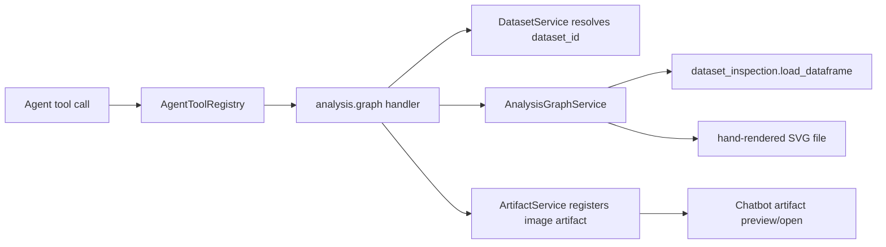
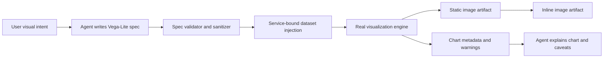

# Exploration

## Current Facts

- `analysis.graph` currently accepts `{dataset_id, operation, params?}` through the Agent tool registry.
- The service maps fixed operations to hand-rendered SVG:
  - `bar_count`
  - `histogram`
  - `scatter`
  - `line`
  - `correlation_heatmap`
- The current service owns dataset loading, column validation, value coercion, output path creation, SVG writing, and graph metadata.
- The Agent tool handler registers the produced SVG as an `ArtifactKind.IMAGE` artifact and returns `artifact_id` plus structured graph metadata.
- `data.query` is a stronger DSL precedent:
  - Agent writes expressive SQL.
  - Service validates statement shape before execution.
  - Execution is bounded.
  - Registered dataset bindings are the only data source boundary.
  - Result payload is structured and bounded.
- Current project dependencies include PySide6, pandas, DuckDB, scikit-learn, statsmodels, xgboost, lightgbm, but not Altair, Plotly, matplotlib, Kaleido, vl-convert-python, or Qt WebEngine as explicit dependencies.
- The user prefers an existing complete engine, analogous to DuckDB for SQL, because Xenix-owned DSLs impose extra burden on the LLM.
- The user does not need compatibility with the old `{operation, params}` contract because the software is not released.
- The user wants `analysis.graph` to stay orthogonal to transformation tools. Data transformation already belongs to `data.clean`, `data.query`, and `data.transform`.
- The user agrees the provider-facing schema should be exactly `{dataset_id, spec}`.
- The user agrees to the first spike.
- The user does not want Vega-Lite transform features specially prohibited for orthogonality reasons.
- Local spike evidence: `vl-convert-python` 1.9.0 was installed into an isolated temp target outside the project environment and successfully converted Vega-Lite specs to SVG and PNG on Windows/Python 3.14.

## Existing Topology

## Current Weakness

- The operation enum makes simple charts easy but becomes brittle as soon as a user asks for grouping, aggregation, faceting, layered reference lines, color encoding, time units, box plots, annotations, or small multiples.
- Adding one operation per chart type grows schema and service code without giving the Agent a general composition model.
- Hand-rendered SVG keeps packaging simple, but it makes visual grammar evolution expensive.
- The current `params` object has no discoverable visual grammar beyond tool description and tests.

## Desired New Shape

## First-Principles Contract

A useful Agent-facing chart contract should separate these concerns:

- Data source: registered dataset ids and optional aliases.
- Visual/statistical reduction needed to draw a chart: aggregate, bin, sort, sample, chart-local limit.
- Visual mapping: mark type and channel encodings.
- Presentation: title, axis labels, legend, tooltip metadata, dimensions, theme.
- Output: artifact format, metadata, warnings, and provenance.

The service, not the Agent, should own:

- allowed source resolution
- schema/type validation
- row and category bounds
- unsupported feature rejection
- renderer selection
- artifact registration
- packaged/offline behavior

## Orthogonality Rule

`analysis.graph` should not own durable data preparation:

- No joins between datasets inside graph calls.
- No cleaning, type repair, imputation, normalization, or materialized derived columns as graph responsibilities.
- No graph-side SQL replacement.
- If data needs business reshaping, the Agent should call `data.query` or `data.transform` first, then graph the resulting registered dataset.

Transform nuance:

- Vega-Lite transform features can remain available as part of the visualization grammar.
- Orthogonality should be enforced primarily at the tool-planning level and data-source boundary: if durable data shaping is needed, the Agent should use `data.query` / `data.transform`; if a Vega-Lite transform naturally belongs to chart construction, `analysis.graph` can render it.
- Xenix still rejects unsafe data access, external resources, unbounded output, and renderer features that cannot be made reliable in the static image path.

## Spike Evidence - `vl-convert-python`

Local commands used system Python 3.14 and a temporary install target because the PDM virtual environment has no `pip` module.

Observed:

- `vl_convert.__version__` reported `1.9.0`.
- `vlc.vegalite_to_svg(spec)` returned SVG text for a simple bar chart.
- `vlc.vegalite_to_svg(spec)` and `vlc.vegalite_to_png(spec)` worked for a spec with top-level Vega-Lite `transform`.
- The PNG output had a valid PNG signature and rendered visibly.
- PNG conversion emitted one `tiny_skia::painter` warning during the transform chart test, but still produced a valid visible image.

Generated spike artifacts:

- `tasks/analysis-graph-dsl-redesign/spike-vl-convert.svg`
- `tasks/analysis-graph-dsl-redesign/spike-vl-convert-transform.svg`
- `tasks/analysis-graph-dsl-redesign/spike-vl-convert-transform.png`

External documentation evidence from sub-agent:

- `vl-convert-python` exposes `vegalite_to_svg`, `vegalite_to_png`, and `vegalite_to_vega`.
- Official docs describe the Python package as dependency-free / self-contained.
- It does not require Node.js, a browser, or network for ordinary conversion.
- Optional font download behavior can touch network and should be disabled or avoided in Xenix.
- PyInstaller-specific official proof was not found; because the package uses platform wheels / native extension behavior, packaged smoke is required.

## Unknowns

- Whether a browser/WebEngine rendering path is acceptable for a native Qt Widgets app.
- Whether interactive output is a real product requirement or just an attractive side effect of Vega-Lite/Plotly.
- Whether multiple input datasets should be allowed directly in `analysis.graph` or should remain composed through `data.query` / `data.transform` before graphing.
- How much policy validation Xenix needs beyond injecting registered dataset values and rejecting external/inline model-supplied data.
- Whether `vl-convert-python` packages cleanly with PyInstaller in both onedir and final distribution flow.

## Candidate Next Posture

- Move toward `Solidify` around Vega-Lite spec + `vl-convert-python` static SVG rendering.
- Remaining pre-implementation proof should focus on sanitizer policy and PyInstaller packaging smoke.
