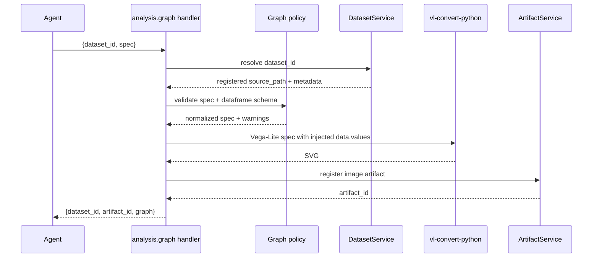

# Sanitizer And Policy Draft

## Why Policy Exists If Input Is `{dataset_id, spec}`

`dataset_id` tells Xenix which registered dataset the user intends to graph.

Vega-Lite `spec` can still carry its own data instructions:

- top-level `data`
- nested unit/layer/facet `data`
- top-level `datasets`
- `url`-based data sources
- inline `values`
- resource hints and config that may affect rendering behavior

So the policy layer is not a custom visualization DSL. It is the boundary that makes the real Vega-Lite engine behave like an Xenix tool:

- one registered dataset in
- bounded static image artifact out
- no external data source
- no hidden local path or network fetch
- no unbounded output

Analogy:

- `data.query` lets the Agent write SQL, but Xenix validates statement shape and binds only registered tables.
- `analysis.graph` should let the Agent write Vega-Lite, but Xenix binds only the registered dataset and controls render bounds.

## Provider-Facing Contract

```json
{
  "dataset_id": "ds_...",
  "spec": {
    "$schema": "https://vega.github.io/schema/vega-lite/v6.json",
    "mark": "bar",
    "encoding": {
      "x": {"field": "region", "type": "nominal"},
      "y": {"aggregate": "sum", "field": "revenue", "type": "quantitative"}
    },
    "title": "Revenue by region"
  }
}
```

The Agent should normally omit `data`. Xenix injects data.

If the Agent includes `data` because it is copying Vega-Lite examples, the first implementation can either reject it with a clear error or strip it and inject the registered dataset. Current recommendation: reject explicit `data` / `datasets` first, because silent replacement can hide model mistakes.

## Proposed Pipeline



## Policy Levels

### Level 1 - Structural Guard

Reject before rendering:

- `spec` is not an object.
- Serialized spec exceeds a fixed size.
- Required visual shape is missing: no `mark`, `encoding`, `layer`, `facet`, `concat`, `vconcat`, or `hconcat`.
- Width/height are negative, non-finite, or exceed Xenix bounds.
- Unsupported output mode is requested.

Suggested bounds for first implementation:

- spec JSON size: 64 KB
- chart width: 200-1600 px
- chart height: 160-1200 px
- direct row injection: 10,000 rows
- output SVG size: cap after rendering, for example 2 MB
- render timeout: bounded by service call timeout or a short worker timeout if needed

### Level 2 - Data Boundary

Reject before rendering:

- Any `data` property in the Agent-provided spec.
- Any `datasets` property.
- Any `url` property that is used as a data/resource source.

Then inject:

```json
{
  "data": {"values": "<records from registered dataset>"}
}
```

Open implementation detail:

- For large datasets, do not inject the full frame. Either cap rows before rendering or require the Agent to pre-aggregate with `data.query` / `data.transform`.
- Current pragmatic option: inject up to the 10,000-row cap and return `truncated: true` metadata. This is acceptable for exploratory charts but can make aggregate charts wrong when the dataset is truncated.
- Stricter option: no blind row truncation for aggregate charts; if dataset exceeds cap, ask the Agent to use `data.query` / `data.transform` first. This keeps charts truthful.

Current recommendation:

- Prefer truthful output over silently sampled aggregate charts.
- Allow full injection only up to the 10,000-row cap.
- If row count exceeds cap, fail with a clear instruction: reduce data first with `data.query` / `data.transform`, or use a chart spec that can be rendered safely after a service-owned sampling policy.

### Level 3 - Field Boundary

Validate referenced fields where feasible:

- Traverse `encoding.*.field`.
- Traverse common transform field refs such as `field`, `groupby`, `sort.field`, `as`.
- Confirm source field names exist in the registered dataframe before rendering.
- Allow generated transform output fields referenced later through `as`, but track them so they do not trigger false unknown-field errors.

Purpose:

- Catch wrong column names before `vl-convert`.
- Give the Agent actionable validation errors.

This is not intended to become a full Vega-Lite compiler. It should cover common field references and let the engine handle deeper grammar semantics.

### Level 4 - Static Artifact Boundary

Reject or warn on features that do not survive static SVG output:

- interactive selections / params if they are used only for interaction
- tooltip-only information if the final artifact is static and tooltip data is not visible
- animations or dynamic behavior if introduced by future Vega features

Current recommendation:

- Do not ban them broadly at first.
- Render statically and return warnings when interaction-only features are detected.

### Level 5 - Presentation Defaults

Normalize only Xenix-owned defaults:

- default width/height if omitted
- optional title fallback from dataset name
- theme/config only when not specified
- no remote font downloading

Avoid overriding user/Agent visual choices unless needed for reliability.

## What Policy Should Not Do

- It should not define custom marks, channels, or transform syntax.
- It should not translate a Xenix DSL into Vega-Lite.
- It should not do joins, cleaning, imputation, or durable derived datasets.
- It should not silently rewrite chart semantics to make an invalid spec work.
- It should not ban Vega-Lite transforms merely because separate data tools exist.

## First Implementation Recommendation

Start strict on data access and loose on visualization grammar:

- Required tool args: `{dataset_id, spec}`.
- Reject Agent-provided `data`, `datasets`, and URL data sources.
- Inject registered dataset rows as `data.values`.
- Cap spec size, dimensions, render output size, and render time.
- Validate obvious field references against dataframe columns.
- Let `vl-convert-python` own Vega-Lite grammar execution.
- Return metadata:
  - `renderer`: `vl-convert-python`
  - `vega_lite_schema`
  - `row_count`
  - `rendered_row_count`
  - `truncated` or `requires_preaggregation`
  - `warnings`
  - `referenced_fields`

## Open Decision

The key product decision is row handling:

1. Strict truthfulness: fail when the dataset is too large and require `data.query` / `data.transform` first.
2. Exploratory convenience: sample/cap rows and mark metadata as truncated.
3. Hybrid: allow row cap for non-aggregate charts, but fail aggregate charts unless the data fits or was pre-aggregated.

Confirmed direction: hybrid.

Implementation implication:

- If the spec appears to use aggregation or other whole-dataset semantics and the dataset exceeds the safe in-memory render cap, reject with an actionable error that asks the Agent to pre-aggregate with `data.query` / `data.transform`.
- If the spec is row-level and the dataset exceeds the visual point cap, allow service-owned sampling or truncation only when the metadata clearly reports `truncated: true`, `rendered_row_count`, and the sampling/truncation policy.
- The service should avoid pretending a sampled aggregate chart represents the full dataset.
