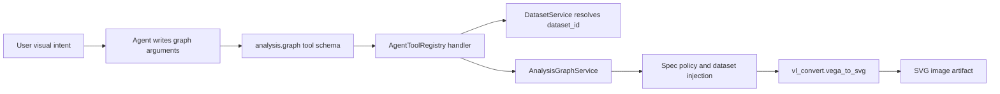
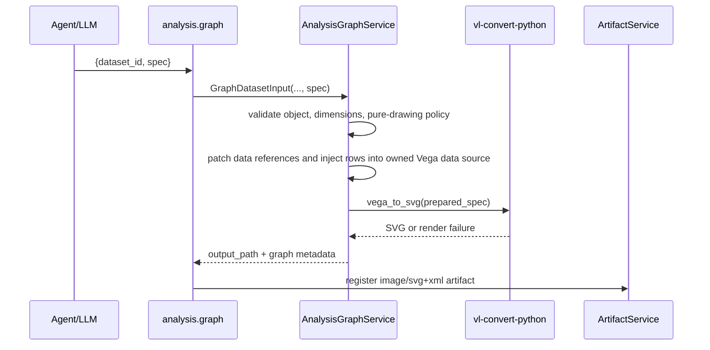

# Analysis Graph Vega Branch

## Objective & Hypothesis

- Objective: redesign `analysis.graph` around a single Xenix Vega profile so Xenix can render graph types that Vega-Lite cannot express, especially word clouds, without exposing multiple graph DSLs to the Agent.
- Hypothesis: one Vega-based profile plus Xenix-owned dataset injection, pure drawing policy, bounded rendering, and `vl-convert-python` 2.x can preserve graph/data boundaries while fixing the wordcloud layout gap.

## Classification & Mode

- Typed input: `Intent`.
- Current mode: `Solidify`.

## Guardrails Touched

- Product scope: analysis graph tools produce service-managed image artifacts from registered datasets.
- Agent Harness boundary: `analysis.graph` provider-facing tool schema, validation, execution result, and failure feedback.
- Service boundary: `AnalysisGraphService` owns dataset loading, spec policy, renderer selection, SVG output, metadata, and observability.
- Data boundary: graph tools read registered datasets by `dataset_id`; durable data preparation stays with `data.clean`, `data.query`, and `data.transform`.
- Artifact boundary: graph output remains `ArtifactKind.IMAGE` with `image/svg+xml`.
- Deployment boundary: packaged static rendering depends on `vl-convert-python`.

## Current Understanding

- Current `analysis.graph` accepts `{dataset_id, spec}` where `spec` is a Vega-Lite JSON object.
- Current service injects registered dataset rows as private Vega data and ignores/replaces user-authored `data` and `datasets`; external `url` resources remain rejected.
- Current renderer path is `vl_convert.vegalite_to_svg`.
- `vl-convert-python` also exposes `vega_to_svg` in the installed environment.
- Vega supports `wordcloud` transform; Vega-Lite does not.
- Local spike: `vl_convert.vega_to_svg` successfully rendered a basic Vega bar chart with inline values.
- Local spike: `vl_convert.vega_to_svg` did not successfully lay out a Vega `wordcloud` mark in the current environment; output text stayed at `translate(0,0)` / `font-size=0px` and the converter printed a JavaScript `Cannot set properties of null (setting 'height')` error.
- Isolated spike with `vl-convert-python==2.0.0rc1`: the same Vega `wordcloud` spec produced positioned, non-zero-size text such as `translate(200,165)` / `font-size="56px"` with no `ERROR` marker in the SVG.
- The likely renderer-side root cause is canvas/text-measurement support. `vl-convert-python` 2.0.0 RC 1 release notes mention a Canvas 2D polyfill for PNG rendering and label-transform support.
- Replacing Vega-Lite outright will make common charts harder for the Agent, but removes the larger cognitive load of two graph DSLs.

## Candidate Shape

- Replace the Agent-facing graph DSL with Vega only; do not keep Vega-Lite and Vega as co-equal choices.
- Keep a single `analysis.graph` tool accepting `{dataset_id, spec}`.
- `spec` is a Vega JSON object under Xenix graph policy.
- User-authored `data` and `datasets` are ignored and replaced by Xenix-owned dataset injection; external `url` resources remain rejected.
- Xenix injects the registered dataset into final converter input as a service-owned Vega `data` source.
- The Agent should not author the injected data source name. Xenix should own the name and patch/overwrite necessary Vega data references before rendering.
- Vega data-level transforms stay out of `analysis.graph`; the Agent should use `data.transform` first when durable data shaping, aggregation, grouping, joins, or derived rows are needed.
- Vega mark-level transforms are allowed as drawing/layout behavior, independent of transform type. `wordcloud` is one important case, but the boundary is mark-level drawing transform vs data-level data preparation.
- Render Vega specs through `vl_convert.vega_to_svg`.
- Adopt `vl-convert-python==2.0.0rc1` if wordcloud support is in scope.

## Boundary Topology

## Proposed Vega Branch Sequence

## Decision Surface

| Decision | Recommended direction | Reason |
| --- | --- | --- |
| Tool shape | Keep one `analysis.graph`, no `spec_format` | User prefers one graph DSL to reduce LLM cognition load. |
| Graph DSL | Switch Agent-facing spec to Vega only | Vega can express wordcloud and lower-level layouts that Vega-Lite cannot. |
| Vega data source | User spec omits `data`; service injects a private named data source and patches/overwrites required references | Keeps registered dataset ownership in Xenix and avoids exposing a data-source name to the Agent. |
| External data | Ignore and replace user `data` / `datasets`; reject remaining `url` resources | Prevents hidden data ownership while avoiding brittle failures when the Agent emits ordinary Vega boilerplate. |
| Data-level transform | Exclude from `analysis.graph`; require `data.transform` first | Preserves graph/data-transform orthogonality and keeps graph specs pure drawing specs. |
| Mark-level transform | Allow | Mark transforms belong to Vega drawing/layout semantics and are needed beyond wordcloud. |
| Derived Vega datasets | Exclude | They require user-authored `data` entries and blur the data transformation boundary. |
| Multiple registered datasets | Exclude for this branch | Joins/composition should remain owned by `data.query` / `data.transform`. |
| Field validation | Best-effort only for obvious `field`, `groupby`, `fields`, and simple `datum.*` references | Full Vega expression/static analysis is too complex for this slice. Renderer errors plus clear retry guidance cover the rest. |
| Word cloud | Do not promise support until a renderer spike proves non-zero positioned text | Current local `vl-convert-python` spike failed to lay out wordcloud correctly. |
| Static interactivity | Warn for signals/events/hovers that do not survive as meaningful static SVG behavior | Existing artifact is static image, not an interactive Vega view. |

## Files

- `implementation-plan.md`: execution plan for the selected Xenix Vega profile.
- `result.md`: implementation result and verification record.

## Negative Impact Forecast

- Agent must write lower-level Vega for ordinary charts, which is more verbose and brittle than Vega-Lite.
- Vega error messages are lower-level and may be harder for the Agent to repair.
- Existing field validation cannot fully understand Vega expressions, signals, and nested dataflows.
- Some Vega transforms may render slowly or produce very large SVGs; output size and row caps remain necessary but may not fully bound CPU time.
- Word cloud may still fail under `vl-convert-python`; a separate fallback may be needed.
- Packaged/offline behavior needs explicit smoke coverage because Vega transform extensions can behave differently from ordinary Vega-Lite charts.
- Service-side reference patching creates a small Xenix Vega profile rather than accepting raw Vega unchanged. This is intentional if it reduces Agent data-source cognition, but it must be documented and tested.

## Unknowns

- How much field validation is worth preserving for Vega expressions and signals.
- Whether packaged `vl-convert-python==2.0.0rc1` wordcloud rendering behaves the same as the isolated local spike.
- Whether the first-slice scale-domain patching profile is enough for the chart types the Agent will commonly generate.

## Verification Shape

- Unit tests for the Vega-only schema.
- Service tests for rendering a minimal Vega chart with injected dataset values.
- Spike/test for rendering a Vega word cloud with `wordcloud` transform must prove actual non-zero positioned text, not just an SVG string.
- Packaged smoke should include one Vega wordcloud render if Xenix adopts the `vl-convert-python` 2.x renderer path.
- Tests proving user-authored `data` and `datasets` are ignored and replaced.
- Rejection tests for Vega external `url`, complex mark dataflow, and complex scale domains.
- Targeted command: `pdm run pytest tests/test_analysis_graph.py -q`.
- Compile check: `pdm run python -m compileall -q src/xenix/services/analysis_graph.py src/xenix/services/agent/tools.py`.

## Next Step

- Prepare Impact Handshake for the selected implementation plan.
- Wait for explicit human "start" before mutating durable code or docs.
