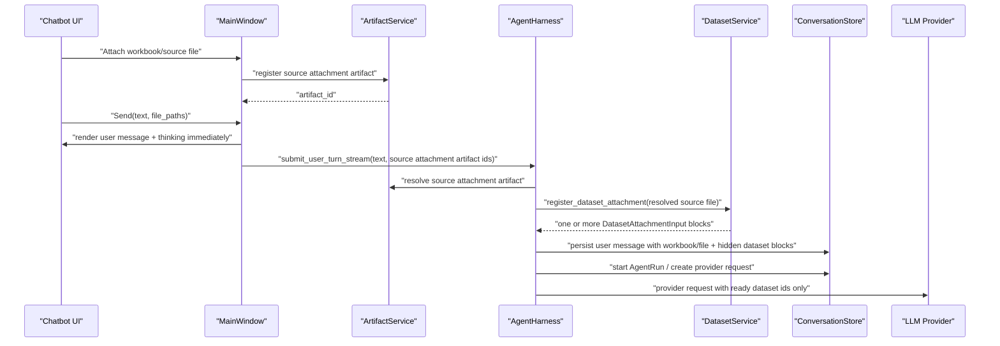

# Deferred Attachment Import After Send

## Objective & Hypothesis

Move workbook/CSV attachment import from Chatbot UI preflight to AgentHarness-owned turn startup. The user should be able to click Send immediately after attaching a large dataset file: the user message appears in the message list with workbook-level attachments, thinking starts, AgentHarness imports the file into app-owned datasets, and only after dataset context is ready does the turn get sent to the LLM provider.

Hypothesis: attachment import is part of the Agent turn authority boundary, not UI composition. UI should collect local file attachment intents and render optimistic user feedback; AgentHarness should own conversion from local file attachments into dataset blocks because it already owns persisted user messages, provider request construction, and tool availability derived from dataset ids.

## Status

locally verified; uncommitted

## Durable Owners / Blast Radius

- Chatbot UI / MainWindow attachment flow:
  - `src/xenix/ui/chatbot.py`
  - `src/xenix/ui/main_window.py`
- AgentHarness turn startup and stream lifecycle:
  - `src/xenix/services/agent/harness_service.py`
  - `src/xenix/services/agent/conversation_store.py`
- Dataset import boundary:
  - `src/xenix/services/dataset_service.py`
- Conversation/message storage:
  - `src/xenix/services/storage/models.py`
  - `src/xenix/services/storage/repositories/agent_conversations.py`
- Provider request projection and tests that assume dataset blocks are ready before submission.
- UI tests around attachment chips, send button enablement, pending/failed import states, and message rendering.

## State Diff

From: Chatbot UI starts attachment preflight on file attach, calls `DatasetService.register_dataset_attachment()` before send, disables send while attachment import is pending, and passes ready `DatasetAttachmentInput` blocks into AgentHarness. UserMessage displays dataset metadata because dataset blocks are the only submitted attachment representation.

To: Chatbot UI registers each attached workbook/source file with `ArtifactService` at Composer attach time and allows immediate Send without dataset import. `MainWindow` renders an optimistic user message and thinking state immediately, then calls AgentHarness with source attachment artifact identities. The visible UserMessage keeps workbook-level attachments only; clicking the attachment opens the workbook/source file through `ArtifactService`. AgentHarness resolves those artifacts and imports attachments into datasets before persisting the real user turn, creating the AgentRun row, or sending the first provider request. If import fails, no durable user turn, AgentRun, or LLM request is created for the failed submission; the optimistic message is rolled back, the original user text and workbook attachments are restored to the Composer, and the message list shows an error item.

## Invariants

- UI must not parse or import datasets for business decisions.
- UI must not block Send on large workbook import.
- Local file paths remain service-owned implementation facts and must not be sent to the LLM provider.
- Provider-facing user messages must contain ready dataset context, not raw file paths or pending attachment placeholders.
- The message list should show the user's submitted text and attached workbook/file names immediately through UI-owned optimistic rendering.
- Datasets created from workbook sheets are not visible objects in the UserMessage.
- No visible "importing datasets" event is required; the ordinary thinking/running state covers the deferred import wait.
- AgentHarness must not call the LLM until every attached file either imports successfully into dataset blocks or the turn fails.
- AgentHarness must not create the AgentRun row until attachment import succeeds.
- Workbook import still splits each non-empty sheet into one dataset.
- Failed imports must not leave half-success visible dataset blocks, durable user turns, AgentRun rows, or provider requests.
- Once Send is accepted, the submitted attachment import is not cancellable.
- Source workbook/file attachment clicks use `ArtifactService`; UI must not open local paths itself.
- Composer-time artifact registration is not dataset import and must stay lightweight enough to avoid reintroducing the send-blocking problem.

## Decisions Consumed

- Dataset registration imports external tabular files into app-owned Parquet datasets.
- Dataset ids are tool/input identities; local file paths are not LLM-facing authority.
- AgentHarness owns Thread, Turn, Message, provider interaction, and tool execution.
- UI owns interaction and rendering, not dataset import authority.
- ArtifactService owns source workbook/file attachment registration, artifact URI resolution, and OS file opening.

## Open Questions

None blocking for the current implementation slice.

## Questions Resolved In This Slice

- OQ-009: UserMessage represents the attachment as a workbook/file-level visible block. It does not show pending dataset import blocks or resulting sheet datasets.
- OQ-010: AgentRun row is created after attachment import succeeds, not before.
- OQ-011: Once Send is accepted, the submitted attachment import is not cancellable.
- OQ-012: Multi-sheet workbook imports do not change the visible UserMessage into multiple dataset chips; sheet datasets are provider/tool context only.
- OQ-013: Source workbook/file attachments use `ArtifactService`. The attachment is registered with `ArtifactService` when it is added to the Composer, and clicks open through `ArtifactService`.

## Initial Code Evidence Before This Slice

- Before this slice, `MainWindow._start_attachment_preflight()` started a background thread at attachment time and called `_register_composer_dataset()`.
- Before this slice, `MainWindow._register_composer_dataset()` called `DatasetService.register_dataset_attachment()` and converted every registered sheet dataset into `DatasetAttachmentInput`.
- Before this slice, `ThreadDetailView._handle_button_clicked()` refused Send while `_has_unready_attachments()` was true.
- Before this slice, `MainWindow._submit_chat_message()` called `_ready_composer_attachments()` and returned early when any attachment was not ready.
- Before this slice, `AgentHarnessService.SubmitUserTurnInput` accepted `dataset_attachments`, not file attachment intents.
- Before this slice, `AgentHarnessService._start_user_turn()` was the first durable write point. In the implemented design, source import happens before `_start_user_turn()` so an import failure can roll back the optimistic UI without leaving a half-sent durable turn.
- `ConversationStore.start_turn()` persists user message content blocks as JSON; `ThreadSnapshot.provider_messages()` later projects ready dataset blocks into provider-facing text.
- Provider tool exposure is derived from the snapshot before the provider request, so file import must finish before provider request creation.

## Proposed Sequence

## Explorer Findings Integrated

- UI side: current preflight is full dataset import, not lightweight metadata inspection.
- UI side: current Send is blocked both in `ThreadDetailView` and `MainWindow` until imports are ready.
- Harness side: best insertion point is before user message persistence and before provider request creation. This avoids durable half-turns when import fails while still allowing UI-owned optimistic rendering.
- Harness side: do not import in provider adapter or provider-message projection; that is too late for tool availability and would risk local paths leaking or first request missing dataset ids.
- User-confirmed product behavior: visible UserMessage attachments are workbook/file-level objects, not dataset objects, and import completion does not need a separate visible event.
- User-confirmed cancellation behavior: once the message is sent, attachment import is not cancellable.
- User-confirmed run lifecycle: AgentRun row is created after attachment import succeeds.
- User-confirmed open boundary: source workbook/file attachments are registered with `ArtifactService` when added to Composer, and clicks open through `ArtifactService`.
- User-confirmed failure behavior: import failure restores the original user message and attachments to Composer and shows an error item in the message list.
- Test blast radius includes `tests/test_main.py`, `tests/test_agent_harness_first_slice.py`, `tests/test_agent_harness_streaming.py`, `tests/test_agent_harness_foundation.py`, `tests/test_agent_ai_observability.py`, and existing `tests/test_services.py` dataset import coverage.

## Verification Plan

- UI: attaching a large file registers a source artifact, does not import a dataset, and does not disable Send.
- UI: clicking Send returns promptly, clears Composer, adds the user message, and sets thinking/running state.
- UI: clicking a workbook/file attachment opens through `ArtifactService`.
- Harness: submit with source attachment artifact ids resolves artifacts and imports datasets before first provider request; provider input contains ready dataset context and no local paths.
- Harness: AgentRun row is created only after attachment import succeeds.
- Workbook: one attached XLS/XLSX with multiple non-empty sheets becomes multiple provider/tool datasets before provider request while the visible UserMessage remains workbook-level.
- Failure: failed import restores original text and attachments to Composer, rolls back the optimistic user message to the previous stable message view, shows a message-list error item, does not create a durable user turn, does not create an AgentRun row, and does not call the provider.
- Cancellation: after Send, attachment import cannot be cancelled and the UI must not offer attachment removal/cancel semantics for that submitted turn.
- Regression: existing ready dataset attachment tests either move to Harness or are rewritten around file attachment intents.

## Verification Run Log

- `pdm run python -m compileall -q src/xenix tests/test_main.py tests/test_agent_harness_first_slice.py` - passed.
- `pdm run pytest tests/test_main.py::test_main_window_submit_chat_message_uses_registered_source_attachments tests/test_main.py::test_main_window_attach_file_registers_source_artifact tests/test_main.py::test_main_window_pre_run_harness_error_restores_composer_source_attachments tests/test_agent_harness_first_slice.py::test_agent_harness_imports_source_artifact_before_provider_request tests/test_agent_harness_first_slice.py::test_agent_harness_source_import_failure_does_not_start_run -q` - passed, 5 tests; final rerun 5 passed in 6.15s.
- `pdm run pytest tests/test_agent_harness_streaming.py -k "file or dataset or tools" -q` - passed, 3 selected tests.
- `pdm run pytest tests/test_main.py -q` - passed, 53 tests; final rerun 53 passed in 24.56s.
- `pdm run pytest tests/test_agent_harness_first_slice.py tests/test_agent_harness_streaming.py tests/test_agent_ai_observability.py -q` - passed, 52 tests; final rerun 52 passed in 74.25s.
- `git diff --check` - passed.

## Next Action

Commit the verified slice when requested, keeping unrelated dirty files out of the commit.
