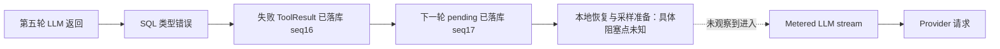

# 确认变体诊断

本轮提交上一轮工具架构与恢复边界改动为 `22c1ccb`；以下均是该提交之后的调查和局部实验，产品源码与自动化测试未改动。用户所指“捕获确认”按原报告识别为 `business.restock.v1.confirmation`，分流为 `business.routing.v1.confirmation`。

## 补货：触发错误已知，原始阻塞栈仍未知

原报告位于 `build/agent-harness-namespace-d7bbe8d/confirmation/business.restock.v1.confirmation-deepseek-deepseek-v4-flash-dab06b8186724e01b8f3135009c61aa0.json`；900 秒后父进程终止 cell。第五轮完整 usage 在 16.842 秒，已记录 25,820 tokens，后续没有第六次 `benchmark.subject.sampling_started`。

从原运行 `confirmation.log` 恢复的异常为 DuckDB `BinderException: *(BIGINT[], DOUBLE)`，错误位置是 SQL 第 16 行的 `a.batches*a.cost_yuan`。事实是批次数表达式产生列表而非标量；原 SQL 全文没有被保留，`range(...)` 的标量形式是可复现同类错误的解释，不能当成已恢复的原文。

当时 2026-09-14 05:42:09 UTC 的只读数据库观察已从本任务会话历史提取，见 [原观察](restock-live-observations.json)：sequence 14 为 assistant、15 为 `data.query`、16 为 failed ToolResult、17 为 `pending_llm_sampling`。临时数据库随后随 cell 目录被删除。这说明 SQL 已经失败并结算，挂起出现在继续采样的路径；不能将其描述为该 SQL 仍在执行。

边界来自生产源码：[Conversation](../../src/xenix/services/llm/conversation.py) `sample_existing_frontier_stream` 在 `begin_sampling` 后依次投射开始事件、读快照、构造上下文与工具 schema，再进入 `LLMService.stream`；[Harness](../../src/xenix/services/agent/harness_service.py) 在开始事件中注册取消句柄并投射 thinking；[benchmark gateway](../../tests/e2e/agent_harness/_infra/runner.py) `_MeteredLLMService.stream` 在执行 Provider 代码前立即记录 `sampling_started`。原冻结版本的这段顺序一致。因此现有证据将第六轮阻塞缩小到主 Provider 请求之前；具体在读库、锁、上下文还是该阶段事件交接，原证据无法区分。

两次实验都不足以认定旧问题已修复：

- 使用真实 headless 服务图、真实数据集导入和 `data.query`，只将 Provider 输出换成脚本，制造 `range(0,3)*1.5` 同类错误。失败结果正常进入历史，约 0.08 秒后进入下一次 gateway；修正 SQL 后完成四次 gateway 调用。见 [恢复证据](restock-error-replay.json)。
- 使用当前 HEAD、原 subject 设置与确认用例请求，进行一次独立的真实 subject 诊断，记录阶段、快照及每 30 秒活动栈；7 次主采样、37,054 tokens、32.325 秒完成。该次没有产生原 SQL 错误，也没有挂起，未调用 Judge，不是完整 benchmark 分数。30 秒记录的 SSL 读取栈属于这次正常请求，不能用来解释旧故障。见 [摘要](restock-evidence.json)，详细文件在 `build/restock-confirmation-diagnosis/`。

当前不支持修改网络超时、增加重试或宣称工具架构重构已修好此项。下一项所需证据是挂起现场的活动栈和 canonical 快照；现有 benchmark 在中断时仅保留采样 journal，未保留中断前完整工具轨迹，且清理 runtime，使一次可定位的现场变成证据缺口。这是诊断能力缺陷，不等同于导致挂起的产品根因。

## 分流：准确率确实不足，且可以精确重建

原报告为 `business.routing.v1.confirmation-deepseek-deepseek-v4-flash-be4664113a0043e2b290941f6ec7a9d9.json`。第一次请求保存 model 68，第二次沿用它输出 `artifact://180`，再整理为 `artifact://194`，预测列准确率均为 26/30。Judge 正确识别实际建议队列；机器候选枚举另找到的 channel 完美映射不是合法预测，不能拿它证明通过。

离线实验按生产导入路径将原 CSV 物化成 Parquet，再使用相同文本预处理、分组切分、参数与分类器。第一次仅用 CSV 文件哈希推导切分时不能重建分数；改用产品实际保存的 Parquet 哈希后，留出成员 digest、六个历史分数、选中模型全部 30 条预测均吻合，四条错误的最大预测概率差为 0。见 [重建与验证](routing-replay.json)。原二进制模型已随 cell 清理，此为有完整输出比对的重建，不是重新打开原对象。

### 信息在文本表征层已经丢失

| 工单 | 实际错误机制 |
| --- | --- |
| T-B943C179：办公室周末无人值班，请通知派件员工作日送 | Jieba `HMM=False` 将“派件员”分成“派 / 件 / 员”；预处理删除所有单字，也删除“送”。剩下的“办公室 / 周末 / 无人 / 值班 / 通知 / 工作日”全部不在选中词表里，最终向量为零，靠截距猜为退换货。 |
| T-F7F8AD2D：尺码与标签不一致，需要换一件合身的 | “不”“换”被单字过滤；`min_df=2` 又排除低频的“尺码”等词，最终只有“需要”一个有效特征，偏向发票。 |
| T-01CA1F80：I do not need a new invoice; I need a refund for the returned kettle | unigram 表征不编码否定的作用范围；`invoice` 对发票相对退换货的 logit 差贡献约 +0.677，`not` 也贡献 +0.236，超过 `refund` 和 `returned` 的反向证据。并不是英文 `not` 被停用词删除。 |
| T-D00705F3：No invoice issue here; I only need a working tracking number | `no` 与 `only` 在选中词表外；`invoice` 的相对贡献约 +1.047，压过 `tracking` 的 -0.532，错投发票。 |

关键源码是 [text_preparation.py](../../src/xenix/services/ml/text_preparation.py) `_tokenize_normalized`：无上下文地剔除 `len(token)<2`；默认停用词还包含“没有”“但是”“不过”等业务含义词。随后 [text_analysis.py](../../src/xenix/services/ml/models/text_analysis.py) `MultilingualTextClassifier.fit` 以 TF-IDF、`min_df` 和线性分类器学习。这些都是输入模型之前或模型表征内部的信息损失，无法仅靠加强最终回答提示词恢复。

### 选型反复使用同一个小留出集

六次训练都是同一模型族，业务分组为 B01、B08、B14，共 18 条留出工单。两个得到 94.4% 的候选仍在同一留出集上比较；相同分数及混淆矩阵不构成独立验证。当前工具反馈保留了组数与样本数，压缩时删除 membership digest；LLM 的反馈里没有直接的“与其他候选相同的验证集”标识。

| 配置 | 原始单次留出准确率 | 新批次准确率 | 历史五折分组验证 |
| --- | --- | --- | --- |
| 默认 unigram、min_df=1 | 14/18（77.8%） | 28/30（93.3%） | 79/90（87.8%） |
| 选中 unigram、min_df=2 | 17/18（94.4%） | 26/30（86.7%） | 76/90（84.4%） |
| unigram + bigram、min_df=1 | 14/18（77.8%） | 27/30（90.0%） | 本轮未做 |
| unigram + bigram、min_df=2 | 17/18（94.4%） | 26/30（86.7%） | 本轮未做 |

五折实验只用历史标签拟合和选定固定分组，私有新批次标签仅在预测后用于评分。它表明当前模型的历史证据本身不足以稳定支持“至少九成”，并不证明默认参数今后一定达到九成。单次调参选出的胜者泛化更差，已经有明确反事实：当时已训练出的 model 39 默认候选，在相同新批次可达 28/30。

产品能力也影响这个决策：[ModelTrainInput](../../src/xenix/services/agent/tool_inputs.py) 只接受绑定、模型与参数等；这个原始文本分类器的 `fit` 使用一次留出评估，服务关闭了其调参入口，Agent 没有直接请求该模型分组交叉验证的工具参数。继续调用同一个 `model.train` 改词表参数，会重复这组验证，不能制造新证据。

### 交付补救改变了衡量对象

最终回答已经独立指出四条误分及正确队列，说明 Agent 可读懂这些原文；它没有将这一判断变成保存方案的可复用能力，而是对原预测增加 `confidence<0.5` 人工复核标记。表中 19 条自动分流均正确、11 条需复核，不等于整批 30 条建议队列达到 90%。其阈值也未通过独立留出预测校准，`prediction_score` 只是分类器最大概率。

这是选定分析器能力与业务交付之间的缺口。把四条答案硬写进当前表只能修饰这批结果；要满足“之后继续沿用保存方案”，修正应进入可复用的表征、选型或分类方案。此处不建议降低 oracle 阈值，也不把人工复核率当成整体准确率。

## 建议按证据能力优先修复

1. 优先修正中文有意义单字被机械剔除的问题，并保留业务否定含义；把每行词表覆盖不足的信息带到预测结果或紧凑反馈，让“向量为零”和“只剩泛词”可见，保持预测与错误可观察，不以抛错阻止模型调用。
2. 让文本模型选型获得可比较的分组验证证据，并在反馈里用简短公共标识说明验证集是否相同；不要求 Agent 按固定步骤反复训练，也不恢复大量内部 digest 或元数据。
3. Skill 可以简短解释“同一留出集上多次调参不等于多次独立验证”“自动分流子集准确率与全批次准确率不同”，但它无法替代上述表征与评估能力。语义分类或保存后的校正方案应单独设计，避免针对这 30 条补关键词规则。

表征消融显示修复方向有收益但存在权衡：仅保留中文单字，选中 `min_df=2` 的确认结果可到 27/30，标准题 29/30；默认 `min_df=1` 的标准题可到 30/30，但确认题从 28 降到 27，五折也未提升。字符 n-gram 对照在两批分别约 28–29/30，历史验证更低。见 [完整对照](routing-representation-probes.json)。因此这些是定位机制的实验，不足以把某个表示直接升级为默认，也不应以确认题分数反向挑固定参数。
