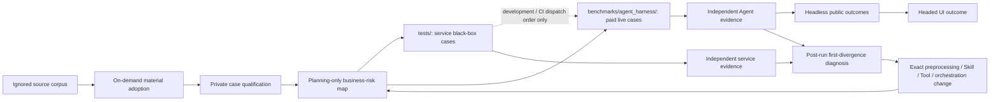
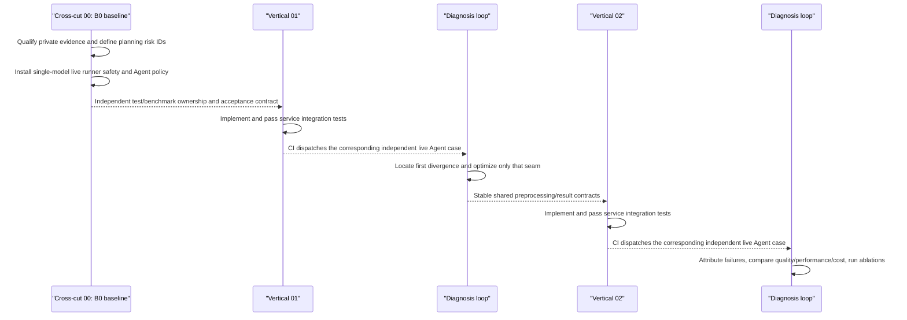

# Program Topology and Sequence

## Topology

The ignored corpus enters this topology only through the fail-closed [on-demand material-adoption plan](materials/on-demand-adoption.md). Only the business risk and planning vocabulary are shared. Service tests and Agent benchmarks own separate code, fixtures, evaluators, commands, and reports. The dotted edge is workflow control only: CI does not dispatch a paid benchmark job after a red service job, while a directly invoked benchmark neither checks nor reads service results. The Agent subject sees only admitted business inputs; its evaluator privately owns answers, labels, future windows, reference code, and scoring rules.

## Two Verticals and One First Cross-Cut

| Lane | Product question | First delivery |
| --- | --- | --- |
| Cross-cut 00 — Baseline, acceptance, diagnosis | Where does a real business task first fail, and what is the smallest justified change? | Qualified cases, service/Agent evidence separation, before/after runs, acceptance policy, attribution |
| 01 — Foundation, clustering, forecasting | Can Xenix prepare data safely, assess segment quality, and forecast through an honest temporal workflow? | Shared profile/evaluation facts, split-aware semantics, trustworthy clustering, first native forecast workflow |
| 02 — Recommendation and text | Can Xenix produce and evaluate user-level ranking and defensible multilingual text results? | Popularity/cold-start + collaborative Top-K; language-aware text preparation and task-specific quality evidence |

## Sequence

Cross-cut 00 is therefore a bracket around product work, not a third product vertical or final cleanup phase.

## Authorization Points

1. `IH-B0`: benchmark safety, independent Agent cases, acceptance policy, guidance/CI ordering, and private qualification; no service-test or production behavior change.
2. `IH-F1` — Dataset profile and cleaning evidence: bounded Dataset-ID profile facts, progressive disclosure, and a clean-room whole-Dataset cleaning service case.
3. `IH-F2` — Group-safe preparation, evaluation, and lifecycle facts: immutable binding identity, group-disjoint evaluation, same-holdout baseline evidence, true apply lineage, and bounded Agent results.
4. `IH-CF`: consumed after objective verification and paid characterization of clustering trustworthiness and the first forecast workflow, including seasonal-naive, Holt-Winters, and bounded-auto SARIMA under `D-014`, with Agent/service parameter authority split by `D-015`.
5. [`IH-RT`](handshakes/IH-RT.md): proposed recommendation ranking and text quality workflow, decomposed into RT-R personalized ranking, RT-T1 multilingual preparation/grouped classification, and RT-T2 text discovery/retrieval evidence.
6. `IH-O<n>`: one reproduced benchmark failure and its exact optimization seam.

No `IH-O<n>` is written in advance. Logs, traces, and DB evidence determine whether the owner is data preparation, ML service, Tool boundary, Agent orchestration, UI, or evaluator infrastructure.
