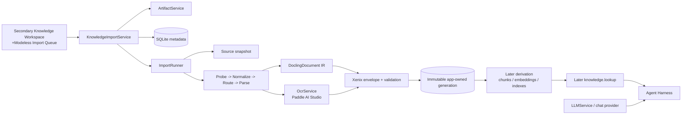

# Architecture and Authority

## Recommendation

Create a **Knowledge Base domain**, not a catch-all `AIService` and not an extension
of `LLMService`. It owns local document/import/retrieval policy and coordinates
SQLite metadata with app-owned filesystem bytes. `LLMService` stays the chat-provider
adapter boundary.

The current first workstream has one narrow completion boundary: source snapshot to
immutable **canonical-ready DoclingDocument + Xenix envelope**. Chunking, embedding,
indexing, and Agent lookup consume that later. OCR is an independent Document AI
service; VLM is not supported in MVP.



## Authority Map

| Concern | Authority | Explicitly not authoritative |
| --- | --- | --- |
| User-selected original file | User | Import job/normalizer |
| App-owned source snapshot | Filesystem under the knowledge root | Original path/provider cache |
| Source opening identity | `ArtifactService` / `ArtifactRow` | Raw path in UI/tool result |
| Document content IR | Frozen `DoclingDocument` JSON + asset manifest | SQLite JSON payloads, LLM context |
| App lifecycle/provenance | Xenix Canonical Document Envelope + services | Docling origin URI/version/provider response |
| Import/document/index metadata | SQLite through Knowledge Base services | Index files/UI state |
| OCR projection | Versioned `OcrService` output normalized into Docling/envelope | Replacement for source pixels/native text |
| Chunk/vector/index bytes | Later immutable filesystem generations | SQLite blobs/provider cache |
| Retrieval evidence/replay | Later canonical Agent tool result/Harness | UI-parsed raw payload/hidden prompt channel |

`ArtifactService` is reused for a stable source snapshot and intentionally
user-openable rendering/export only. It is not a generic row for pages, chunks,
embeddings, indexes, or provider result URLs.

## Recommended Domain Interfaces

| Interface | Responsibility | Does not own |
| --- | --- | --- |
| `KnowledgeImportService` | UI-safe commands/status for the singleton global library | provider mechanics, storage layout |
| `ImportRunner` | idempotent attempt lifecycle, phase checkpoints, cancel/recovery | UI widgets, retrieval |
| `FileProbe` | snapshot facts/safety/page evidence | conversion or semantics |
| `FormatNormalizer` | traceable parser-input plan/intermediate policy | routing or canonical publication |
| `ParserRouter` | extensible document/page route plan | durable state/UI |
| `ParseExecutor` / Docling adapters | produce Docling content/projections in staging | artifact/SQLite authority |
| `OcrService` | profile resolution, remote job lifecycle, normalized OCR output | canonical lifecycle or LLM calls |
| `Canonicalizer` | validate/freeze Docling IR and Xenix envelope | filesystem layout/metadata transaction |
| `CanonicalGenerationSink` | atomic file publication and current-generation coordination | parser heuristics/chunks/indexes |
| `KnowledgeDerivationService` | later chunks/embeddings/index coordination | source parsing or Agent presentation |

An optional `DocumentAiService` composition root may instantiate OCR/other capability
adapters later, but it is not an authority-owning replacement for this domain.

## Scope and Visibility

MVP exposes one global Knowledge Library to the local operator. It has no project or
conversation owner, and no library chooser/create/delete UI. The internal library ID
remains stable so multiple instances can be added in the future without a destructive
migration. Global ownership never means automatic full-document prompt injection:
the later `knowledge.lookup` tool remains the only Agent evidence route.

## Boundary Sequence

```mermaid
sequenceDiagram
    participant U as User
    participant UI as Queue Dialog
    participant K as Import Service
    participant R as Import Runner
    participant A as ArtifactService
    participant F as App-owned files
    participant DB as SQLite metadata

    U->>UI: Select files and review preflight
    UI->>K: Enqueue accepted local references
    K->>DB: Create document/import attempt
    K->>R: Start idempotent attempt
    R->>F: Copy/hash immutable source snapshot
    R->>A: Register stable source snapshot
    R->>R: Probe -> normalize -> route -> Docling/OCR parse
    R->>F: Validate/freeze Docling JSON + envelope; atomic promote
    R->>DB: Publish canonical-ready generation pointer
    DB-->>UI: Durable status refresh
```

The filesystem is staged first because it owns large content. SQLite advances the
canonical generation pointer only after manifests/checksums validate. Recovery never
exposes partial work; index/query visibility is a separate later contract.
