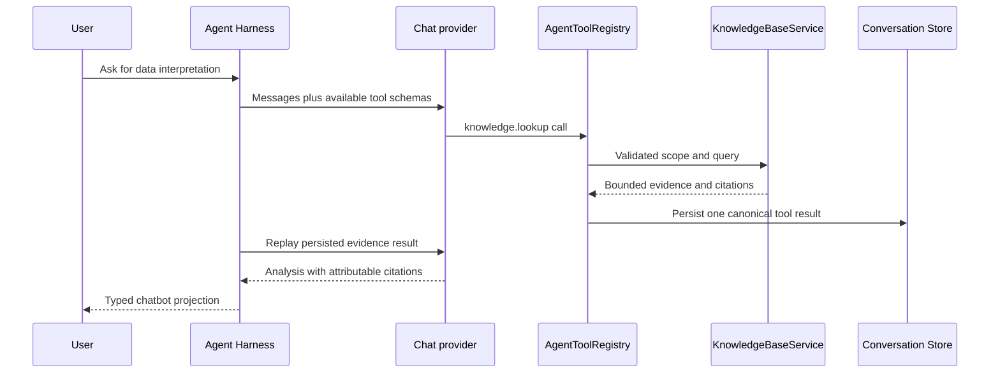

# Retrieval and Agent Contract

## Lookup Is an Agent Tool

Retrieval belongs behind a `knowledge.lookup` Agent tool. It is not hidden prompt
assembly, and it is not a provider-specific RAG extension. This preserves the
existing Harness ordering: the Agent proposes a tool call, the Knowledge Base
returns one canonical bounded result, the result is persisted, and the next
provider request is replayed from that fact.

The tool becomes available only when a user has explicitly enabled knowledge. MVP has
one global Library, so its lookup input intentionally has no user-selectable
`library_ids`; a future multi-library workstream may add an opaque scope without
changing citation authority:

```json
{
  "query": "Which seasonal assumptions should guide this sales analysis?",
  "mode": "hybrid",
  "document_ids": ["optional-stable-document-id"],
  "top_k": 5
}
```

`mode` is an enum: `keyword`, `semantic`, or `hybrid`. `top_k` has a strict small
maximum. Cross-field rules (such as scope authorization or a requested semantic
mode when no compatible embedding index is ready) are execution validation, not
provider-schema combinators.

## Bounded Result and Citation Shape

The result returns the evidence necessary to reason, not an entire document or a
filesystem path:

```json
{
  "query": "...",
  "mode_used": "hybrid",
  "index_generation_id": "stable-id",
  "results": [
    {
      "citation_id": "stable-id",
      "library_id": "stable-id",
      "document_id": "stable-id",
      "document_generation_id": "stable-id",
      "source_artifact_id": "stable-artifact-id",
      "chunk_id": "stable-id",
      "title": "Q3 field journal",
      "locator": {"page": 4, "section": "Seasonality"},
      "quote": "bounded evidence excerpt",
      "score": 0.82,
      "match_kinds": ["keyword", "semantic"]
    }
  ]
}
```

The `score` is retrieval guidance, not a claim of truth. The Agent should cite a
result only when it used it, distinguish the user's documented experience from a
fact established by the attached dataset, and say when no suitable evidence was
found. Tool presentation—not the provider or the tool result—constructs any
`artifact://<source_artifact_id>` Markdown link.

## Conversation Sequence



No raw document, image bytes, absolute path, index dump, API key, or unbounded
retrieval evidence crosses the provider-tool boundary. The initial slice keeps
multimodal provider-message transport out of scope: OCR creates local derived
evidence, VLM is outside MVP, and the chat provider sees only the bounded lookup
result.

## Retrieval Strategy

> **Storage position under review (2026-07-15).** The concrete filesystem-backed
> recommendation below was a preliminary media-first storage proposal. Workstream 02
> now starts from the lookup contract and retrieval units; do not treat any storage
> medium or index engine in this section as accepted until that workstream is
> resolved.

The recommended first index implementation is filesystem-backed:

- A language-aware BM25-style inverted index supplies keyword retrieval. Chinese
  tokenization can reuse the existing `jieba` dependency, with a defined fallback
  for mixed-language terms.
- A compact dense-vector matrix plus an ID/offset manifest supplies semantic
  retrieval. Start with a deterministic flat cosine scan behind `RetrievalIndex`;
  introduce HNSW or a vector database only after corpus-size measurements show that
  it is needed.
- Hybrid search unions small candidate sets and applies reciprocal-rank fusion.
  This is stable, explainable, and avoids prematurely tuning incomparable score
  scales.

SQLite FTS would be technically convenient, but it stores searchable chunk text in
SQLite and conflicts with the stated “SQLite metadata only” boundary. Use it only
if Sir deliberately relaxes that rule.

## Citation Projection

The first UI may render citations in the existing tool-result/detail presentation,
but it must use typed citation data rather than parse a free-form payload. A later
dedicated citation event/component may show source title, page/section, confidence,
and an artifact activation link. In either case, conversation replay retains the
same `citation_id` and immutable document-generation reference.
