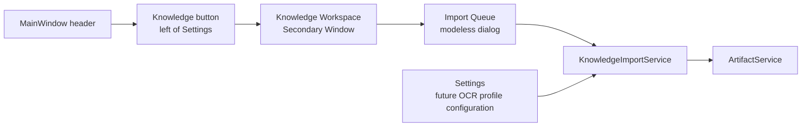

# UI and Interaction Design

## Product Shape

Knowledge Base is a global, modeless **Secondary Window**, not a Settings tab, chat
history item, or new full-window navigation system. The existing MainWindow remains a
narrow chat shell. A single Knowledge button immediately to the left of Settings opens
or raises the cached window.

MVP exposes one global Library. It has no library list, selector, creation, deletion,
enablement, or per-library chat scope. An internal stable library identity preserves
future expansion, but the user has no reason to manage it today.



The import queue is a separate modeless dialog, not a tab in the workspace and never
a `QProgressDialog`. Closing either window stops UI observers only; service-owned
work continues and refreshes durably on reopen.

## Knowledge Workspace

```text
┌────────────────────────────────────────────────────────────────────┐
│ Global Knowledge Library                         [Import files]      │
├────────────────────────────────────────────────────────────────────┤
│ Documents                                      [Open Import Queue]   │
│  market-notes.docx       Canonical-ready        [Open source]        │
│  retail-scan.pdf         Canonical-ready · OCR warning [Inspect]    │
│                                                                    │
│ Details: source artifact, canonical generation, parser/OCR route,  │
│          page/section locator, warnings, attempts                  │
└────────────────────────────────────────────────────────────────────┘
```

Search, semantic/keyword modes, retrieval readiness, citations, and the future chat
knowledge on/off control belong to storage/tool workstreams. This window says
`canonical-ready` honestly rather than exposing a premature Search button.

## Modeless Import Queue

The queue dialog combines transient file selection/preflight with persistent queue
status. It accepts only `.txt`, `.doc`, `.docx`, `.pdf`, `.jpg`, `.jpeg`, and `.png`.
Markdown is explicitly rejected.

| Stage | UI behavior |
| --- | --- |
| Select/drop | Multi-file local selection; preserve order; reject folders/unsupported/duplicates row by row. |
| Preflight | Shows content detection, conversion/encoding route, encrypted state, duplicate state, OCR availability, and warnings; creates no source snapshot. |
| Enqueue | Starts durable service work; duplicate SHA defaults to open existing rather than a second import. |
| Running | Shows actual phase (`snapshot`, `probe`, `normalize`, `route`, `parse`, `ocr`, `canonicalize`, `publish`) and truthful page units only. |
| Needs attention | Bounded password/converter/profile repair action; password is transient. |
| End state | Canonical-ready, canonical-ready with warning, failed/retryable, or cancelled. |

Rows render only `ImportStatusView` DTOs. They never construct filesystem paths or
call providers. Opening sources uses `artifact://`; details/previews use bounded
service DTOs and never raw provider JSON/full document payload by default.

## UI Invariants

- Existing chat attachment controls remain dataset-only and are not widened to
  Knowledge Base formats or `DatasetService` calls.
- Existing Settings navigation remains stable; a later Document AI profile surface is
  separate from document/queue management. No VLM setup is added in MVP.
- All new copy, phase names, and errors use Qt translation/retranslation on
  `LanguageChange`.
- A queued remote OCR job is not described as cancelled until the runner reaches a
  safe checkpoint; no fake overall percent appears for opaque remote work.
- Reopening workspace/queue queries durable state, so a missed Qt signal cannot leave
  UI truth stale.

## Implementation Boundary

The first approved UI slice should add only the header button, a cached secondary
workspace, a cached/one-at-a-time queue dialog, service injection from the composition
root, and focused UI tests. It must not rewrite MainWindow into `QStackedWidget`,
alter the existing Settings two-tab structure, or change Agent/chat layout as a side
effect of import work. Detailed design is in
[workstreams/01-import/ui-design.md](workstreams/01-import/ui-design.md).
