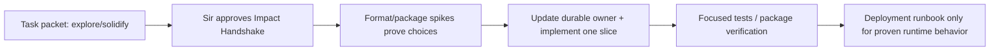

# Import Workstream Durable-Documentation Plan

## Current Permission Boundary

This workstream is in design. Only `tasks/knowledge-base/` may change now. The
following is a promotion plan, **not authorization** to edit `docs/`, source,
configuration, dependencies, migrations, or tests. Each durable claim moves only in
the approved implementation slice that proves it.

## Promotion Map

| Claim once approved and evidenced | Durable owner | Timing | Do not copy |
| --- | --- | --- | --- |
| A single global Knowledge Library, accepted MVP formats, source preservation, reviewable import, no VLM/Markdown MVP | `docs/10-prd/README.md` | When product slice is approved | adapter classes, fields, package versions |
| Source snapshot/artifact authority, canonical-ready boundary, envelope/Docling IR separation, state/atomic publication, UI -> service topology | new `docs/20-product-tdd/knowledge-import.md` plus `20-product-tdd/README.md` route | Before or with the first cross-unit implementation slice | volatile alternatives and exact ORM/file layout |
| Decision to use Docling IR and its consequences, pikepdf/OCR adapter boundaries, perhaps singleton library evolution | new ADR (proposed next number) when the decision is accepted after spikes | Only after evidence locks the decision | transient benchmark output |
| Exact service/wiring/Qt lifecycle mechanics | source, tests, nearest local `AGENTS.md`; only add Unit TDD memory if the seam proves expensive | With implementation | a duplicate UI spec |
| Docling/Paddle/LibreOffice/pikepdf packaging, model cache, runtime paths, crash recovery, migration/backups | relevant `docs/40-deployment/` runbook(s) | When a runtime artifact exists and is verified | design-only dependency hopes |

The present durable documents are intentionally sparse. The first expected technical
contract is a focused `knowledge-import.md`, not a wholesale copy of this task
packet. It should preserve only facts that several units must share and source/tests
cannot cheaply enforce.

## Proposed Durable Contract Outline

When its prerequisite spike/Impact Handshake is approved, `knowledge-import.md`
should contain only:

1. source file, snapshot, artifact, Docling content IR, and envelope authority;
2. `canonical-ready` versus later derivation/retrieval readiness;
3. immutable attempts/generations, atomic promotion, cancellation/recovery;
4. no raw paths/secrets/provider payloads across UI/Agent boundaries;
5. format-routing and page/OCR provenance requirements; and
6. source/test anchors that prove these invariants.

## Promotion Sequence

If a spike disproves Docling, pikepdf, or Paddle assumptions, update this task packet
and return to design. Do not pre-commit a durable ADR simply to make the plan look
finished.
