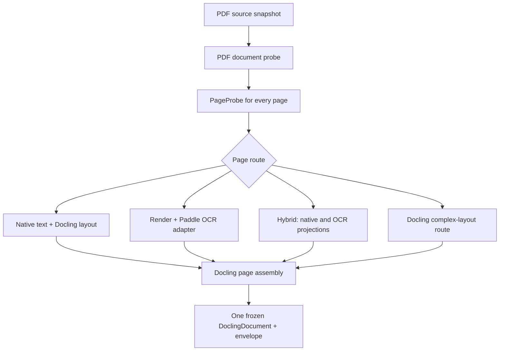

# PDF Page Routing and OCR Service Design

## PDF Is a Document-Level Container With Page-Level Routes

The user-facing import is one document/one canonical generation. Its parse plan is
not necessarily one pipeline: each page may have a different route, and the assembled
DoclingDocument preserves original page numbering and per-item provenance.



`PageProbe` must report evidence, not a magical label. Its features include native
text coverage/quality, image coverage, visible-versus-invisible text hints, font/glyph
decode anomalies, page geometry/rotation, object/stream safety facts, and prior
parser failures. `PageRoute` stores its reason and selected descriptor. The initial
policy has these intent classes:

| Observed condition | Route | Canonical effect |
| --- | --- | --- |
| Born-digital, credible text | Docling native/layout route | native text provenance |
| Scanned/image-only | render page, `OcrService`, adapter to Docling | OCR text/geometry/confidence |
| Mixed document | choose independently per page | mixed provenance inside one generation |
| Existing OCR layer, credible | native text route; no redundant OCR | existing layer provenance |
| Broken/suspect font or conflicting layer | hybrid route | retain both candidates; policy chooses displayed/searchable projection later |
| Complex layout/table | Docling layout/table route; OCR only where text is absent/suspect | loss notes and table provenance |

“Broken-font” is a quality suspicion, not a certainty; tests must make the threshold
and fallback explainable. Do not classify a whole document from the first page.

## Pikepdf's Narrow Role

`pikepdf` is a strong candidate for `PdfDocumentProbe` and a bounded preprocessor:
it can inspect page trees, open password-protected PDFs, run syntax/linearization
checks, and expose parser hardening limits through QPDF. [pikepdf tutorial](https://pikepdf.readthedocs.io/en/latest/tutorial.html)
[pikepdf parser limits](https://pikepdf.readthedocs.io/en/latest/api/main.html)

It is **not** the text/layout parser and it must not silently “fix” the source.
Its action choices are:

1. inspect only (default);
2. return `needs-attention` for a password or unrecoverable corruption;
3. when an explicit repair/rewrite is proven necessary, create a named,
   checksummed, attempt-local derived PDF with a reason and pikepdf/QPDF descriptor.

The source snapshot stays untouched and remains the user-openable artifact. A
password is kept only in process memory for the attempt. A decrypted working copy is
not persisted unless an approved adapter requires it; if it is unavoidable, it is
short-lived staging, access-controlled like source content, wiped on completion, and
never promoted as an artifact.

`pikepdf` has native QPDF packaging and MPL-2.0 licensing, so it requires Windows
wheel/PyInstaller and license/NOTICE verification before adoption. [pikepdf license](https://github.com/pikepdf/pikepdf)

## OCR as an Independent Service

Define a service-owned port rather than use Docling's builtin OCR implicitly:

```text
OcrService.analyze(OcrRequest) -> OcrResult

OcrRequest
  image/page bytes or staging asset reference; language hints; requested mode
  source/page/coordinate transform; capability profile snapshot; cancellation budget

OcrResult
  regions/text/reading order; polygons or bounding boxes; confidence/language
  provider/model/version descriptor; warnings; source-to-image transform
```

The MVP concrete adapter is `PaddleAiStudioOcrAdapter`: it calls the user-configured
PaddleOCR Official API (AI Studio), submits only the selected page/region input,
polls its asynchronous job within a bounded budget, downloads any transient result
into app-owned staging, and normalizes it to `OcrResult`. It does not call a
PaddleOCR MCP server or `LLMService`; MCP is an external-tool integration surface,
while Xenix needs a typed internal service boundary. The API SDK/client choice is a
spike: an SDK may bring a substantial native dependency graph even when it does not
run local models, while a minimal pinned HTTP adapter assumes the schema-normalization
burden. [PaddleOCR Official API overview](https://www.paddleocr.ai/main/en/version3.x/inference_deployment/serving/paddleocr_official_api/overview.html)
[Python API](https://www.paddleocr.ai/main/en/version3.x/inference_deployment/serving/paddleocr_official_api/python.html)

`OcrResultToDoclingAdapter` inserts the text/geometry as labelled content/projection
in the assembled DoclingDocument. This makes Paddle provider changes replaceable and
prevents an OCR API payload from becoming canonical content by itself.

## Local PP-StructureV3 Is a Deliberate Follow-Up

PP-StructureV3 is more than OCR: it performs layout/table/document analysis and can
process PDF pages independently, export structured results, and use optional
orientation/unwarping models. [PP-StructureV3 usage](https://paddlepaddle.github.io/PaddleOCR/main/en/version3.x/pipeline_usage/PP-StructureV3.html)

It is feasible as a **future local `StructuredDocumentCapability`**, not as a hidden
OCR implementation or an MVP checkbox. Its model downloads, Paddle/PaddleX/native
runtime, CPU/GPU memory, single-request default serving behavior, output-to-Docling
mapping, PyInstaller collection, and user-visible disk/runtime management require a
dedicated spike. Prefer a sidecar/worker or user/self-hosted HTTP service over loading
Paddle runtime/models into the GUI process. The MVP contracts intentionally distinguish
`text_regions` OCR from `layout`/`tables` structured parsing so it can be added without
changing the importer. No VLM route is enabled in MVP.

## Required PDF/OCR Spikes

1. Per-page route/merge stability on born-digital, scan, mixed, OCR-layer,
   broken-font, rotated, and complex-layout CJK PDFs.
2. Password entry/retry with no password persistence or logs.
3. `pikepdf` malformed/encrypted/limit behavior and packaged native runtime.
4. Paddle AI Studio upload/submit/poll/download/result-normalization, timeout/rate
   limit/cancel semantics, geometry transform, privacy/logging, and Chinese accuracy
   fixtures; compare official SDK against a minimal HTTP adapter in a clean package.
5. A separate local PP-StructureV3 sidecar/worker CPU/GPU/package/disk/Docling-mapping
   feasibility report before any local support commitment, including the Python 3.14
   compatibility gap.
