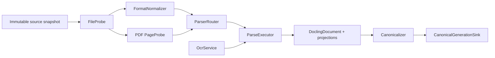

# Extensible Import Pipeline Contract

## The Five Concepts

The proposed names are good. Keep all five, but make each one do one irreversible
kind of work so format growth does not turn into a `match suffix` monolith.



| Concept | Input -> output | Owns | Must not own |
| --- | --- | --- | --- |
| `FileProbe` | bytes/snapshot -> `FileProbeResult` | magic/container facts, safety facts, encoding candidates, PDF/page observations | conversion, semantic parsing, network calls, DB writes |
| `FormatNormalizer` | probe + snapshot -> `NormalizationPlan` / `NormalizedSource` | deterministic parser-input normalization and its lineage | semantic interpretation, parser choice, canonical publication |
| `ParserRouter` | normalized source + capabilities + policy -> `ParsePlan` | registry-based adapter/page-route selection | I/O details, lifecycle mutation, UI policy |
| `ParseExecutor` (`Parse`) | parse plan -> `ParseResult` | execute selected adapters and compose a DoclingDocument/projections | source authority, durable DB state, chunks/indexes |
| `Canonicalizer` | `ParseResult` -> envelope + frozen IR manifest | validation, immutable freeze, content/envelope boundary | parsing heuristics, OCR selection, storage layout or retrieval |

`Parse` is a **phase/operation**, not an overloaded global utility class. In code,
prefer `ParseExecutor`, `DocumentParser` adapters, `ParsePlan`, and `ParseResult`.

## FileProbe: Facts, Twice

The same pure probing logic has two callers:

- **Preflight probe:** runs against the selected path to give quick local feedback;
  it is disposable and never authoritative because the file can change before enqueue.
- **Authoritative probe:** runs again after the app-owned snapshot is copied and
  SHA-256 hashed. Only this result may drive normalization, routing, or provenance.

For MVP, the probe uses an Xenix-owned signature/container registry plus format
specific readers: PDF header/basic metadata, CFB DOC signature, ZIP relationship
checks for DOCX, PNG/JPEG signatures/dimensions, and text candidate checks. It emits
facts such as suffix/magic agreement, byte size, container expansion estimate,
encryption, page count, image pixels, BOM, candidate encodings, control-character
rate, and maximum line length.

`python-magic` is useful as an optional corroborating adapter, but should not be the
MVP authority: its own package requires libmagic DLLs on Windows and warns that a
`Magic` instance is not thread-safe. Add it only after a package/DLL spike; do not
make importing accepted formats depend on it. [python-magic](https://pypi.org/project/python-magic/)

`charset-normalizer` is a good direct dependency candidate for text encoding
**candidates**, not an unquestioned answer. It can assess raw bytes but its result
must be bounded by an allowed encoding set and confidence/ambiguity policy.
[charset-normalizer API](https://charset-normalizer.readthedocs.io/en/latest/api.html)

## FormatNormalizer: Parser Inputs, Not Semantic Content

`FormatNormalizer` consumes the authoritative facts and produces a versioned
`NormalizedSource` or an executable `NormalizationPlan`. It preserves the original
snapshot/hash and records every derived input. Typical work is:

| Format | Normalization outcome |
| --- | --- |
| TXT | selected encoding, newline/control-character policy, immutable decoded text with source byte/line mapping |
| DOCX | validated OOXML container and a safe Docling-compatible source descriptor |
| DOC | `OfficeConversionCapability` plan for a versioned PDF/DOCX intermediate |
| PDF | password/repair policy, page inventory, optional page working inputs |
| JPEG/PNG | orientation/pixel transform and image-coordinate mapping |

It may materialize an **attempt-local derived input**, but only through a named
capability (for example Office conversion) and only with source hash, operation,
runtime version, and output hash recorded. It must not silently repair/rewrite a
source file or decide headings/tables/reading order. If normalizing needs I/O, it is
best expressed as a plan which the runner executes; that keeps `FormatNormalizer`
deterministic and testable.

## ParserRouter: Registry, Not an If-Else Ladder

`ParserRouter` holds a registry of `ParserRouteProvider` entries. A provider declares
the normalized formats, required capabilities, granularity, output contract,
descriptor version, and priority. The router receives policy and probe facts and
returns a fully explainable `ParsePlan`:

```text
ParsePlan
  source_hash, normalized_source_descriptor, policy/version
  units[]: document or page/region; route ID; route reason; required capability
  merge strategy: Docling page/document assembly and locator policy
```

Adding a future format becomes a new probe/normalizer/route provider registration,
plus fixtures—not an edit to UI controls or a central `if suffix == ...` block.
The product allowlist remains separate: a known Docling input format is not accepted
until the Knowledge Base enables and tests it.

## Parse and Canonicalization

`ParseExecutor` runs each plan unit with a cancellation token. It returns only
staging-relative content: a `DoclingDocument`, generated assets, labelled OCR
projections, warnings/loss notes, route descriptors, and merge provenance. It never
writes SQLite or turns results into search chunks.

`Canonicalizer` validates that the assembled DoclingDocument, envelope references,
and assets are internally consistent and contained under staging; it freezes the
Docling JSON and Xenix envelope with checksums. `CanonicalGenerationSink` is the
separate storage port that atomically publishes those files and advances the durable
current-generation pointer. See [Docling IR](docling-ir.md) for the content/envelope
contract.
