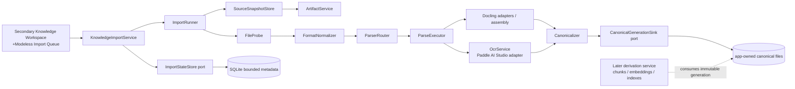
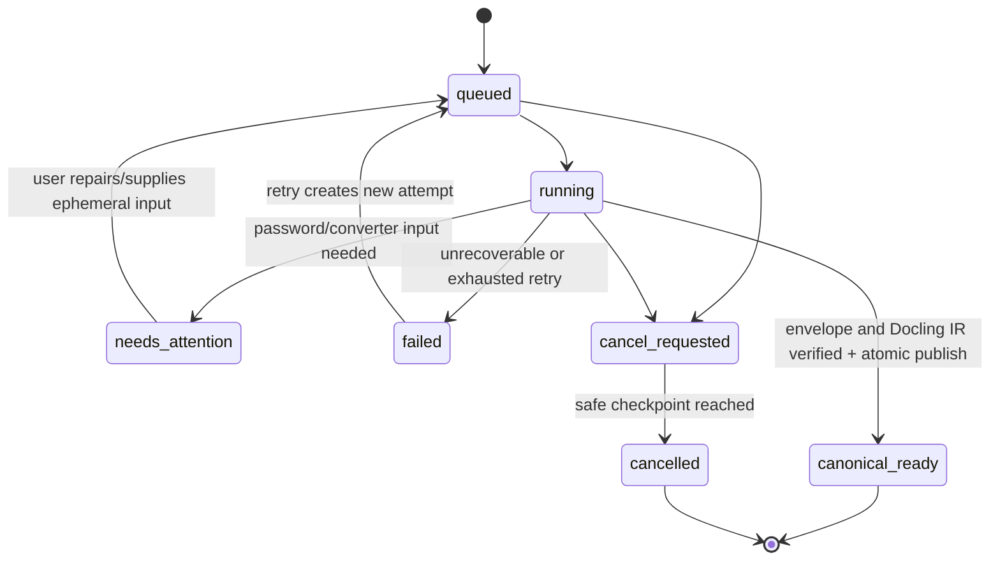

# Import Service Design

## Boundary: Canonical-Ready, Not Retrieval-Ready

`KnowledgeImportService` owns one transformation:

```text
user-selected bytes -> app-owned source snapshot -> DoclingDocument -> Xenix envelope
```

The published result is a **canonical-ready** immutable generation. Structure-aware
chunking, embedding, keyword/vector indexing, and `knowledge.lookup` are separate
storage/tool workstreams. A canonical-ready document is therefore not automatically
searchable or Agent-available.

DoclingDocument is content IR only. `Canonicalizer` freezes it beside a Xenix-owned
lifecycle envelope; it does not reproduce Docling's document tree. OCR is an optional
labelled projection performed by an independent `OcrService`. VLM is explicitly out
of MVP scope.

## Topology and Dependency Direction



All arrows point from user intent to service orchestration to adapters/ports. UI
widgets neither construct paths nor instantiate Docling/OCR/provider clients. No
adapter creates lifecycle state by itself.

## The Single-Global-Library Rule

MVP exposes exactly one global Knowledge Library. `KnowledgeImportService` resolves
the internal stable `global_library_id`; no library picker, create/rename command, or
library ID is exposed in MVP UI. The persistent model should nevertheless retain a
library identity so future multi-library support does not require a destructive data
migration. Same-content deduplication is scoped to that singleton library now.

## Facade Contract

The actual Python types belong to an approved slice, but the public service surface
should remain small and UI-safe:

```text
preflight_imports(local_file_refs) -> PreflightBatch
enqueue_imports(accepted_preflight_ids) -> ImportBatchReceipt
list_imports(cursor?, filters?) -> ImportStatusPage
get_import(import_id) -> ImportDetailView
cancel_import(import_id) -> ImportStatusView
retry_import(import_id, ephemeral_password?) -> ImportStatusView
resume_incomplete_imports() -> RecoveryReport
```

Preflight is transient. It may inspect a user-selected local file, but creates no
snapshot/artifact and cannot be an authority because the file can change. Enqueue
only passes preflight tokens/IDs; the runner snapshots and probes the immutable copy
again. All persistent/output views use IDs, display names, bounded errors, capability
labels, and `artifact://` identity—never raw source paths, secret values, or provider
payloads.

## Pipeline Contracts

The runner composes five specific concepts. Their detailed contracts are in
[pipeline-contract.md](pipeline-contract.md); the key integration rule is:

```text
SourceSnapshot -> FileProbe -> FormatNormalizer -> ParserRouter -> ParseExecutor
               -> DoclingDocument + labelled OCR projections -> Canonicalizer
               -> CanonicalGenerationSink
```

- `FileProbe` produces content and safety facts, including a PDF `PageProbe` result.
- `FormatNormalizer` produces a traceable parser-input plan, including DOC conversion
  or text decoding; it never decides semantic structure.
- `ParserRouter` selects a document/page/region `ParsePlan` through a registry.
- `ParseExecutor` runs Docling and OCR adapters and assembles a `ParseResult` with
  staging-relative assets and provenance.
- `Canonicalizer` validates/freezes Docling JSON plus its Xenix envelope. The sink,
  not the canonicalizer, owns final filesystem layout and metadata promotion.

This separates extension points cleanly: adding a future file format means registering
probe/normalization/route/parser capability plus fixtures, not changing UI logic or a
central suffix switch.

## Identity, Attempts, and Idempotency

| Identity | Meaning | Mutation rule |
| --- | --- | --- |
| `document_id` | stable logical document in the global library | persists across attempts/revisions |
| `import_id` / attempt | one user enqueue or retry execution | immutable history; retry has a new ID and `retry_of` |
| `canonical_generation_id` | one published envelope + frozen Docling IR | never overwritten; pointer moves atomically only on success |

The source SHA-256, normalized-input descriptor, probe/router/parser descriptor,
Docling/docling-core version, OCR profile descriptor, and envelope schema version
form the stage identity. A retry can reuse a verified snapshot/checkpoint only when
these identities and checksums match. A same-SHA-256 source defaults to pointing the
user to the existing document rather than adding duplicate evidence; a future explicit
revision command may create another lineage.

## Durable State Model

Status and phase are separate so the queue is trustworthy and remote work does not
invent a percentage:



`phase` is `snapshot`, `probe`, `normalize`, `route`, `parse`, `ocr`,
`canonicalize`, `validate`, or `publish`. Optional completed/total units are shown
only for real units such as PDF pages. Canonical-ready means source snapshot,
DoclingDocument JSON, envelope, assets, and manifests have matching checksums and a
durable current-generation pointer. It does not promise later index readiness.

Password-protected PDFs/DOCs are in MVP. The password is entered transiently, held
only for the current attempt, excluded from logs/manifests/SQLite, and discarded at
attempt completion. `needs_attention` preserves the snapshot when a password or
required Office converter is missing.

An image/scan without an available OCR profile can still be canonical-ready with a
valid image/page item and a visible `text_projection=unavailable` warning. It must
never pretend to expose search text. OCR outages similarly retain source/IR evidence
and create a labelled warning rather than invalidate a valid deterministic parse.

## Publication, Cancellation, and Recovery

```mermaid
sequenceDiagram
    participant U as User
    participant Q as Modeless Queue UI
    participant K as Import Service
    participant R as Import Runner
    participant F as Files
    participant A as ArtifactService
    participant M as State Store

    U->>Q: Add files, review preflight, enqueue
    Q->>K: enqueue(preflight IDs)
    K->>M: create document/attempt: queued
    K->>R: schedule attempt
    R->>F: copy bytes, hash, finalize source snapshot
    R->>A: register stable source snapshot
    R->>M: attach source artifact ID; phase updates
    R->>R: probe -> normalize -> route -> parse/OCR -> canonicalize
    R->>F: validate envelope/Docling JSON/assets; atomic promote
    R->>M: set current canonical generation + canonical_ready
    M-->>Q: durable status signal/poll result
```

Every adapter writes staging-relative references only. The runner checks a
cancellation token between safe units. On startup, it scans nonterminal attempts,
acquires a recovery lease, and resumes only checkpoints whose marker, descriptor, and
checksums match. Otherwise it cleans derived staging and produces a retryable recovery
failure. A prior canonical-ready generation is never replaced by incomplete work.

## What the Import Service Must Not Do

- It must not invoke `LLMService`, VLM, chunking, embeddings, indexes, or Agent tools.
- It must not accept Markdown or follow external/local resources referenced by a file.
- It must not make `python-magic`, a suffix, or a remote OCR response the sole source
  of format/lifecycle truth.
- It must not expose paths, secrets, unbounded source content, or raw provider errors
  to UI, future tools, or artifacts.
