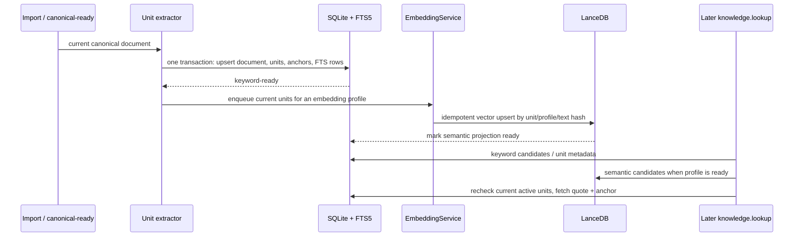

# Candidate Stack Evaluation — Retrieval-First Position

## Overall Assessment

Sir's candidate stack is coherent when its layers are assigned by retrieval purpose:

```text
SQLite: current knowledge catalog + retrievable units + lexical lookup
CAS: large source/canonical content needed to parse, open, and reindex
LanceDB: derived semantic candidate lookup
```

This is not “choose three storage media first.” It follows the three different things
the product needs to retain: a current searchable corpus, large source material, and
an optional vector acceleration structure.

## Proposed Responsibility Split

| Candidate | Store this | Why | Authority / MVP position |
| --- | --- | --- | --- |
| SQLite | library/document rows, Knowledge Units, normalized display text, versioned pre-tokenized text, source anchors, FTS5 postings, index-job status | keyword retrieval, filters, quotes, and joins must be simple and transactional | authoritative current retrieval corpus; conditional adoption pending Sir's policy confirmation |
| Local CAS | raw source snapshot, DoclingDocument/envelope JSON, referenced assets and large projections | preserve what must be opened or re-extracted without bloating query tables | Import-owned source/canonical material; not a search engine |
| LanceDB OSS | `unit_id`, vector, embedding profile/revision, content hash, active marker | semantic candidate recall over the same units | derived/rebuildable vector access path; never source of truth |

The important correction is that a bounded normalized Knowledge Unit is not an
arbitrary “large document.” It is the actual queryable business object. If Sir adopts
this split, the earlier strict task-packet rule that SQLite cannot contain chunk text
must be replaced with the narrower rule: **SQLite may hold bounded retrieval units and
their FTS index, but never raw documents, Docling IR, image assets, provider payloads,
or vector bulk data.**

Project ADR 0006 already permits bounded, queryable local application state, so this
is compatible with existing durable storage ownership; it still needs an approved
Knowledge Base product/contract decision before implementation.

## Keyword Retrieval — Accept With One Required Detail

Use SQLite FTS5 for Knowledge Unit keyword lookup, but never feed unsegmented Chinese
text to its default tokenizer. The extractor writes both:

```text
display_text:    原始规范化文本，用于 quote/snippet
fts_terms:       版本化中文/混合语言预分词结果，用于 MATCH
```

Queries go through the same tokenizer profile and escape/parameterize FTS syntax.
`jieba` is already a project dependency; its dictionary/profile becomes part of the
index profile. Use FTS5's BM25/highlight/snippet only after Chinese, English,
mixed-language, short-term, and phrase fixtures establish quality. FTS5 availability
and its tokenizer behavior must be proven in the packaged build, not inferred from a
development interpreter. [SQLite FTS5](https://www.sqlite.org/fts5.html)

Do not enable LanceDB FTS/hybrid in the first iteration. It duplicates SQLite's
lexical corpus and can introduce a second tokenizer/ranking system. Hybrid behavior
should combine **SQLite FTS candidate IDs** and **LanceDB vector candidate IDs** in
Xenix, then rehydrate/validate hits from SQLite.

## Semantic Retrieval — Adopt LanceDB Conditionally

LanceDB OSS is a credible embedded local vector option, but it has native Rust/
Arrow dependencies, a sizeable package footprint, and no cross-store transaction with
SQLite. Treat it as a rebuildable index, not as a document or metadata database.

The first semantic implementation should write vectors explicitly through an Xenix
`EmbeddingService`; do not let LanceDB's automatic embedding registry control provider
credentials, model downloads, or input preparation. A vector row contains at most:

```text
unit_id, profile_id, profile_revision, text_hash, vector, active
```

After a LanceDB search, Xenix fetches/rechecks the unit in SQLite before returning it.
That prevents a stale/deleted vector row from becoming visible. Start with exhaustive
search; ANN index creation/optimization is a later measurement-triggered switch.

LanceDB supports local tables, vector search, filtering, manual indexing, and its own
FTS/hybrid features; those features are why its role must be kept narrow here.
[LanceDB tables](https://docs.lancedb.com/tables)
[LanceDB vector indexes](https://docs.lancedb.com/indexing/vector-index)
[LanceDB hybrid search](https://docs.lancedb.com/search/hybrid-search)

## Write and Query Flow



The SQLite transaction is the point at which keyword retrieval becomes available.
LanceDB may lag or be rebuilt without corrupting the corpus; hybrid mode reports the
actual modes used rather than fabricating semantic coverage.

## Supporting Reliability, Kept Proportional

| Mechanism | Position | Scope |
| --- | --- | --- |
| WAL | adopt after storage/package verification | permits concurrent readers with one SQLite writer; database must remain local, and long reads/checkpoints need monitoring [SQLite WAL](https://sqlite.org/wal.html) |
| Single write coordinator | adopt narrowly | serialize **Knowledge** SQLite/FTS and LanceDB index mutations; workers emit staged extraction results rather than independently mutating the corpus |
| SHA-256 CAS | adopt for app-owned large source/canonical blobs | content identity/dedup and safe source/canonical references; not the retrieval corpus |
| `zstandard` | conditional codec | reasonable for Docling JSON, but Python 3.12–3.14 support and PyInstaller need a pinned direct dependency/package spike; do not compress already-compressed source bytes by default |
| staging + atomic rename | adopt for CAS blob publication | staging must share the final volume; it cannot atomically commit SQLite + filesystem + LanceDB together [Python `os.replace`](https://docs.python.org/3/library/os.html#os.replace) |
| idempotent state/index profile | adopt minimally | one current input/profile key, `pending/ready/failed` state, retry/rebuild; not a full audit log or retained history |
| integrity checking | adopt at publish/rebuild/maintenance | verify blob hash/size, SQLite/FTS integrity, vector count/profile consistency; never run an exhaustive scan on every lookup |

For a CAS object, separate the logical content hash from the storage codec descriptor:
hash the uncompressed canonical JSON or raw asset bytes, then record `zstd` version/
level and stored-byte hash/size in its manifest. That avoids changing logical identity
solely because compression settings evolve. [Python `hashlib`](https://docs.python.org/3/library/hashlib.html)

## LanceDB Adoption Gates

LanceDB should enter the product only after an isolated spike proves:

1. pinned `lancedb`/`pylance`/`pyarrow` versions work on Windows Python 3.12, 3.13,
   and 3.14 and in the packaged application;
2. its native DLLs/hidden imports, package size, license notices, and offline behavior
   are acceptable;
3. idempotent upsert, deletion/tombstone filtering, restart, profile switch, and
   rebuild from SQLite units behave correctly;
4. Chinese FTS5 plus LanceDB vectors improves the actual target corpus; and
5. exhaustive versus ANN search is selected by P95 latency, memory, recall, and disk
   evidence—not vector count folklore.

LanceDB is Apache-2.0, but its distributed native dependencies still require a
license/notice inventory. [LanceDB repository](https://github.com/lancedb/lancedb)

## MVP Order

1. Define and test Knowledge Unit granularity plus source anchors.
2. Implement SQLite rows + Chinese-pretokenized FTS5 keyword lookup; this alone
   fulfills the first useful retrieval promise.
3. Add CAS/Docling JSON archival only as Import requires it, with zstd gated by
   packaging evidence.
4. Add explicit EmbeddingService → LanceDB vector projection and report readiness.
5. Add hybrid fusion and the Agent tool after the ToolScope enabled/off design.
6. Enable ANN/index optimization only after measured need.
