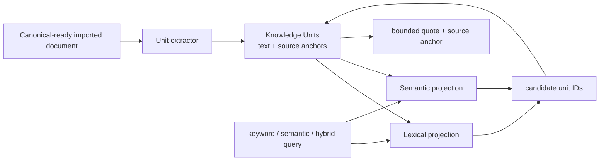

# Retrieval-First Information Model

## Start With the Observable Lookup Result

The later `knowledge.lookup` call must answer one concrete question: which small,
usable passages from the global imported-document library help the Agent answer the
user now?

Each hit therefore needs only:

```text
KnowledgeUnit
  unit_id
  document_id + current canonical revision
  normalized searchable text
  bounded quote/excerpt
  source anchor: source artifact + page/section/Docling item locator
  lightweight filters: title, source type, language, optional user labels
```

The `quote` may be the whole small unit or a span selected from it. The source anchor
answers “where did this come from?”; it is a retrieval requirement, not an attempt to
build a full audit log.

## What We Store, and Why

| Object | Why it is stored | Minimum content |
| --- | --- | --- |
| Library catalog | constrain global lookup now and permit future scoped lookup | stable hidden `library_id`, enabled/index availability |
| Document catalog | filter, present title, open original, and know whether its units are current | `document_id`, source artifact ID, canonical revision/fingerprint, title, lifecycle |
| Knowledge Unit | the actual object a search must find and quote | normalized text, source anchor, order/type/language, content fingerprint |
| Lexical projection | find units for exact terms, phrases, and keyword queries | token/posting representation keyed by `unit_id` |
| Semantic projection | find conceptually similar units when configured | embedding profile descriptor and vector representation keyed by `unit_id` |
| Projection availability | distinguish no results from not-yet-indexed/unavailable | current input fingerprint, profile, status, safe error code |

Only the first three are domain data. Lexical/semantic representations are derived
retrieval projections: they may be rebuilt, replaced, or absent without changing what
the document said.

## Read and Write Paths



On canonical revision change, the system updates the document's current units and
invalidates/rebuilds the relevant projections. It does not need append-only attempts,
full historical generations, a provenance graph, or an elaborate recovery subsystem
to meet MVP retrieval behavior.

## MVP Scope Discipline

MVP indexes **imported documents only**. It does not automatically ingest chat turns,
datasets, model artifacts, arbitrary logs, or AI-generated conclusions. It does not
introduce editable Knowledge Items, inter-item relations, a knowledge graph, or a
multi-source truth model. Those can be separate future product decisions.

## Unit Granularity Is a Product/Quality Decision

Use a hierarchy-aware extractor rather than one global character count. Candidate
units may be a paragraph group under a heading, a table row group with headers, or an
OCR passage tied to an image/page. The final rule should optimize the lookup result:

- enough local context to be understandable;
- small enough to return a bounded quote;
- exactly locatable in the original document; and
- stable enough to reindex predictably after a document changes.

Do not choose unit shape based on a database page, file record, or vector batch size.
