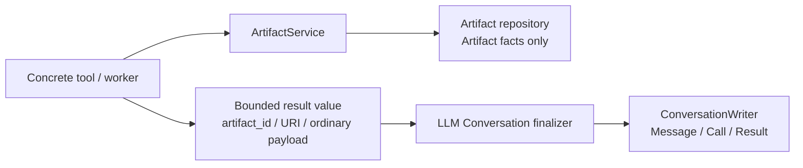

# Artifact Provenance Removal — Implementation Rehearsal

## Status and Working Assumption

This is a pre-implementation dry run, not product-code authorization. It assumes the accepted scope in [15-artifact-provenance-removal-impact-handshake.md](15-artifact-provenance-removal-impact-handshake.md): remove every Thread/Turn/Message/Tool Call Artifact relationship; remove Artifact aggregation from the canonical Conversation snapshot and Thread-deletion ownership.

It is retained as the detailed Artifact workstream rehearsal. It must be executed only as part of the single whole-task cutover in [17-whole-task-implementation-rehearsal.md](17-whole-task-implementation-rehearsal.md), not as its own schema/release slice.

No lineage replacement, `ToolResultMessage.artifact_refs`, deferred binding, Tool Call tombstone, recovery rule, or data-idempotency work is part of this slice.

## Target Topology to Preserve While Editing



There is deliberately no edge from ArtifactService/ArtifactRow to Conversation/Harness storage, and no edge from the Conversation finalizer back to Artifact for reconstruction. A process can therefore leave a domain Artifact after a provisional exchange is discarded; that remains the accepted loss trade.

## Confirmed Starting Facts

| Fact | Evidence / implementation consequence |
| --- | --- |
| Current `ArtifactRow` has four outbound FKs and seven indexes. | Fresh ORM DDL probe confirms nullable `thread_id`, `turn_id`, `message_id`, `tool_call_id`; `kind` is `VARCHAR(10)`; JSON and Boolean fields must be copied without coercion. |
| SQLite foreign keys are enabled for normal storage connections. | The rebuild must work with `PRAGMA foreign_keys=ON`; a temporary SQLite rehearsal successfully copied the domain columns, dropped the old Artifact child table, renamed the replacement, and retained the row without disabling FKs. |
| v14 is currently terminal. | `CURRENT_SCHEMA_VERSION = 14`, `run_migrations` stops at `migrate_v13_to_v14`, and `SQLModel.metadata.create_all` runs only for a fresh `user_version=0` database. Model changes alone cannot alter deployed v14 Artifact tables. |
| Artifact registration currently requires Conversation validity. | `ArtifactService` imports `AgentConversationRepository`, instantiates it, calls `_validate_links`, and also exposes `list_thread_artifacts`. All of this must disappear. |
| Artifact writes happen before later Conversation finalization. | Three direct tool paths and the generated-dataset worker forward the current Turn/Tool Call IDs. This is the concrete reason the FK requirement conflicts with staged Calls. |
| Canonical Conversation currently has an accidental Artifact read side. | `ThreadSnapshot.artifacts` is queried in `ConversationStore`; production code has no reader of that field, while two first-slice tests use it. |
| Ordinary result values are distinct from normalized lineage. | Existing tool outputs already contain bounded `artifact_id`/URI descriptors. Preserve them; do not add a field/table that turns them into Artifact-to-Message provenance. |
| Worker bootstrap runs storage initialization. | A preprocessing worker may initialize the database independently, so the migration must be complete and valid before worker-side Artifact registration runs. |

## Implementation Sequence

Apply these as one coherent source-and-test batch; do not leave an intermediate source state that relies on a mismatched ORM schema.

### 0. Freeze the exact semantic choices

Before mutation, confirm these interpretations:

1. `ArtifactRow` and `RegisterArtifactInput` contain no `thread_id`, `turn_id`, `message_id`, or `tool_call_id`. No metadata field substitutes for them.
2. Deleting a Thread never deletes its Artifact rows/files. Artifact has no stale Thread label because it has no Thread field.
3. `ThreadSnapshot` no longer contains `artifacts`; a future UI read model must query Artifact explicitly rather than expand canonical Conversation state.
4. The old `ToolExecutionContext.turn_id` and `tool_call_id` fields are not removed in this narrow correction. They become unused by Artifact writes and are removed only in the approved no-Turn protocol slice, rather than silently widening this change into a Harness redesign.

### 1. Change the schema and forward migration together

Files: `storage/models.py`, `storage/migrations.py`, storage bootstrap/migration tests.

1. Remove `ArtifactRow.thread_id`, `turn_id`, `message_id`, and `tool_call_id` entirely.
2. Advance the owned version to 15 and add only `migrate_v14_to_v15`; never rewrite an existing migration edge.
3. In one SQLite transaction, validate the supported legacy Artifact table shape, then:
   - create a temporary replacement table with only target columns and **no indexes yet**;
   - copy `id`, `kind`, title/path/media/summary, preview/metadata JSON, ready flag, and creation timestamp verbatim;
   - drop the old Artifact table, rename the replacement to `artifact`, then create the three target indexes (`kind`, `title`, `mime_type`);
   - set `PRAGMA user_version=15` last.
4. Do not disable foreign keys. The old Artifact table is a child table only; the rehearsal proves this rebuild is valid with normal FK enforcement.

The table replacement must not create target-named indexes before dropping the old table because SQLite index names are global and would collide with the existing `ix_artifact_*` names.

### 2. Remove the domain-to-conversation dependency

Files: `artifact_service.py`, `storage/repositories/artifacts.py`.

1. Remove `AgentConversationRepository`, `_conversations`, `_validate_links`, and all Turn/Message/Tool Call fields from `RegisterArtifactInput` and `ArtifactRow` construction.
2. Remove `list_thread_artifacts`, `list_by_thread`, `list_by_message`, and `list_by_tool_call`; no current production caller needs a Conversation-derived Artifact query.
3. Retain only Artifact-domain query methods such as direct ID/URI resolution and kind listing.
4. Recommended contract hardening: set `RegisterArtifactInput` to reject unknown fields (`extra="forbid"`) and add a focused test that legacy `turn_id` input fails visibly. All current callers are in-process constructors, not a public permissive JSON API. If that behavior change is not desired, retain the default only deliberately and use static call-site tests to prevent silent reintroduction.

### 3. Remove the reciprocal Conversation read/lifecycle coupling

Files: `storage/repositories/agent_conversations.py`, `agent/conversation_store.py` and focused tests.

1. Delete the `ArtifactRow` import and pre-Thread-delete Artifact deletion loop.
2. Delete the Artifact repository dependency, `ThreadSnapshot.artifacts`, and its query from `ConversationStore`.
3. Rewrite the two snapshot tests to obtain the ordinary result `artifact_id` and call `ArtifactService.resolve_uri`; do not invent a new snapshot field or Message reference.

### 4. Remove provenance from local and worker Artifact writes

Files: `agent/tools.py`, `dataset_export_service.py`, `preprocessing_worker.py`, their focused tests.

1. Remove `thread_id`, `turn_id`, and `tool_call_id` from the three direct `RegisterArtifactInput` calls, DatasetExportService signature, generated-dataset worker payload, and worker forwarding.
3. Preserve error cleanup around generated export files/datasets and preserve existing bounded tool payloads.
4. Do not touch provider `tool_call_id` fields: those are current provider-wire correlation and outside Artifact provenance.

### 5. Verify the boundary, not only compilation

Run the focused suites during the change, then broader checks after all assertions pass:

```text
pdm run test tests/test_migrations.py tests/test_storage_bootstrap.py
pdm run test tests/test_agent_harness_foundation.py tests/test_agent_harness_first_slice.py
pdm run test tests/test_analysis_graph.py tests/test_analysis_lambda.py tests/test_analysis_profile.py tests/test_data_cleaning.py tests/test_data_tokenization.py tests/test_data_transform.py tests/test_services.py
pdm run check
```

Run the repository-wide test suite only after these focused proofs pass.

## Predicted Branches and Friction

| Situation | Decision / response | Why |
| --- | --- | --- |
| A future UI asks for per-Thread Artifact filtering. | Do not use Artifact fields or metadata to rebuild the relation. Propose an explicit presentation/domain read model after this migration. | It is a distinct product capability and cannot reintroduce Artifact-to-Conversation coupling by convenience. |
| A v14 database has no `artifact` table. | Treat it as an unsupported/corrupt v14 baseline unless evidence proves it was a released valid shape; do not silently guess missing domain rows. | A migration must not conceal unknown schema history. |
| A v14 Artifact table is missing a preservation-critical domain column or has a pre-existing temporary replacement table. | Fail closed with a diagnostic; do not `DROP` it or fabricate values. | Transactional migration protects known states; a leftover intermediate table indicates a state that needs recovery guidance. |
| `metadata_payload` violates the old NOT NULL contract. | Let the transactional copy fail rather than silently converting unknown data to `{}`. Repair only if an evidenced legacy defect is found and is explicitly added to the migration. | Preserves domain truth and makes corruption visible. |
| An old application/worker remains alive during upgrade. | It may attempt an insert containing dropped columns and fail. Treat mixed-version concurrent use as unsupported; close existing app/worker processes before schema migration. | The SQLite schema transition is intentionally not backward-compatible with an old Artifact ORM. |
| Storage worker starts while the main process migrates. | Normal composition should finish main bootstrap before worker spawn. If a concurrent startup reaches the same DB, surface the SQLite lock/failure rather than continuing against mixed schema. | The worker is not a migration authority and must not race a partially upgraded store. |
| Stale code passes removed input fields. | Prefer `extra="forbid"` plus a regression test; otherwise Pydantic/SQLModel may silently ignore extra fields. | A silent ignored `turn_id` hides a broken caller and weakens the boundary. |
| Tests still depend on `snapshot.artifacts`. | Replace only those test assertions with resolution through existing bounded result payloads. Do not make Artifact data a canonical Conversation projection again. | Keeps the test aligned with the corrected topology. |
| A search finds provider `tool_call_id` fields. | Leave them untouched. | Provider correlation is not an Artifact foreign key or Artifact lineage. |
| A generated domain Artifact exists after a cancelled/discarded exchange. | Retain it as an accepted domain orphan; do not add cleanup/recovery/idempotency machinery here. | This is the already accepted process-loss and side-effect trade. |

## Information Needed at Implementation Time

1. A supported v14 Artifact DDL fixture with one populated row, including JSON, nullable fields, and all four old Conversation values. This is the authoritative migration test input, not a current ORM model reused as a fake legacy schema.
2. A current fresh-schema probe asserting exact columns, no outbound FKs, target indexes, and ORM readability of the copied Artifact row.
3. A final `rg` inventory after editing for:
   - `ArtifactRow.thread_id`, `.turn_id`, `.message_id`, `.tool_call_id`;
   - `RegisterArtifactInput(... thread_id/turn_id/message_id/tool_call_id ...)`;
   - `_validate_links`, `list_by_thread`, `list_thread_artifacts`, `list_by_message`, `list_by_tool_call`, and `snapshot.artifacts`; and
   - accidental `services.agent` imports from Artifact domain code.
4. Confirmation that no deployment process intentionally supports an older executable/worker sharing the same local database during an upgrade.

## Minimum Proof Matrix

| Proof | Expected observation |
| --- | --- |
| Fresh bootstrap | Artifact has target columns/indexes, no Conversation foreign keys, and current version 15. |
| v14 upgrade | One populated Artifact keeps every domain fact and ORM-loads; only the four rejected Conversation values disappear. |
| Artifact registration without Conversation | Register succeeds with no Thread/Turn/Message/Tool Call row or input. |
| Thread deletion | Conversation rows delete; the Artifact remains resolvable by `artifact://` and is not included in any canonical snapshot. |
| Local tool and worker | Artifact registration succeeds without final Tool Call persistence; result payload still exposes the normal bounded artifact ID/URI. |
| Static topology | ArtifactService has no `services.agent` / Conversation repository import; repositories expose no Message/Tool Call Artifact queries. |
| Negative input guard | If `extra="forbid"` is adopted, legacy provenance kwargs fail at input validation rather than being ignored. |

## Deliberate Non-Goals During This Slice

- No removal or replacement of old Turn/Run persistence beyond Artifact's former dependency on it.
- No redesign of `ToolExecutionContext`, tool dispatch ownership, provider normalization, pending-message finalization, or Chatbot events.
- No Artifact garbage collection, file lifecycle repair, name-collision work, data-lineage modeling, or cross-process recovery.

The narrow correction is complete only when this topology is true in source, fresh storage, and an upgraded v14 database—not merely when the old fields disappear from type definitions.
