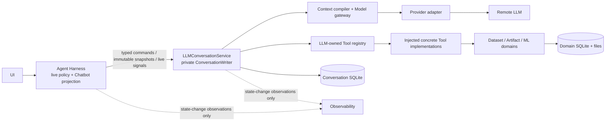

# Whole-Task Implementation Rehearsal — One Cohesive Cutover

## Status

This is the master implementation rehearsal for the **entire** LLM Conversation Service / Agent Harness boundary change. It supersedes any interpretation of Artifact provenance removal as an independently deployable slice.

> **Stage 23 supersession (2026-07-15).** The historical rehearsal below says
> that source intake obtains a Dataset/Artifact pair. The delivered source
> projection contract no longer does that: intake materializes a Dataset and
> records original-source provenance in `DatasetImport`; it writes only the
> Dataset reference into canonical conversation state. Harness derives the
> temporary source attachment for Chatbot presentation without an Artifact
> relation. This note corrects the live contract without rewriting the
> rehearsal evidence.

The delivery unit is one complete source, schema, runtime, UI, and migration cutover. Internal workstreams describe a safe development order only; none is a separately shippable architecture or schema state. Product code remains unchanged until one whole-task Impact Handshake is approved.

The planned storage edge is one forward `v14 -> v15` migration containing the final Conversation model, legacy-aggregate removal, Artifact decoupling, and all required data conversion. There is no preliminary Artifact-only migration.

## Non-Negotiable End State

1. `LLMConversationService` is the public deep facade for canonical Thread/typed Message persistence, context compilation, provider interaction, Tool protocol/registry/dispatch, and private writer ownership.
2. Agent Harness owns only live policy: intake/import coordination, whether/when to sample or invoke a staged Tool, step/guard/cancellation decisions, and Chatbot-event projection.
3. Canonical durable state is one ordered Thread Message log. `UserMessage`, `ClientControlMessage`, `AssistantMessage`, `ToolCallMessage`, and `ToolResultMessage` are independent final Message kinds. `PendingLLMSamplingMessage` is the sole provisional kind.
4. No persistent `Turn`, `Run`, provider-request lifecycle, completion-guard row, tool execution ledger, response group, parent Assistant, or Artifact-to-conversation lineage remains.
5. A Tool Call is not an Assistant part. A Tool Result directly and uniquely identifies one Tool Call; the final LLM emission containing Calls and all Results commits atomically.
6. Artifact keeps Artifact facts only. It neither validates nor stores Thread/Turn/Message/Tool Call provenance, and Message gains no normalized Artifact reference field.
7. Process loss discards the incomplete exchange. It does not replay a Tool, infer a Tool Result from an Artifact/log/domain row, or restore a step/guard pause.
8. Observability is write-only relative to Conversation authority: loss, duplication, rotation, or outage cannot alter replay, frontier eligibility, final Tool Results, or recovery behavior.

## Target Topology



The only reverse-looking runtime path is dependency inversion: composition registers a concrete Tool implementation against an interface defined by LLM. LLM never imports Harness, concrete Tool modules, or domain services; Harness never invokes a Tool handler or writes a canonical Message/result.

## End-to-End Rehearsed Control Flow

### 1. Client intake and source attachments

1. Harness asks `LLMConversationService` to claim a Client submission under the per-Thread writer gate, using `thread_id`, the observed final frontier ID, and `client_submission_id`.
2. The claim is **in-memory only**. It prevents duplicate local attachment materialization while the same process is alive; it is not a stored Turn/Run/message lifecycle.
3. After the claim succeeds, Harness imports source attachments and obtains stable Dataset domain IDs. A crash at this point may leave a domain record without a User Message; that is an accepted pre-conversation side effect.
4. Harness asks the service to append the immutable `UserMessage` with bounded domain references. The database uniqueness constraint on `(thread_id, client_submission_id)` handles an acknowledgement-lost duplicate after commit.
5. On import failure, Harness releases the in-memory claim and no User Message is appended. On a stale/duplicate claim, Harness must not import again.

This is the required answer to the current bug where source import can happen before a rejected or duplicate User append. It does not make LLM call Harness or grant Harness a Message setter.

### 2. Sampling, staging, and policy

1. Harness calls `sample_existing_frontier(thread_id, expected_frontier_id, tool_scope, model_selection)`.
2. Under the same writer gate, the service verifies the exact final Client frontier and inserts one `PendingLLMSamplingMessage`; provider I/O happens after the gate is released.
3. The model gateway normalizes normal and streaming output into one ordered provider-neutral sequence. Streaming text remains retry-safe buffered until that completed sequence exists; Harness consumes only transient sampling/retry signals and turns them into Chatbot events.
4. The service holds normalized Tool Calls and terminal candidates in a private, in-memory pending-exchange registry keyed by the pending Message ID. It has no persistence other than the allowed pending Message and enforces the selected count/byte bounds below.
5. Harness can inspect read-only staged Call descriptors and decide whether to trigger `invoke_staged_tool(pending_message_id, staged_call_message_id)`. The service revalidates frozen scope/contract, invokes its own registered Tool implementation, and holds the bounded terminal candidate. Harness never supplies an outcome.
6. Dispatch is serial by default. The final canonical order is provider source order even if a future policy permits parallel work.
7. When all staged Calls are terminal, the service compare-and-swaps the current pending Message and writes the final Assistant/Tool Call sequence plus every directly linked Tool Result in one transaction.
8. For a no-Tool Assistant candidate, Harness applies the live completion-guard policy and either asks the service to finalize it or supplies a typed Client-control proposal for the service to append before the next sample. The guard itself remains live; only an actual context-changing control is durable.

The private pending-exchange registry is not a public or persisted Run. A later process has no registry entry and can only discard the stale pending Message at the writer-startup barrier.

### 3. Cancellation, pause, deletion, and late work

- Harness holds cooperative cancellation tokens for provider/Tool work. It asks the service to invalidate the pending Message under the writer gate before displaying the terminal UI state.
- A finalizer, cancellation, Thread deletion, or shutdown wins by compare-and-swap on that pending Message ID. A losing provider/Tool callback is a no-op; it cannot recreate a Message or Tool Result.
- A known Tool failure/cancellation that arrives while its pending exchange is still current is a bounded terminal Tool Result. A process-loss interruption is not.
- A live step-budget pause retains only in-memory Harness policy plus the pending Message/private registry. Confirmation continues only in the same process. Exit discards it; there is no resume command by old ID.
- Thread deletion performs invalidate/cancel -> delete under writer ordering. Domain effects already started may survive, but no late callback can resurrect the Thread.

## Proposed Public and Internal Module Shape

`LLMConversationService` is the new public facade. The current provider/settings wrapper must not keep the broad public `LLMService` name after it becomes only one subordinate capability.

| Module / role | Authority | Boundary rule |
| --- | --- | --- |
| `services/llm/conversation.py` — `LLMConversationService` | public commands, snapshots, writer gate, pending lifecycle | no imports from `services.agent` or concrete domain modules |
| `services/llm/messages.py` | typed Message DTOs, final/provisional grammar, snapshots | callers get immutable values, never ORM rows |
| `services/llm/tooling.py` | Tool definition, implementation protocol, registry, frozen scope, staged invocation/result types | concrete implementations depend on this contract, never the reverse |
| `services/llm/context.py` | final Message -> provider history/tool definitions | pure projection; cannot mutate canonical Message data |
| `services/llm/gateway.py` | provider selection, retry, transport, normal/stream normalization | replaces the current low-level `LLMService` facade role; no Conversation writes outside the service |
| `services/agent/harness_service.py` | live intake, policy, confirmation/cancellation, signal-to-Chatbot reduction | holds no repository/session/tool registry and returns no canonical outcome |
| `services/agent/tools.py` | injected concrete Tool implementations | no longer owns Tool interface/registry/presentation as one object |
| `services/agent/tool_presentations.py` and Chatbot projection | UI policy | consumes typed ToolCall/Result snapshot values only |

`LLMSettingsService` remains its existing configuration owner. The exact internal gateway name can be settled during code organization; the public name is `LLMConversationService`, not `LLMChatService` and not a renamed provider wrapper.

## Canonical Storage Shape and Enforcement Plan

The recommended durable names are `conversation_thread` and `conversation_message`, replacing `agent_thread` and all old execution tables. Exact source identifiers should use the same vocabulary (`ConversationThreadRow`, `ConversationMessageRow`) rather than preserve Agent/Turn terminology as compatibility camouflage.

`conversation_message` must use explicit protocol-critical columns, not an opaque `(kind, payload)` blob as its only contract:

- common immutable identity/order: `id`, `thread_id`, `sequence_index`, `kind`, `created_at`;
- Client identity/content: `client_submission_id`, bounded content/domain-reference payload;
- Assistant content: typed bounded text/refusal/reasoning fields, with no raw provider payload or generic opaque continuity blob in v15;
- Tool Call identity: Tool ID, provider Call ID where applicable, contract version, frozen arguments, scope fingerprint;
- Tool Result identity: `tool_call_message_id`, terminal status, bounded value/error; and
- Pending has no live execution fields beyond its Message identity and creation time.

The pending Message reserves the next sequence position. Finalization deletes that exact pending row and inserts the first final LLM Message at its reserved position, followed by the rest of the ordered emission/Results in the same transaction. No later Client append is allowed while it exists.

Variable bounded content may use JSON columns; protocol identity, ordering, direct Call/Result relation, and lifecycle must use explicit columns and constraints.

Required mechanical backstops:

1. unique `(thread_id, sequence_index)`;
2. unique client submission identity within a Thread;
3. partial unique index allowing at most one pending Message per Thread;
4. unique Tool Result -> Tool Call relation;
5. same-Thread and target-kind validation for Result -> Call through a SQLite trigger or equivalent database assertion plus writer validation;
6. final Message immutability through writer-only mutation and a database update guard; and
7. no generic repository method that independently appends a Call or Result.

The writer, rather than a new response-group table, proves the cross-row all-or-nothing emission invariant. Provider response grouping is reconstructed only as an adapter projection of the validated contiguous final sequence.

## Provider and Context-Compiler Rehearsal

The only supported runtime dialect today is OpenAI-compatible Chat Completions. The whole task must improve that one adapter before claiming a generic multi-provider abstraction.

| Current behavior | Final behavior |
| --- | --- |
| `ProviderResponse` separates `assistant_content_blocks` and `tool_calls`; raw responses/SSE chunks can flow onward. | One ordered `ProviderOutputItem` sequence. The initial adapter stores only typed text/refusal/reasoning plus Tool Call IDs/arguments; raw wire remains observability-only. |
| Unknown provider Tool Calls are silently skipped. | Unknown/unexposed Tool names, blank/duplicate Call IDs, malformed/oversized arguments, zero or multiple selected choices, invalid stream indexes, and unsupported ordering fail before dispatch and discard the pending exchange. |
| Normal and stream loops create different persistence/event flows. | Both paths normalize into the same final item sequence and use the same staging/finalization code. Streaming adds only transient sampling/retry signals while text remains retry-safe buffered. |
| Replay joins adjacent old rows. | Context compiler reads final typed Messages, direct Result -> Call links, and explicit sequence grammar. |

For OpenAI-compatible Chat Completions, the ordering rule is fixed and must be tested: exactly one completed assistant choice maps to zero or one typed Assistant Message from its whole content/reasoning/refusal, followed by Tool Call Messages in normal-response `tool_calls[]` order or completed stream-index order. Stream arrival order is not canonical ordering; indexes must be strict, non-negative, and contiguous from zero. A malformed/empty result without Calls, blank or duplicate Call IDs, unknown exposed-name mismatch, non-object JSON arguments, over-limit calls/arguments, or unsupported output shape fails closed before dispatch. A future provider that cannot present an equally faithful ordered item sequence is rejected rather than inventing an Assistant envelope or silently reordering semantics.

No Responses API cursor/shared remote Conversation is introduced. If a future adapter needs opaque continuation, it must declare a lossless canonical continuity field and capability/fallback rule before it is enabled.

## Tool, Skill, and Domain Rehearsal

1. Move `AgentToolSpec` out of provider transport and into LLM-owned tooling.
2. Split the current `AgentTool` object: LLM owns Definition/Protocol/Registry/Invocation; concrete domain-backed implementations own only implementation; Harness/UI owns presentation.
3. Composition root creates implementations and registers them with the LLM-owned registry. Harness receives neither the registry nor a handler execution port.
4. Harness passes only a provider-neutral scope selection (Tool/Skill identifiers and policy constraints). LLM validates it, resolves definitions/resources, and compiles provider context. Harness does not build Tool prompt fragments or wire schemas.
5. Current built-in Skill activation/resource tools move through the same registry and context-compiler path. Their activated state must derive from final Message facts, not a hidden Harness map.
6. `ToolExecutionContext` loses persistent Turn/Tool Call identities in this full cutover. Implementations receive only the bounded domain context they need (for example Thread scope, discovered Dataset IDs, and a live cancellation probe). Artifact registration receives none of the removed conversation provenance.
7. Tool outputs retain ordinary stable IDs, such as `dataset_id`, `artifact_id`, ML task ID, and provider-safe bounded summaries. They do not expose paths or add a normalized Artifact relation to Message.

## Artifact Is an Internal Sub-Step, Not a Separate Delivery

Inside the single v14-to-v15 migration and source cutover:

- rebuild `artifact` without `thread_id`, `turn_id`, `message_id`, `tool_call_id`, or Conversation foreign keys;
- remove ArtifactService's Conversation repository import/validation and all Artifact repository Thread/Message/Tool queries;
- remove Conversation snapshot Artifact aggregation and Thread-delete Artifact cleanup; and
- remove provenance forwarding from Tool implementations, DatasetExportService, and preprocessing worker.

Artifact table replacement must occur before legacy Conversation tables are dropped. It copies all Artifact-domain facts verbatim, creates target indexes only after the old table is gone, and never creates an Artifact-to-Message substitute.

## Full v14-to-v15 Migration Choreography

1. Start one transaction from a supported v14 database. Verify the legacy tables/columns needed for conversion; fail closed on unsupported/corrupt shapes rather than fabricating history.
2. Create target Conversation tables and target Artifact replacement table without conflicting indexes.
3. Copy Artifact domain facts and remove all four old Conversation columns (`thread_id`, `turn_id`, `message_id`, `tool_call_id`).
4. For each legacy Thread, migrate stable title/model/instructions and walk legacy Messages in deterministic sequence order.
5. Map only verified final protocol units:
   - completed User/Assistant content becomes the corresponding typed final Message;
   - a completed legacy Tool Call plus its unambiguous terminal result becomes independent final ToolCallMessage and ToolResultMessage;
   - provider Call IDs and bounded required reasoning continuity are retained only when valid; and
   - stable System instruction is normalized into Thread configuration or an explicit Client control only when its semantics are known.
6. At an unmatched/nonterminal Tool Call, discard the dependent suffix. A later independently rooted User segment may start a new valid target segment. Never manufacture a Result, tombstone, response group, or replay claim.
7. Treat legacy `IN_PROGRESS`/failed/cancelled execution residue, `AgentRun`, provider-request, and guard rows as non-conversation execution state. Do not carry them into the target journal or use them to restart work.
8. If a supposedly complete legacy group is non-adjacent/corrupt such that ordering or pairing would be invented, fail the migration rather than silently producing an incoherent transcript.
9. Drop old Artifact links and legacy Conversation/Turn/Run/provider-request/guard/mutable-ToolCall tables only after target rows are written and validated in the transaction. The legacy `agent_turn.user_message_id -> agent_message` and `agent_message.turn_id -> agent_turn` foreign-key cycle must be explicitly broken (null the old optional `user_message_id` values after conversion) before dropping the old Message/Turn tables under normal SQLite FK enforcement. Drop remaining children before parents. Set schema version last.
10. After the application-root writer guard is acquired, the main `LLMConversationService` startup barrier may discard stale target pending Messages. Generic storage bootstrap and worker bootstrap must never perform that cleanup.

Fresh bootstrap creates only the target schema. Upgrade tests use manually authored v14 schema/data fixtures, not current ORM definitions masquerading as history. The migration must prove ORM readability, foreign keys/indexes, row preservation, incomplete-suffix cutting, and fresh/upgrade equivalence.

## Harness, UI, Title, and Observability Rehearsal

### Harness and Chatbot events

- Replace `submit_user_turn`, `cancel_run`, `ContinueStepBudgetInput`, Run IDs, and Turn IDs with Message-frontier and pending-Message commands.
- A live Chatbot activity is keyed by pending Message ID; a live Tool activity is keyed by staged/final ToolCallMessage ID. Neither is a persisted Chatbot Event.
- `Thinking` begins/ends around provider sampling only. It is not a Message and does not remain active while a Tool runs.
- On joint final commit, Harness reloads/projects final snapshot events. On discard/cancel/process loss, it removes provisional UI activity and does not render a fake failed transcript row.
- Tool details project typed Call/Result values, preserve bounded details/actions, and do not query a mutable Tool Call row.
- Title generation remains an explicit secondary model operation over final context. It updates Thread title only; it does not create a Run/provider-request/message or mutate history.

### Step guard and completion guard

- Step count, confirmation, selected live model, cancellation token, and guard attempts live only in Harness memory.
- A guard that changes later model context yields an explicit ClientControlMessage through an LLM service command; a guard decision alone is not persisted.
- A process exit during confirmation does not resume. The stale pending exchange is discarded, and UI offers only an explicit new sample from the final Client frontier.

### Observability and usage

- Provider attempts, retries, raw wire/SSE chunks, timing, cancellation diagnostics, failure context, and successful token usage move to logs/traces/metrics only.
- The current persisted `AgentProviderRequestRow` and `AgentRun.usage_payload` are removed. Chatbot connection/retry/optional-usage events become live-only projections.
- No successful token usage is migrated into a Message field or used to recover state. Token accounting does not affect replay or the next valid frontier.

## One-Writer and Startup Rehearsal

1. Move `SingleInstanceGuard` from `scripts/run_packaged.py` to the common GUI startup path reached by both packaged and development launchers, after Velopack's required first hook and before storage/conversation writer construction.
2. Keep worker entry points outside that GUI path. Workers may use domain storage but must not construct `LLMConversationService`, writer capability, or pending cleanup.
3. `ConversationWriter` is private to the service. It owns all Message transactions; callers get typed commands/snapshots only.
4. Per-Thread mutation gates serialize append, submission claim/release, pending insertion/finalization/discard, cancellation, title/model changes, and deletion. Provider and Tool I/O occur outside the gate; callbacks re-enter through pending-ID compare-and-swap.
5. Mixed old/new executable access to the same local database during this incompatible migration is unsupported. An upgrade must have no old GUI/worker alive; failure preserves the database for normal migration recovery, never resets it silently.

## Resolved Core Contracts for the Whole-Task Impact Handshake

| Contract | Accepted resolution | Why it matters |
| --- | --- | --- |
| Artifact relation | Remove `Artifact.thread_id` together with all Turn/Message/Tool Call fields, FKs, queries, snapshot ownership, and Thread-delete cleanup. | Artifact stays a domain object without reintroducing Conversation coupling through an opaque label. |
| Assistant content/continuity | Typed `text`, `reasoning`, and `refusal`; no raw payload or generic opaque continuation field in v15. | The only supported Chat Completions adapter needs no further continuity to reconstruct valid history. |
| OpenAI text/Tool ordering | One typed Assistant Message from the full assistant container, then Calls in normal array order or strict completed stream-index order. | Prevents a hidden response envelope and makes normal/stream parity testable. |
| Stream text on retry | Retain retry-safe buffering. No irreversible partial Assistant text is projected before completed normalization. | Avoids a rollback/replacement UI state machine in this migration. |
| Historical token usage | Observability-only; transient Chatbot usage is allowed but never canonical. | Avoids a second execution/request authority. |
| Result staging bounds | At most 16 Calls; at most 64 KiB canonical UTF-8 JSON per Call argument and terminal Result payload; at most 1 MiB result candidates per exchange. Oversized Calls fail before dispatch; oversized completed results become bounded terminal errors, never silent truncation. | Prevents unbounded in-memory pending exchanges while preserving complete Call/Result closure. |
| User batching | Reject a second User append on a `NEEDS_LLM` Client tail; explicitly sample/retry the existing frontier. | Prevents a hidden queue and attachment import before a rejected append. |
| Attachment claim | Use the ephemeral writer-gated submission claim described above. | Prevents duplicate import without a persistent execution object. |
| Step/guard interface | Harness uses pending-Message commands and transient policy state; LLM invokes Tools itself. | Prevents `HarnessPort.invoke_tool` or a hidden durable Run. |
| Legacy malformed history | Deterministic verified-prefix/later-User cut; fail closed for ambiguous complete groups. | Makes migration honest and testable. |

## Development Order Is Not Delivery Slicing

The worktree may be built in this order, but the final merge/release must contain every row below and one v14-to-v15 edge:

1. Define typed LLM contracts, public facade, pure context compiler, Tool protocol, provider output algebra, and architecture tests.
2. Implement target storage/repository/writer/pending registry and the full migration fixtures/tests.
3. Refactor provider gateway/normalizer and prove normal/stream parity plus fail-closed adapter behavior.
4. Split Tool definitions from concrete implementations; migrate skills and context compilation; remove Artifact provenance as part of this path.
5. Rewrite Harness live policy and Chatbot projection around pending Message/staged Calls; remove direct persistence/dispatch.
6. Rewrite MainWindow/tool detail/UI actions, title flow, source-attachment claim, and translation coverage.
7. Move single-instance ownership, refactor observability, remove old models/repositories/exports/dev fixtures, and update durable owners.
8. Run migration/fault/concurrency/UI/packaging proof, then delete all temporary compatibility code before final review.

No compatibility alias may become a second production authority. Temporary parallel implementation during development is acceptable only while unreachable from runtime; the final composition root chooses the new service exclusively and legacy runtime paths are deleted.

## Whole-Task Proof Matrix

| Area | Required proof |
| --- | --- |
| Authority topology | Import/architecture test proves Harness cannot access writer/repository/registry execution; LLM core cannot import Harness/concrete/domain modules; ArtifactService cannot import Conversation/Harness. |
| Protocol grammar | Text-only, tool-only, text/call/text, multiple serial Calls, known Tool failure/cancellation, direct Call/Result uniqueness, and source-order projection. |
| Frontier races | Concurrent submit/sample, duplicate submission, source attachment retry, stale expected frontier, model/scope change, and Thread delete all fail closed. |
| Pending lifecycle | Provider failure, DB failure, cancellation, late/duplicate callbacks, shutdown, stale startup cleanup, and process loss leave no unmatched final Call/Result or hidden tombstone. |
| Provider adapter | Zero/multiple choices, empty output, unknown Tool, blank/duplicate Call IDs, invalid/oversized JSON arguments, malformed/non-contiguous stream indexes, typed reasoning/refusal, ordering, normal/stream parity, retry buffering, and raw-wire isolation. |
| Tool/domain boundary | Local/worker Artifact producing Tool succeeds before final Conversation commit; discard leaves an accepted domain orphan but no canonical phantom/context leak. |
| Migration | Fresh target schema; v14 valid complete history; unmatched Call cut; corrupt group failure; Artifact/domain row preservation; no legacy tables/FKs; ORM readability. |
| UI | Thinking/activity lifecycle, provisional text removal, final projection, stop, step confirmation, title, history, tool detail, attachment restore, and translated changed strings. |
| Startup | Dev/package GUI both hold one guard; workers cannot writer-clean; migration failure recovery preserves the database; no mixed-version claim. |
| Observability | Sink failure/rotation/exporter outage does not alter history, context, frontier, or Tool result; transient connection/usage display does not become recovery state. |

## Required Verification Commands After Implementation

Run focused groups while constructing the cohesive change, then the complete repository checks before declaring the whole task complete:

```text
pdm run test tests/test_llm_service_retry.py tests/test_migrations.py tests/test_storage_bootstrap.py
pdm run test tests/test_agent_harness_foundation.py tests/test_agent_harness_first_slice.py tests/test_agent_harness_streaming.py
pdm run test tests/test_analysis_graph.py tests/test_analysis_lambda.py tests/test_analysis_profile.py tests/test_data_cleaning.py tests/test_data_tokenization.py tests/test_data_transform.py tests/test_services.py
pdm run test tests/test_main.py tests/test_single_instance.py tests/test_observability.py
pdm run check
pdm run test
pdm run smoke
```

Packaging verification is required if the common single-instance/startup path changes: `pdm run package` followed by `pdm run smoke-package`.

## Durable Documentation That Moves Only With Proven Code

- `docs/20-product-tdd/README.md`: replace the old statement that Harness owns conversation/provider/tool orchestration.
- `docs/20-product-tdd/artifact-links.md` and `storage-ownership.md`: record Artifact's independent ownership and stable-ID result flow without lineage coupling.
- `docs/30-unit-tdd/README.md` and `src/xenix/services/agent/AGENTS.md`: replace Run/Turn convergence rules with Message-frontier/pending-exchange rules and Harness projection limits.
- `docs/40-deployment/local-state-evolution.md`: update only proven migration/recovery behavior; never document a recovery capability this design declines.

## Readiness Verdict

The target is now ready to be presented as one whole-task Impact Handshake. That handshake remains a pre-mutation authorization and must bind the file-level source changes, exact public DTOs, schema constraints, v14 fixtures, and proof matrix to these accepted contracts. It is no longer a request for unresolved product choices; no Artifact-only or partial architecture mutation is authorized.
