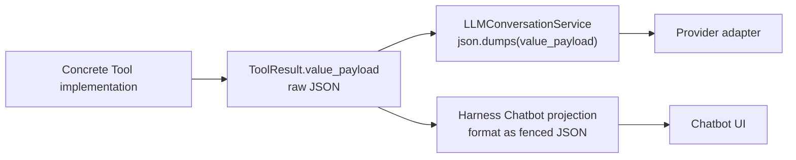
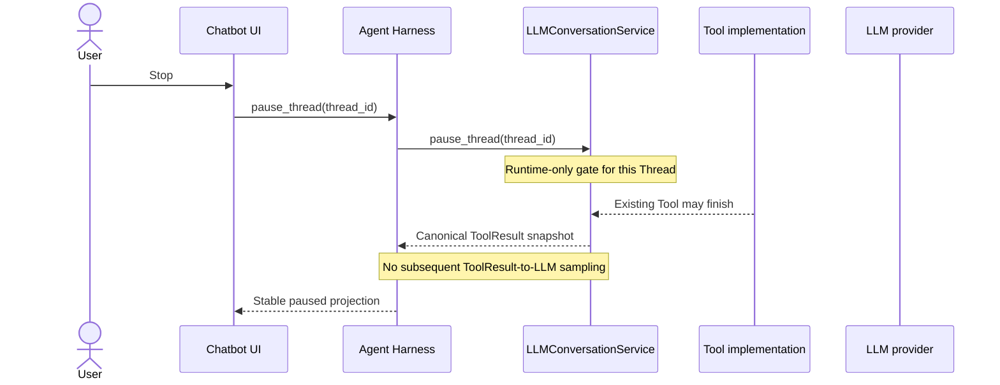

# Canonical Tool Result / Thread Pause / ToolFailure Stage

## Objective

Correct three connected defects without recreating a second conversation
authority:

1. make an Agent Tool's returned value itself the canonical ToolResult value,
   including Xenix Table Text (XTT) for tabular results, rather than retaining
   a structured implementation payload and projecting a separate LLM-facing
   representation later;
2. redefine Stop as a Thread-targeted pause: after it linearizes, no further
   message is sent to an LLM for that Thread, while an already-running Tool
   need not be cancelled; and
3. replace the generic `"Tool execution failed."` collapse with a typed,
   canonical `ToolFailure` contract that carries useful diagnostics through
   the same ToolResult Message.

## Guardrails

- `LLMConversationService` remains the sole canonical Thread/Message writer,
  Tool registry owner, and Tool invoker. Harness remains a live orchestrator
  and Chatbot-event projector. Neither gains a second ToolResult store.
- An Agent Tool's interface is LLM-owned; concrete domain-backed Tool
  implementations are composition-injected implementations of that interface.
  LLM code must not import Harness or concrete Tool modules.
- Do not retain raw structured Tool output as one canonical value and XTT as a
  second derived ToolResult value. A Tool's returned value is the one value
  persisted in its ToolResult Message, supplied to the LLM, and presented by
  Chatbot.
- Provider adapters may encode a canonical ToolResult value into their wire
  carrier, but must not semantically reinterpret or render a different Tool
  Result. In particular, adapter serialization is not a second XTT projection.
- Chatbot may add its structural event/detail envelope and Tool-call grouping,
  but it must copy/render the canonical ToolResult value; it must not turn a
  different raw payload into display JSON.
- XTT is an LLM Tool-result value contract, not an Agent Harness concern. Its
  pure formatter belongs at the LLM Tool interface boundary; concrete Tools
  may call it, but LLM never reaches back into Agent Harness.
- Stop targets a `thread_id`, not a provisional pending-Message id. The pause
  control is runtime-only unless a later explicit product decision requires
  cross-process pause persistence. It is neither a durable Turn, Run, nor
  execution ledger.
- Stop does not promise Tool cancellation, Tool idempotency, rollback, or
  domain-side-effect compensation. Once an already admitted Tool-calling
  exchange begins execution, it may settle its complete atomic result set and
  commit canonical ToolResults; pause only closes later provider admission.
- `ToolFailure` exists for static shape, explicit ownership, and bounded
  complexity—not as a new privacy/security policy. Diagnostic paths, SQL, and
  backend details may be retained where the Tool supplies them. Existing value
  bounds still apply for storage and provider stability; truncation/bounding is
  not semantic redaction.
- The normal successful Tool contract continues not to expose local file paths
  as a capability for Agent behavior; that established rule is about avoiding
  invalid Agent tool reasoning, not a reason to erase diagnostic failures.
- Any storage shape change requires a forward migration, fresh-bootstrap and
  upgrade proof, and a coherent historical-row compatibility rule.

## Pre-implementation Evidence

### Confirmed ToolResult topology defect

The recent Thread `bb5827f1c9794952b3490d869403c4cd` stores successful
`data.query` and `data.transform` results as large raw JSON `value_payload`s.
The current code then performs two independent semantic renderings of that
same raw data:



- `LLMConversationService._provider_messages()` serializes successful Tool
  Results as JSON text.
- `project_tool_chatbot_event()` serializes the same payload again into a
  Markdown JSON detail block.
- `render_xenix_table_tool_result()` exists with focused tests but has no
  production call site. Its current `services/agent/` location also obscures
  that it is a Tool-result contract, not a Harness responsibility.

The defect is therefore not a hidden Harness-owned LLM result projection. It
is that the intended direct XTT ToolResult contract was never connected, while
both consumers render a raw implementation payload independently.

### Confirmed Stop race and wrong control identity

Harness currently keys cancellation by `pending_message_id`. When a Tool
finishes, it clears that event before yielding the ToolResult snapshot; UI can
still hold that obsolete id until a later Thinking event reports the next one.
A controlled two-sample reproduction produced:

1. a non-final ToolResult snapshot from the first pending Message;
2. Stop against that already-cleared id;
3. a new Thinking event and second provider request; and
4. final canonical history `User -> ToolCall -> ToolResult -> Assistant`.

This matches the observed behavior: Stop is incorrectly a revoked-capability
command rather than Thread-level control over future LLM sends.

### Confirmed failure-contract loss

The same Thread has failed `data.query` ToolResults at sequence indexes 9, 12,
and 21. Each stores `result_status=failed`, empty value payload, and the same
`"Tool execution failed."` summary. The broad catch in LLMConversationService
discards the original exception, including existing `ValidationError` fields
such as `error_code`, `error_details`, `repair_hints`, and `retryable`.

The original per-call diagnostics cannot be reconstructed from the current
canonical rows or logs. This is neither a Chatbot rendering defect nor a Tool
Schema display defect: the canonical ToolResult contract has already lost the
information before either consumer sees it.

## Settled Design Direction

### 1. Direct canonical Tool Result values

Define an LLM-owned result algebra that concrete Tool implementations return
directly:

```text
ToolInvocationOutcome = ToolSuccess(value: ToolResultValue) | ToolFailure(...)
```

`ToolResultValue` must be bounded and explicitly serializable. For
`data.query`, `data.transform`, and the other tabular-result Tools, the
implementation constructs XTT before returning `ToolSuccess`. The exact XTT
text (or an explicit JSON value containing that XTT) is then the canonical
ToolResult value. It is persisted unchanged, supplied unchanged to the LLM
boundary, and copied/rendered unchanged by the Chatbot Tool detail.

The implementation plan must settle one narrow representation choice before
mutation:

- direct text / a canonical Markdown-like ToolResult block; or
- an explicitly typed JSON object/array whose specified value is XTT.

Either is valid only if there is one stored value and no later semantic
raw-payload-to-XTT or raw-payload-to-UI-JSON projection.

Generic non-tabular Tools may return their directly useful JSON value, but its
contract must already be the value both consumers receive. Wire JSON encoding
is permitted solely as transport encoding, not as a new semantic result.

### 2. Thread-targeted pause

Expose a Thread-targeted pause operation through Harness to
LLMConversationService. Its target and lifecycle are:



- The pause must linearize against the decision to start each provider request.
  Once observed, Harness must not send a newly produced ToolResult or any
  later Client message to an LLM for that Thread.
- Existing provider I/O cannot be unsent. A provider response that arrives
  after pause must not create a fresh continuation. A Tool already executing
  is allowed to finish; the stage does not add cancellation to it.
- Pending-message cancellation remains an internal cleanup/abandonment
  capability where needed. It is not the product meaning of Stop.
- A paused Thread must not become stuck behind a terminal ToolResult. The
  implementation review must choose and prove the re-entry rule. The default
  proposed rule is: a new explicit UserMessage clears the runtime pause and is
  permitted after a terminal ToolResult; it does not automatically re-sample
  the old ToolResult. This preserves the accepted lack of automatic recovery
  and avoids inventing a persistent Run/Retry object.

### 3. Typed ToolFailure

Introduce an LLM-owned `ToolFailure` value with a small, static shape, such as
`code`, `message`, optional structured `details`, optional `repair_hints`, and
optional `retryable`. Exact field names and bounds are finalized in the impact
handshake.

- A concrete Tool may return a known failure directly.
- Expected domain failures (including existing `ValidationError`) convert once
  at the LLM Tool boundary without losing their supplied diagnostic fields.
- Unexpected exceptions also convert once into `ToolFailure`, retaining the
  useful exception diagnostic subject only to existing size/bounded-state
  limits.
- A failed ToolResult persists that `ToolFailure` as its canonical value;
  provider input and Chatbot detail consume that same value. No generic
  `error_summary` rendering path may erase it afterward.

## Implementation Surface

- `src/xenix/services/llm/tooling.py`
  - define the LLM-owned success/failure Tool outcome and bounded value
    contract;
  - move or replace the XTT formatter at this boundary.
- `src/xenix/services/agent/tools.py`
  - make concrete Tool handlers return the LLM-owned outcome directly;
  - construct XTT in tabular Tool implementations before returning;
  - preserve useful domain failure data rather than relying on a later catch.
- `src/xenix/services/llm/conversation.py`
  - persist/replay the direct outcome value without ToolResult projection;
  - make provider-message construction carry the direct canonical result;
  - own the Thread pause gate and its linearization with sampling;
  - remove Stop's dependence on pending-message cancellation while retaining
    internal cleanup semantics.
- `src/xenix/services/llm/providers.py`
  - encode a direct canonical ToolResult into each wire protocol without
    inventing an alternate semantic payload.
- `src/xenix/services/agent/harness_service.py`
  - coordinate Thread pause and prevent any post-pause provider send;
  - retain Tool completion observation/projection without triggering the next
    sample.
- `src/xenix/services/agent/chatbot_events.py` and UI consumers
  - render/copy the direct canonical ToolResult value rather than formatting a
    separate raw result payload as JSON;
  - route Stop by active Thread identity rather than pending Message identity.
- Storage models/migrations/repositories and focused LLM/Harness/UI tests if
  the ToolResult value/failure shape changes.
- Update the nearest Unit TDD and boundary durable documents only after the
  final representation and pause-lifetime decisions are proven.

## Failure and Race Rules

| Situation | Required behavior |
| --- | --- |
| `data.query` / `data.transform` succeeds | Tool itself returns XTT as its direct canonical value; stored value, LLM input, and Chatbot result body agree. |
| Non-tabular Tool succeeds | Its directly returned bounded value is stored and consumed without a second semantic result serializer. |
| Tool returns known failure | The complete typed `ToolFailure` is canonical and visible to both LLM and Chatbot. |
| Tool raises unexpected exception | Convert once into bounded `ToolFailure`; preserve useful diagnostics rather than collapsing to a generic sentence. |
| Stop during a running Tool | Do not require cancellation or rollback. Allow completion, commit its ToolResult if it reaches the canonical boundary, and send no next LLM request. |
| Stop after ToolResult commits, before next sample | The Thread pause gate wins; no next Thinking/provider request/tool call is created. |
| Stop during provider I/O | The already-sent request may finish, but its result must not create a new post-pause LLM continuation. |
| New UserMessage after paused ToolResult | Subject to the finalized re-entry rule, it explicitly resumes/newly drives the Thread; there is no automatic replay of the stale frontier. |
| App exit/process loss | No durable pause/Run recovery is introduced. Existing accepted unfinished-exchange trade remains. |

## Verification

- Add a black-box ToolResult contract test proving that a tabular Tool returns
  canonical XTT, the persisted ToolResult contains that exact value, the
  provider receives that value, and Chatbot detail presents that value rather
  than JSON derived from a hidden raw payload.
- Cover a representative direct JSON ToolResult to prove transport encoding
  does not alter its canonical semantic value.
- Add ToolFailure tests for direct known failure, `ValidationError` with all
  useful fields, and unexpected exception; prove the canonical row, provider
  message, and Chatbot detail agree.
- Reproduce the current post-ToolResult Stop race, then prove that no second
  provider call, Thinking event, Assistant output, or Tool Call occurs after
  a Thread pause.
- Prove a Tool already running at pause may finish without being cancelled and
  still cannot trigger a subsequent LLM request.
- Prove pause/new-message re-entry behavior, including the terminal ToolResult
  frontier and cross-thread isolation.
- Run focused LLM Tooling, conversation lifecycle, provider adapter, Harness
  streaming, Chatbot projection, and MainWindow tests. If storage changes,
  also prove fresh bootstrap, upgrade migration, repository behavior, and
  historical Thread replay.
- Run `pdm run check` and the selected full regression suite after focused
  contract tests pass.

## Implementation Record — 2026-07-16

Sir approved the settled design and implementation. The delivered representation
is direct text for XTT and direct JSON values for non-tabular results:

- `ToolSuccess(value)` and `ToolFailure` are LLM-owned Tool outcomes.
  Concrete tabular Tools construct XTT before returning `ToolSuccess`; no raw
  tabular payload is persisted for later XTT or Chatbot rendering.
- `ConversationMessageRow.value_payload` is logically widened from JSON object
  to JSON value. Its existing SQLite JSON column already stores text, objects,
  arrays, and scalars, so no physical schema or migration edge is required.
  Reload coverage proves direct XTT survives storage unchanged. Historical
  failed rows are read as a bounded legacy `ToolFailure` value rather than
  rewriting history.
- `ProviderMessage.tool_result_value` carries that direct value to adapters.
  The OpenAI-compatible adapter emits text verbatim and JSON only as wire
  encoding. Chatbot events copy the same value and wrap it only in a structural
  detail block.
- `pause_thread(thread_id)` is process-local state owned by
  `LLMConversationService`. Its per-attempt admission hook prevents a future
  provider request after pause. A response returned after pause is discarded;
  an already executing Tool exchange may finish its atomic result set, but
  Harness does not sample the resulting ToolResult frontier. Title-provider
  responses receive the same post-response pause gate. Only a new explicit
  UserMessage clears the runtime pause; no stale ToolResult is replayed.
- New failures persist the direct typed `ToolFailure` object and leave the
  legacy `error_summary` empty. Domain `ValidationError` fields and useful
  unexpected-exception diagnostics survive subject to existing value bounds.

Automated proof:

- Final no-Run cleanup regression:
  `pdm run test tests/test_agent_harness_foundation.py
  tests/test_agent_harness_streaming.py tests/test_main.py` — **84 passed**.
- The final `pdm run test` regression completed with **349 core tests passed**
  and **59 Qt/MainWindow tests passed**. The only output beyond success was
  three pre-existing third-party sklearn deprecation/convergence warnings.
- `pdm run check` and `git diff --check` passed after the final focused rerun.

## Next Step

Manual acceptance is ready. Verify a tabular Tool detail, a failed Tool detail,
Stop before/after a Tool boundary, and explicit new-message re-entry on the
same Thread. No commit is authorized until Sir explicitly requests one.
