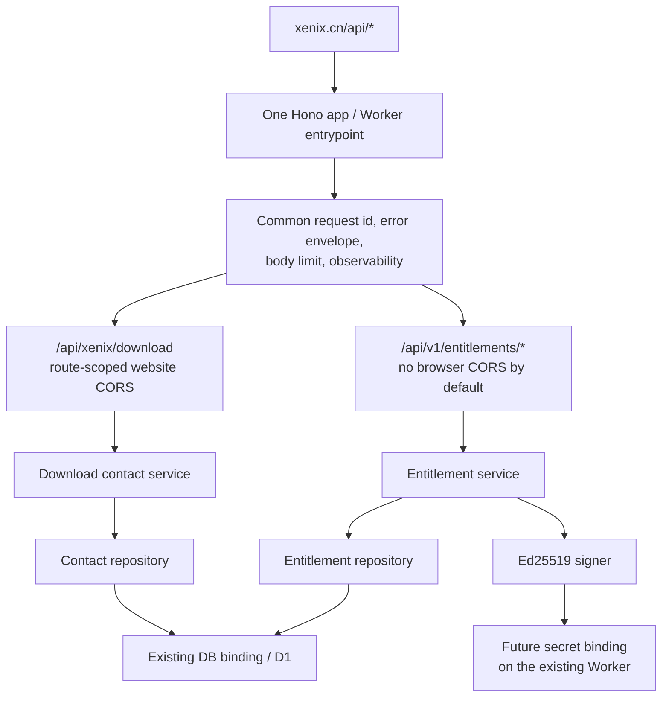

# Candidate Shared-Worker Architecture

**State:** discussion candidate
**Fixed infrastructure constraint:** reuse the existing Worker and D1

## Authority

| Fact | Candidate authority | Projections / consumers |
| --- | --- | --- |
| Activation grant, status, validity, device limit | Existing D1 | Worker decisions, operator inspection |
| Trial start, end, and server-observed subject | Existing D1 | Signed lease, support evidence |
| Device binding and revocation | Existing D1 | Signed lease, refresh decision |
| Activation-code plaintext | Operator at issue time only | User-supplied activation command |
| Activation-code digest | Existing D1 | Atomic redemption lookup |
| Signing private key | Future secret binding attached to the existing Worker | Signing module only by code convention |
| Accepted signing public keys | Frozen native release configuration | Native verifier |
| Current online decision | Existing Worker over D1 | Signed response |
| Cached startup permission | Server-signed local lease | Native startup gate |

The local lease is not a second entitlement authority. It is a bounded signed
projection whose permitted offline duration is part of the server-owned policy.

## One Runtime, Internally Deep Modules



Candidate source shape:

```text
website/src/worker/
├── index.ts                    composition and export only
├── app.ts                      Hono app and common error boundary
├── download/
│   ├── routes.ts
│   └── service.ts
└── entitlements/
    ├── routes.ts
    ├── contracts.ts
    ├── service.ts
    ├── repository.ts
    └── signing.ts
```

This is source modularity, not runtime isolation. All deployed Worker code can access
bindings present in `env`; review, tests, secret handling, and deployment approval
remain the real control.

## Candidate Routes

```text
POST /api/v1/entitlements/trial
POST /api/v1/entitlements/activate
POST /api/v1/entitlements/refresh
GET  /api/v1/entitlements/health
```

- The existing `/api/xenix/download` contract stays unchanged.
- Activation codes appear only in POST bodies, never URLs, logs, analytics keys, or
  response payloads.
- CORS remains only where the browser website needs it. A native client does not
  require CORS.
- Common middleware adds a server-generated request id, a small body limit, safe
  content type handling, and bounded error projection.
- Rate limiting is an abuse-control hint keyed by stable hashed actor/code signals
  plus a secondary network signal. It never decides whether a grant exists.

Route granularity remains open. One `evaluate` command would be a smaller public
interface, while explicit trial/activate/refresh routes make intent, rate limits, and
audit events clearer.

## Candidate D1 Shape

All tables live in the existing database and use explicit domain names:

```text
activation_grants
activation_codes
activation_devices
activation_bindings
activation_trials
activation_idempotency
activation_events
```

Candidate invariants:

- code digest is unique and plaintext is never stored;
- device public-key digest is unique for one registered installation identity;
- one active binding is unique by grant; a device digest is not globally unique
  across grants unless a future product rule requires it;
- trial subject identity is unique according to the chosen trial policy;
- an idempotency key is bound to a request digest; reuse with different content is
  rejected;
- activation-limit checks and binding creation occur in an atomic conditional write
  or transaction, never an unguarded read-then-insert sequence;
- event rows contain bounded codes and hashes, not activation codes, hardware
  identifiers, request bodies, or lease tokens.

Table names and the number of tables are not decided. They should follow the final
state model rather than pre-encode an imagined purchase/account system.

## Shared Migration and Rollout

The first migration must be additive:

1. create activation tables and indexes without altering contact data;
2. deploy Worker code that tolerates absent optional future columns;
3. avoid a destructive contract step until every deployed client/Worker version no
   longer needs the old shape.

Production continues to apply D1 migration before deploying the Worker. Therefore
every migration must be compatible with both the previously deployed Worker and the
updated Worker version during the rollout gap.

Preview policy is unresolved. Safe candidates include:

- local Miniflare D1 for automated behavioral tests and no remote Preview activation;
- a Preview mode that cannot mutate activation tables;
- explicit test rows in the same D1 with enforced environment namespace and cleanup.

The third option has the largest proof burden because a logical namespace in one D1
is not physical isolation.

## Operator Boundary Without User Accounts

Candidate first-release operation:

- a local operator CLI generates a high-entropy activation code;
- it writes only the code digest and grant policy through authenticated Cloudflare
  tooling;
- plaintext is printed once and delivered out of band;
- separate commands inspect a grant, revoke it, or reset one device binding;
- reset increments the binding epoch, invalidates the prior binding, and issues a
  new one-time code rather than reopening the code known by the old device;
- no public `/admin` route and no desktop capability can issue or elevate a grant.

The CLI authentication method, audit identity, accidental disclosure controls, and
remote D1 write mechanism remain open.

## Health and Observability

Health should expose distinct, content-free facts:

- Worker liveness;
- expected activation schema/readiness;
- signing-key availability without performing or returning a signature;
- D1 failure as degraded activation readiness;
- download readiness separately from activation readiness.

Logs and events use request ids and stable safe reason codes. They must exclude
activation codes, device public keys where a digest suffices, raw hardware signals,
signed leases, provider credentials, and user data.

## Non-goals

- independent Worker, D1, or deployment pipeline;
- account, login, role, tenancy, checkout, order, or customer self-service portal;
- permanent offline licensing;
- an unpatchable desktop enforcement mechanism;
- automatic migration of legacy local trial state;
- using the activation service as an LLM proxy unless separately admitted.
