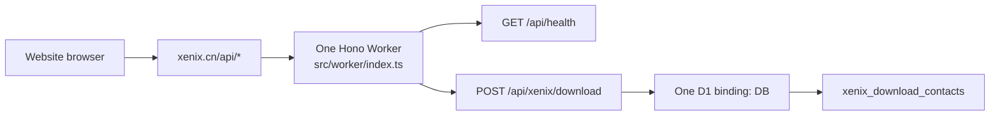
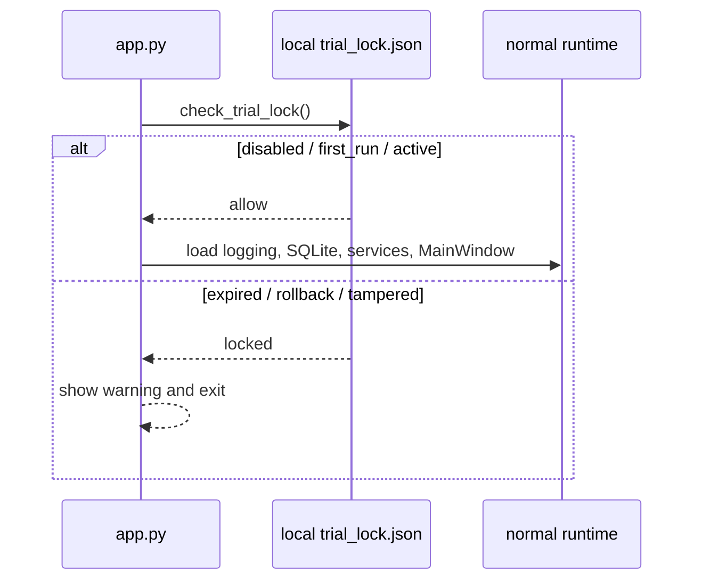

# Current Worker and D1 Topology

**Observed:** 2026-07-23
**Scope:** repository and workflow evidence only
**Mutation:** none outside the online-activation task packet

## Product Contract

- [`docs/10-prd/README.md`](../../../docs/10-prd/README.md), lines 42–43, says
  accounts, roles, tenancy, and concurrent-user coordination are out of scope.
- The same document, lines 48–50 and 58–61, keeps product state local, excludes
  hosted product authority, and explicitly says trial builds do not provide online
  activation.
- Online activation therefore needs a narrow product exception for entitlement
  authority. It must not rewrite the authority of user data or generated outputs.

## Website Runtime

- [`website/package.json`](../../../website/package.json), lines 10–30, owns one
  Node/TypeScript/Hono/Wrangler toolchain. `check` performs TypeScript checking,
  website build, static verification, and a Worker dry-run bundle. It does not run
  Worker behavior tests.
- [`website/src/worker/index.ts`](../../../website/src/worker/index.ts), lines 4–16,
  declares one `DB: D1Database` binding and one optional download URL, then creates
  one Hono application at `/api`.
- Lines 37–53 accept any syntactically valid origin; lines 69–76 install that CORS
  behavior for every current and future route.
- Lines 78–87 implement `/api/health`; readiness means only that the download URL is
  configured.
- Lines 89–154 implement the only business operation,
  `POST /api/xenix/download`, and insert download-contact data into `DB`.
- [`website/drizzle/0001_xenix_download_contacts.sql`](../../../website/drizzle/0001_xenix_download_contacts.sql)
  is the sole D1 migration and contains one contact table plus a created-time index.

Current repository topology:

There is no activation route, license table, device table, audit table, signing-key
binding, rate-limit binding, or Worker test in the current tree.

## Deployment and Configuration

- [`website/scripts/run-worker.ts`](../../../website/scripts/run-worker.ts), lines
  14–42, dynamically generates the actual Wrangler configuration for one Worker and
  one D1 binding. GitHub variables override its local defaults.
- Lines 53–66 pass the download URL through `--var`. This mechanism is appropriate
  for a public URL and inappropriate for a signing private key.
- [`website/wrangler.worker.toml`](../../../website/wrangler.worker.toml) is a tracked
  configuration projection, but normal scripts deploy from generated
  `.wrangler-worker-*.toml` files. These two surfaces can drift.
- [`website-deploy-production.yml`](../../../.github/workflows/website-deploy-production.yml),
  lines 38–77, validates shared settings, runs `pnpm run check`, applies all D1
  migrations remotely, and only then deploys the Worker.
- [`website-deploy-preview.yml`](../../../.github/workflows/website-deploy-preview.yml),
  lines 35–57, gives the Preview Worker the configured D1 database name and id. The
  workflow does not establish an activation-specific data-isolation rule.

Shared Worker/D1 consequences:

- download and activation share rollout, rollback, capacity, secrets visible to
  Worker code, D1 availability, migration order, and operational credentials;
- table prefixes, modules, repository interfaces, and route-specific middleware can
  improve comprehension and reduce accidental coupling, but cannot create a true
  least-privilege boundary inside the one Worker/D1 decision;
- a migration failure can block both domains before Worker deployment;
- a Worker regression can break both routes even if their tables are independent;
- Preview behavior is a first-class product safety question, not a later CI detail.

## Native Trial and Startup

- [`src/xenix/trial_lock.py`](../../../src/xenix/trial_lock.py), lines 21–27 and
  82–164, owns only local states: disabled, first run, active, expired, clock
  rollback, and tampered.
- Lines 167–213 derive expiry from local time and sign a local JSON file with HMAC.
  The HMAC secret is frozen into a distributable client build and is not a server
  authority.
- [`src/xenix/app.py`](../../../src/xenix/app.py), lines 448–476, checks the local
  trial immediately after creating runtime directories and before normal runtime
  imports, logging, SQLite bootstrap, or MainWindow construction.
- The locked dialog at lines 194–239 can open a purchase URL but cannot accept an
  activation code, retry a service, or recover from a valid online decision.
- [`src/xenix/release_config.py`](../../../src/xenix/release_config.py), lines 11–17,
  40–50, and 168–187, freezes trial days, local HMAC secret, purchase URL, and Trial
  LLM configuration into formal release builds.
- [`src/xenix/services/llm/service.py`](../../../src/xenix/services/llm/service.py),
  lines 105–121 and 345–356, seeds and constructs the packaged Trial provider
  independently of any runtime trial or license state.

Current native sequence:

## Evidence Limits

- Repository inspection does not prove the live remote D1 schema or data.
- A successful bundle dry run does not prove D1 transactions, concurrent activation,
  cryptographic interoperability, Preview isolation, or end-to-end native behavior.
- No conclusion in this evidence file authorizes implementation or resolves the
  open product-policy questions.
