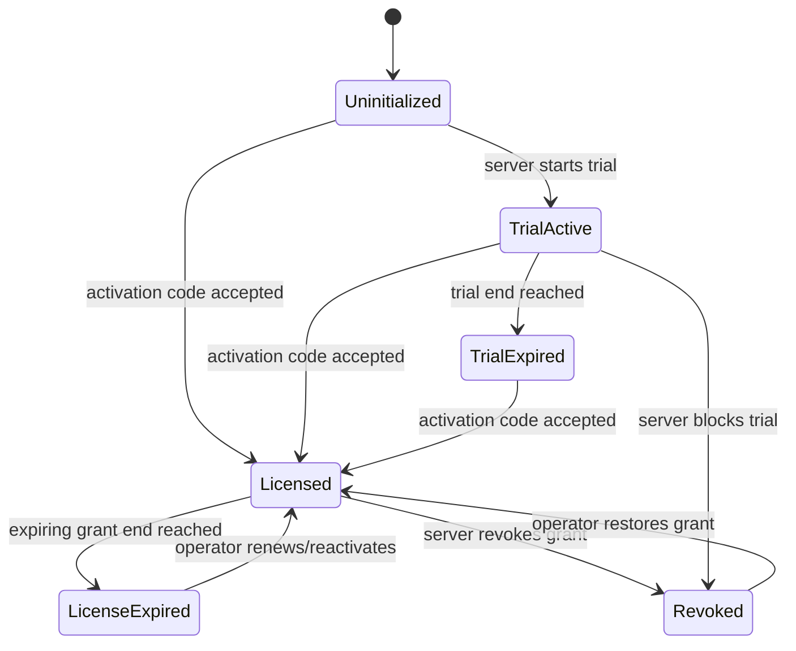
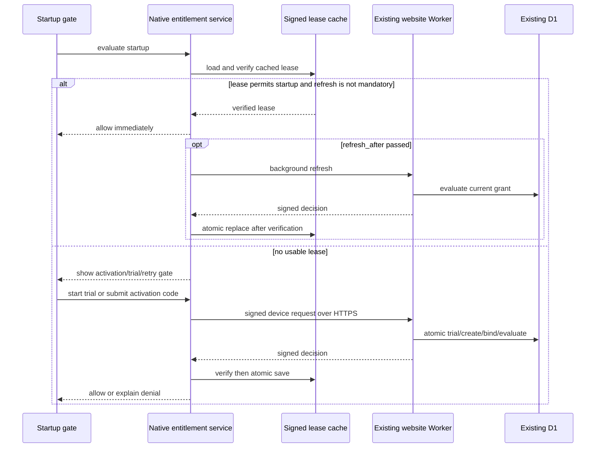

# Candidate Protocol and Policy Model

**State:** discussion candidate

## Vocabulary

- **Grant:** server-owned right to use Xenix under a policy.
- **Activation code:** high-entropy bearer command that may bind a grant to a device;
  it is not itself durable license state.
- **Trial:** time-bounded grant created by the server without an activation code.
- **Device key:** installation-generated asymmetric key used to bind requests and
  leases to one client-held private key.
- **Lease:** signed, time-bounded projection of a grant used by native startup.
- **Refresh:** online command that reevaluates a grant and returns a new decision.
- **Revocation:** server-owned denial that takes effect online immediately and
  offline no later than the previously issued lease boundary.

Whether durable code should use `grant`, `entitlement`, or `license` remains
OA-D06. The protocol should not call a timeout or signature failure a license state.

## Accepted Activation-Code Semantics

OA-D07 is decided:

- one high-entropy code maps to one perpetual, revocable grant;
- that grant has at most one active device binding;
- an exact request retry is idempotent;
- the already-bound key may recover or refresh without creating another binding;
- a different key receives `device_limit_reached`;
- controlled transfer invalidates the old binding and issues a new one-time code.

The old code is not reopened during transfer because the old device already knows
it and could race the intended replacement device.

## Candidate Product States



`offline allowance` is better modeled as a property of a still-valid signed lease
than as a new server grant. UI may present “offline grace”, but the service must
preserve the underlying server state.

Operation outcomes are separate:

```text
success
invalid_request
invalid_activation_code
device_limit_reached
rate_limited
service_unavailable
network_unreachable
tls_rejected
invalid_server_signature
clock_inconsistent
unsupported_protocol
```

## Candidate Native Identity

On first online use:

1. generate a random installation id and standard Ed25519 device key pair;
2. protect the private key with Windows DPAPI for the current Windows user;
3. send the public key and a proof over the request payload;
4. let the server store only the minimum required public key/digest and selected
   best-effort trial subject signal;
5. bind every returned lease to the device public-key digest.

The installation id is activation-owned and must not reuse the observable,
replaceable telemetry installation id. Licensed “same device” is proof of possession
of this key, not equality of a hardware fingerprint. The detailed lifecycle,
privacy, and TPM tradeoff is in [Device Identity and “Same Device”](device-identity.md).

Trial-subject choices:

| Choice | Benefit | Limitation |
| --- | --- | --- |
| Random installation key only | Simple, privacy-preserving, cryptographically bound | Deleting local state can obtain a new trial |
| Stable machine fingerprint only | Better reinstall correlation | Spoofable, privacy-sensitive, hardware/support false positives |
| Installation key plus hashed machine signal | Separates proof-of-possession from abuse correlation | Still bypassable and requires explicit collection/retention policy |

No option proves one human equals one trial. The product promise must match the
chosen abuse-resistance level.

## Candidate Request

Every command carries:

```text
protocol_version
request_id / idempotency_key
request_nonce
product_id
client_version
build_id
device_public_key or device_key_id
device_proof
command-specific fields
```

`activate` additionally carries the activation code in the HTTPS body. The device
proof binds the command, code, nonce, and intended device key so an intercepted body
cannot be modified without detection. Normal TLS provides request confidentiality
unless the client trusts a hostile interception root; whether extra request
encryption is required remains OA-D11.

The service binds one idempotency key to one canonical request digest. An exact retry
returns the same logical result; the same key with different content is rejected.
The Worker derives `device_key_hash` from the canonical raw public key rather than
trusting a client-provided digest. Re-entering a consumed code with the bound key is
a recovery operation; the same code with a different key is a device-limit denial.

## Candidate Signed Response

Use a compact JWS signed with standard Ed25519. The protected header includes:

```json
{"alg":"EdDSA","kid":"xenix-activation-2026-01","typ":"JWT"}
```

Claims required for every signed business decision:

```text
iss                 Xenix activation authority
aud                 Xenix Native product id
protocol_version
decision            allow | deny
reason_code
device_key_hash
request_nonce
jti
iat / nbf
policy_revision
```

An `allow` decision additionally requires:

```text
grant_kind          trial | licensed
grant_id             opaque server id
refresh_after
offline_until
grant_expires_at     required for trial/expiring grants; absent for perpetual grants
binding_epoch
```

A `deny` decision omits permission-bearing grant and lease fields. It can identify a
known opaque grant only if that disclosure is needed and explicitly accepted; it can
never be cached as startup permission. Transport, malformed-request, and service
failures remain operation error envelopes rather than fabricated signed grants.

The client verifies signature, algorithm allow-list, `kid`, issuer, audience,
protocol, nonce, device binding, time bounds, and monotonic policy revision before
using the decision. It never selects the verification algorithm from an untrusted
header without an explicit allow-list.

The Worker private key lives in a secret binding. Native release configuration
contains an overlapping public-key ring, not a shared secret.

## Candidate Startup Sequence



The network path must not block the Qt UI thread. Security failures must not silently
fall back to the legacy local trial or an unsigned cached value.

## Time and Offline Policy

The server owns `iat`, `refresh_after`, `offline_until`, and grant expiry. The client
stores the last verified server time and rejects material backward movement relative
to its last accepted state. Local wall-clock and monotonic checks are tamper signals,
not a trusted remote clock.

Candidate policy ranges for discussion, not decisions:

| Grant | Initial online proof | Refresh target | Maximum offline allowance |
| --- | --- | --- | --- |
| Trial | Required | 12–24 hours | 0–72 hours, never beyond trial end |
| Licensed | Required for activation | 24 hours | 7–30 days |

Requiring every startup to be online maximizes revocation speed but makes DNS,
network, D1, and Worker outages immediate product lockouts. Any offline allowance
delays revocation and admits some clock/state-tampering risk. Sir must choose the
tradeoff.

## Legacy Local Trial

The online implementation does not read, upload, convert, or honor the old
`trial_lock.json` timestamps or signature. The old file is inert. Whether later
cleanup removes it is not a migration and must not become a destructive startup
requirement.

Formal release configuration must eventually stop requiring local trial days and
the packaged local HMAC secret, but that mutation awaits an approved implementation
handshake.

## Key Rotation Candidate

1. ship client key ring with current key A and next key B;
2. continue signing with A until clients containing B are available;
3. switch the Worker secret and `kid` to B;
4. retain A in clients for at least the maximum A-lease lifetime;
5. only later remove A from newly shipped clients;
6. handle compromise separately: stop issuing long leases, rotate immediately, and
   define what older clients can do instead of pretending they can trust an unknown
   emergency key.

A future signed key-manifest or offline root key may reduce release coupling, but it
must earn its added complexity.
