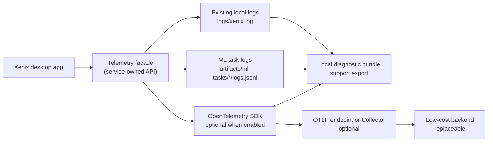
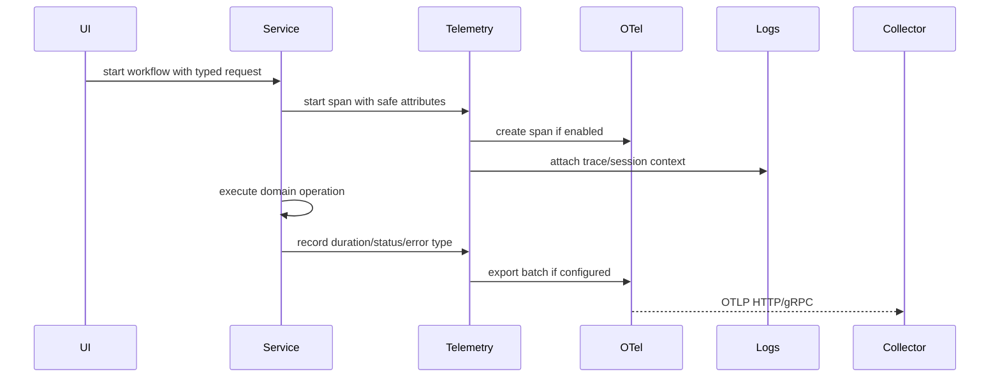
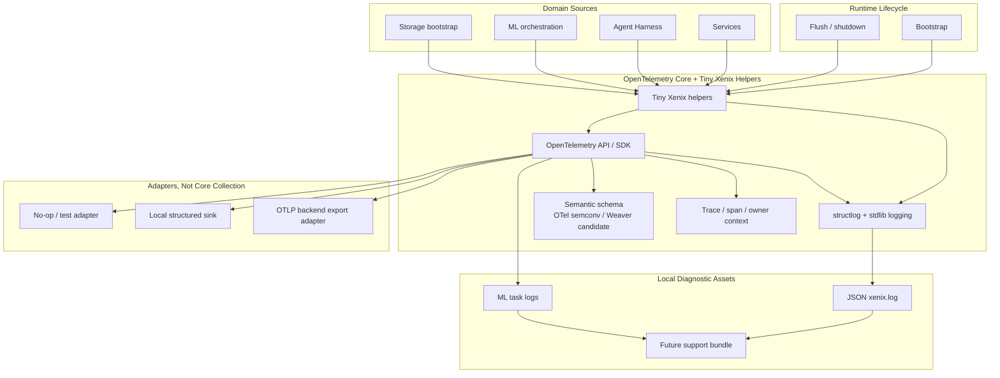

# Public Beta Runtime Telemetry Working Design

## Design Center

The first telemetry slice should answer these beta questions:

- Did the app start, bootstrap storage, and load settings successfully?
- Which internal workflow failed, where, and with which exception class?
- How long do provider calls, tool calls, storage operations, and ML tasks take?
- Which ML task kinds/model families are failing or slow?
- Are failures concentrated by build, OS, package mode, worker kind, or task
  kind?
- Can a support report correlate logs, task ids, traces, and build metadata
  without exposing user data?

It should not answer:

- Which buttons a user clicked.
- What data values are inside a user's dataset.
- What raw prompt, raw model output, provider key, local path, or credential was
  used.

## Three-Axis Model

This work should not be treated as one flat "telemetry" feature. It has three
separate design axes:

1. Internal collection infrastructure:
   - How Xenix records telemetry inside the process.
   - How telemetry is enabled/disabled.
   - How runtime identity, session identity, redaction, sampling, local buffering,
     and shutdown flushing work.
   - Which app layer owns the facade and lifecycle.
2. Instrumentation design:
   - Which internal behaviors are worth recording.
   - What names, attributes, metrics, spans, and events exist.
   - Which attributes are allowed, bucketed, hashed, or forbidden.
   - What diagnostic questions each signal answers.
3. Transport/export:
   - Whether telemetry stays local, is packaged into a support bundle, is sent
     directly over OTLP, or goes through an OpenTelemetry Collector.
   - What backend receives data, if any.
   - How consent, retry, buffering, cost, and failure isolation work.

The axes should be discussed independently first, then joined through explicit
compatibility checks.

## Initial Topology

## First-Slice Signals

This section belongs to the instrumentation-design axis. It is a candidate
catalog, not an infrastructure or transport decision.

Current stage assumption: internal substrate and transport are sufficiently
settled for design discussion. Use OpenTelemetry for traces/metrics/context and
`structlog + logging` for structured logs/events; treat JSON logs, diagnostic
bundles, and OTLP as sinks.

User-level instrumentation principles:

- Signal names must be self-explanatory.
- Trace correlation must use trace/span/owner context, not ad-hoc attributes or
  event bodies.
- Existing Xenix models and lifecycle/status concepts should be reused wherever
  they already express the needed meaning.
- Avoid new storage rows, service objects, or telemetry-only entities unless
  existing models cannot represent the required operational fact.
- Detailed field naming is delegated to engineering execution under these
  principles.

### Traces

Manual spans at durable service boundaries:

- `app.startup`
- `storage.bootstrap`
- `agent.turn`
- `agent.provider_request`
- `agent.tool_call`
- `data.dataset_register`
- `data.query`
- `data.transform`
- `analysis.profile`
- `analysis.graph`
- `ml.task`
- `ml.worker_dispatch`
- `ml.remote_stage`
- `artifact.register`

### Metrics

Low-cardinality counters and histograms:

- `xenix.app.startup.count`
- `xenix.app.error.count`
- `xenix.agent.provider_request.duration`
- `xenix.agent.provider_request.count`
- `xenix.agent.tool_call.duration`
- `xenix.agent.tool_call.count`
- `xenix.ml.task.duration`
- `xenix.ml.task.count`
- `xenix.ml.task.failure.count`
- `xenix.storage.bootstrap.duration`

### Logs

Keep existing local logs as the primary support artifact. In v1, prefer trace id
injection into local log records over exporting every log line remotely. Remote
OTel logs can be a later opt-in once redaction and volume budgets are proven.

## Attribute Budget

Allowed low-cardinality attributes:

- `service.name`
- `service.version`
- `xenix.build.commit`
- `xenix.environment`
- `xenix.package_mode`
- `os.type`
- `python.version_bucket`
- `xenix.session.id`
- `xenix.install.id_hash`
- `agent.provider.key`
- `agent.model.key_hash` or `agent.model.family`
- `agent.request.kind`
- `agent.tool.name`
- `ml.task.kind`
- `ml.model.family`
- `ml.model.task_kind`
- `ml.worker.kind`
- `storage.schema_version`
- `error.type`

Disallowed attributes:

- Raw file paths.
- Dataset cell values, column values, prompts, model responses, API keys, SSH
  hostnames, usernames, credentials, and raw exception messages that may contain
  local paths or data snippets.

## Candidate Sequence

## Implementation Boundary Draft

No implementation has started. A likely implementation boundary, if confirmed:

- Add `src/xenix/telemetry.py` or `src/xenix/services/telemetry.py` as the app
  telemetry facade.
- Wire initialization near logging/runtime bootstrap, not from UI widgets.
- Add explicit instrumentation only at service/orchestration boundaries.
- Use OpenTelemetry API/SDK behind the facade; application code should not know
  the eventual backend.
- Add configuration through environment variables first, then a settings UI only
  if beta operations require it.
- Preserve current logging behavior with telemetry disabled.

## Internal Infrastructure Draft

Internal collection design claim:

- Xenix service code should call a Xenix-owned facade.
- OpenTelemetry should be embraced as the internal observability substrate.
  Xenix-specific code should stay at the helper/convention level and should not
  duplicate mature OTel APIs.
- `structlog + logging` can own the structured log/event authoring surface, while
  OTel owns traces, metrics, propagation, semantic conventions, and backend
  neutrality.
- Backend-specific exporters and analysis products remain outside domain code to
  avoid Better Stack, Datadog, or similar lock-in.
- Telemetry must be no-op-safe and non-blocking from the caller's perspective.
- Event safety should be schema/semantic-convention-based, not best-effort
  string scrubbing or ad-hoc attribute dictionaries.
- Correlation should prioritize trace id, span id, and owner rather than custom
  payload/body fields.
- JSON local logs should become one parseable diagnostic export, not the internal
  source of truth.

## Open Questions

- Should the first beta ship remote export, local bundle export, or both?
- Should the app generate and persist an anonymous install id?
- Should trace sampling be always-on for beta or probabilistic?
- Which events are important enough to instrument before public beta?
- Do we need a crash/error reporting path separate from OTel?
