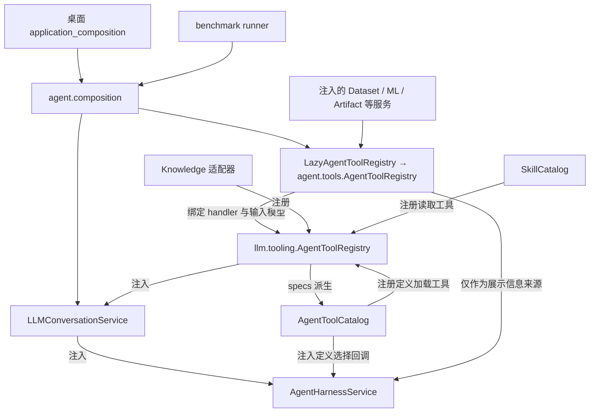
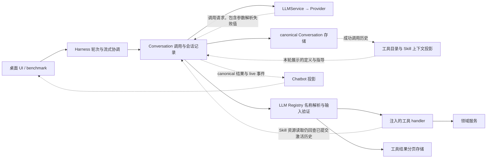

# 工具依赖拓扑与边界审查

以下是实现前工作区的审查快照；用户已授权并实施四项修正，最新拓扑和设计见 [Unit TDD](../../docs/30-unit-tdd/agent-tools.md)，验证进展由 [packet](packet.md) 记录。

生产主链路方向正确，尚有旧边界没有清理完整；最高价值的修改是删除无业务必要的依赖与重复入口，保留唯一的执行和会话记录路径。

## 当前拓扑

第一张图表示装配时的注入和派生关系，不表示工具调用必须经过每个节点。

[桌面入口](../../src/xenix/application_composition.py:56)与 [benchmark 入口](../../tests/e2e/agent_harness/_infra/runner.py:264)使用同一个装配函数；[装配过程](../../src/xenix/services/agent/composition.py:150)把领域 handler 直接注册到 LLM Registry，没有在生产执行时套上另一个 Registry。

第二张图表示运行时调用与数据投影；虚线是上下文或结果数据，实线是调用。

LLM 层不导入具体 Agent 工具或 UI；运行时调用领域 handler 是组合根注入的结果，符合依赖倒置，不能把这条调用箭头误认为模块反向依赖。

## 已经合理的边界

| 职责 | 当前唯一主要归属 | 判断 |
| --- | --- | --- |
| 工具存在、名称映射、输入模型及 handler | LLM Registry | 调用资格已经不依赖本轮是否展示 schema |
| 目录与批量加载完整定义 | AgentToolCatalog | 根据成功调用历史派生后续展示集合，不维护另一份持久化激活状态 |
| 协议解码及坏参数原文保留 | Provider | 参数解析失败进入可记录的调用数据，不再吞掉整次模型输出 |
| 调用排序、异常转失败结果、调用与结果配对保存 | Conversation | Harness 通过 invoke_staged_tool 请求执行，不自行分发工具 |
| 数据、模型、知识库业务行为 | 注入的领域服务及适配 handler | 领域工具可以有业务输入验证，不等于第二套工具授权机制 |
| 面向用户的工具名称、摘要及详情 | Chatbot 投影与 tool_presentations | 展示不拥有 canonical ToolResult，也不执行工具 |

证据：[定义选择与激活](../../src/xenix/services/agent/tool_catalog.py:37)、Registry 调用（审查时位于 `llm/tooling.py:702`）、[Provider 参数解析](../../src/xenix/services/llm/providers.py:520)、[Conversation 调用与归档](../../src/xenix/services/llm/conversation.py:492)、[Harness 的调用点](../../src/xenix/services/agent/harness_service.py:586)。

工具激活在下一次模型请求中生效本身合理，因为正在处理的模型请求已经结束；工具执行仍查询完整注册表，因此这个定义展示时序不会限制同批调用。

## 发现与优先级

### 1. 优先修复：资源读取错误地依赖 Skill 激活历史

[资源读取](../../src/xenix/services/agent/skill_catalog.py:242)要求当前 Skill 已激活；[组合根](../../src/xenix/services/agent/composition.py:172)通过回调读取已提交的 Conversation 快照来计算激活集合，而 [Conversation](../../src/xenix/services/llm/conversation.py:553)在本次回复的全部工具结果齐备后才一起提交。

真实调用链上的离线实验得到：同一回复的 agent.skill.activate 成功、紧接着的 agent.skill.read_reference 失败并返回 agent_skill_not_activated；下一轮重复完全相同的读取参数则成功；两次读取所见激活集合分别为空和包含该 Skill，见 [探针结果](skill-resource-probe.json)。

根本问题是把“指导已读”的历史标记变成了“资源可读”的前置条件，使一个静态资源读取器依赖会话提交时序；这不是模型能力问题，也不能通过调整提示词要求先后分轮来正确解决。

建议直接允许按 Skill 名与资源路径读取 catalog 中已有的 reference/asset，删除资源读取接口的激活集合参数及其回查 Conversation 的注入路径；Skill 已读记录继续用于上下文展示，不需要新增临时激活状态或改变 Conversation 的批次提交机制。

证据范围：这是合成 Skill 和脚本 Provider 经过生产注册、执行、会话及 SQLite 路径的确定性复现；没有据此断言历史上某个 live benchmark 已触发该缺陷。

### 2. 优先收敛：仍有两个同名 Registry 和一个旧公开执行入口

agent.tools.AgentToolRegistry 的 [register_with_llm 文档](../../src/xenix/services/agent/tools.py:196)称它仅用于装配，但仍公开 [execute](../../src/xenix/services/agent/tools.py:212)，自行查表、验证输入、转换验证错误并执行 handler；它不经过 LLM Registry 的分页管线，且只接受 ToolSuccess，与主路径的 ToolFailure 处理契约不同。

该类还通过 [agent 包公共导出](../../src/xenix/services/agent/__init__.py:39)暴露；[analysis_profile 测试](../../tests/ml/test_analysis_profile.py:161)和 [profile_cleaning 测试](../../tests/ml/test_ml_foundation_profile_cleaning.py:92)仍直接调用它，但在检查到的生产工具路径中没有该调用者，所以这是一条仍可用且被测试使用的旁路，并非生产正在运行双重分发。

建议将领域工具聚合收敛为生成或注册 typed AgentTool 的工厂，删除直接 execute 及其专属错误转换；重复的索引身份检查归 LLM Registry 所有，展示信息使用已有 tool_presentation_for_name，无需向 Harness 注入具有执行能力的对象；保留两项 ML 测试的业务价值，让它们通过生产 Registry 或直接在领域服务边界验证业务。

这项修改解决的是公开 API 的职责冲突和测试路径偏离生产，而不只是重命名。

### 3. 与装配清理一起处理：Lazy 工具包装在启动时已被解析

`LazyAgentToolRegistry.register_with_llm`（审查时位于 `agent/lazy_tools.py:27`）立即 _resolve()，而 [生产组合根](../../src/xenix/services/agent/composition.py:161)在构建服务图时就调用它，所以该包装不延迟首次工具执行前的实现导入和工具聚合构造。

具体工具构造还建立 tokenization/profile/graph/lambda 服务与模型别名；其中 analysis.lambda 没有注册到 Agent，却仍被导入和构造，见 [领域工具构造](../../src/xenix/services/agent/tools.py:139)。

“按需向模型展示定义”已经工作，“此包装延迟加载工具实现”没有在生产装配中兑现；其他 lazy_service 对领域服务的延迟构造仍存在，不能据此声称所有 ML 引擎都在启动时初始化，也没有测量它造成多少启动耗时。

建议先随工具工厂收敛删除失效包装和相应误导说明；若实际启动分析证明需要延迟某项实现，再在相应 handler/服务工厂延迟构造，而不是新增注册与激活状态机。

### 4. 后续演进：协议值、schema 投影与执行实现共处一个模块

tooling.py（审查时位于 `llm/tooling.py:1`）同时拥有协议值、输入 schema 投影、注册表、调用和分页存储；[messages.py](../../src/xenix/services/llm/messages.py:21)为使用 InvalidToolArguments 依赖了这个同时导入 jsonschema 和文件分页实现的模块。

注册还会立即运行 AgentTool.spec（审查时位于 `llm/tooling.py:196`） 的 Provider schema 投影与 冻结校验（审查时位于 `llm/tooling.py:578`），所以在类型构造层面，“能执行的 typed Tool”仍必须符合当前公共 Provider schema 子集；当前已注册工具满足该契约，没有观察到由此造成的生产失败。

这是维护与扩展边界问题，优先级低于上述真实缺陷和重复入口；以后改动相关能力时，可把轻量协议值、schema 投影、Registry 执行分成少数明确模块，继续由 Pydantic 输入模型派生定义，避免维护第二份 schema，也不需要建立通用插件框架。

## 次要残留与刻意保留

ToolScope 同时携带展示名称与 Dataset 上下文；当前源码没有 context.dataset_ids 的生产读取者，而 list_specs（审查时位于 `llm/tooling.py:634`）把空名称元组解释为展示全部，调用方不容易表达空集合；当前生产目录始终包含基础工具，没有发现用户可见故障，可以在删除旧 scope 语义时一并明确。

scope_fingerprint 当前只参与生成、记录和历史字段兼容，不再决定是否执行工具；作为可观测性记录可以保留，不应把它重新升级为调用前提，也不值得为本轮审查新增 migration。

领域服务、模型任务调度器与工具 Registry 各有业务职责；没有理由仅因它们都涉及执行或输入校验就合并它们；同样，本次未发现 UI 绕开 Conversation 直接分发工具。

## 建议的实施边界

第一批只删除 Skill 资源读取的会话前置依赖，并将领域工具工厂、展示与唯一 Registry 收敛，连带清除失效 Lazy 层；这些改动直接减少误失败、重复契约与装配复杂度。

保留注册与展示解耦、参数失败反馈、Conversation 唯一写入权及 typed 输入模型；不更改业务工具参数、Provider 重试策略、数据库 schema 或 benchmark 题库；模块拆分和旧 scope 字段整理按后续变更需要处理。

本轮仅完成源码审查和一次离线探针，产品源码未改动，未增加自动化测试，未运行新一轮 live benchmark，也未提交已有工作区修改。
