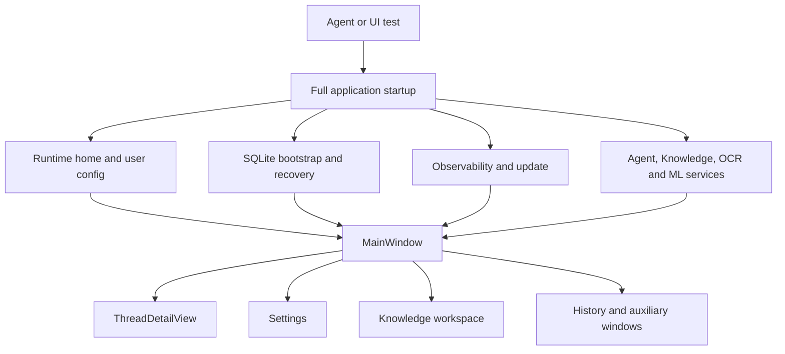
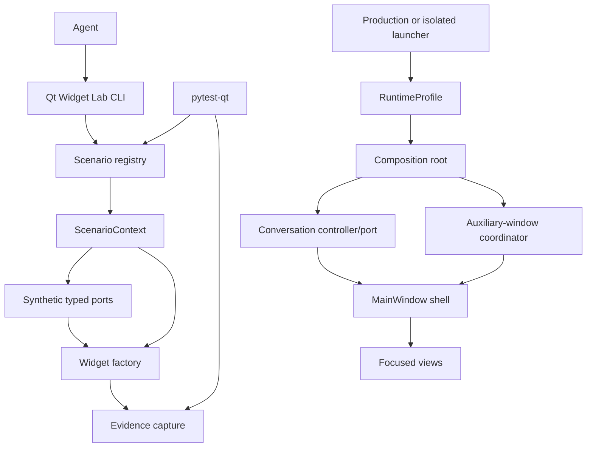
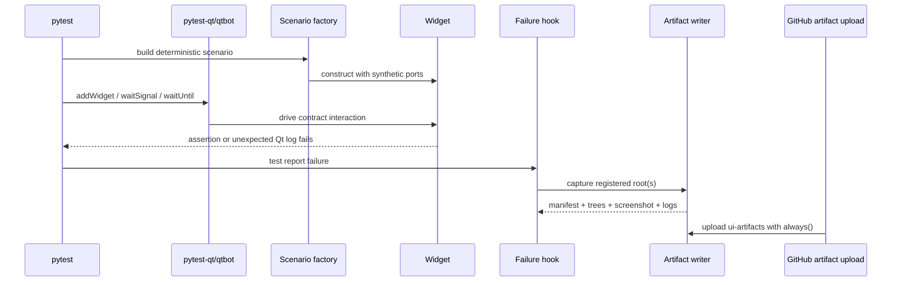

# UI Agent DX and Maintainability — Design

## Reasoning model

The feedback loop has three multiplicative costs:

```text
feedback cost = reach target state × arrange state × observe result
```

- Full startup makes **reach** expensive by traversing storage, configuration,
  networking, recovery, OCR/ML composition, and update behavior.
- Ad-hoc navigation makes **arrange** expensive and non-repeatable.
- Log-only diagnostics make **observe** expensive after both local and CI failures.

The Widget Lab reduces the first two factors. Structured evidence reduces the
third. A lower-degree `MainWindow` reduces the context and fixture cost of changing
the code itself. These moves compound rather than compete.

The test pyramid follows entropy: pure state has the lowest environment entropy,
widget contracts add an event loop, controlled screenshots add fonts/style/DPI,
and native windows add the OS compositor. Test volume decreases as entropy rises.

## Current and target topology

### Current



`MainWindow` is a high-degree articulation point: composition, navigation,
conversation state, background workflow, dialog lifecycle, and presentation all
meet there. Removing one constructor parameter without moving ownership does not
change this topology.

### Target



The lab imports production widgets but not the full production composition root.
The full app still uses the same views, while real services are adapted at narrow
ports.

## Scenario contract

The contract should remain a deep, small interface rather than a framework:

```text
ScenarioSpec
  id: stable dotted id
  title: human-readable title
  description: short intent
  viewport: width × height
  style / locale: explicit defaults
  build(context) -> ScenarioHandle

ScenarioContext
  QApplication
  deterministic clock/id source where required
  artifact policy

ScenarioHandle
  root QWidget
  close/cleanup
  optional readiness predicate
```

The scenario does not know about pytest. The pytest caller adapts readiness to
`qtbot`; the interactive/capture caller uses a deliberately tiny Qt-native
`QEventLoop`/`QTimer` driver. The native driver provides no assertion, spy, or
general waiting DSL.

Required CLI behavior:

```text
pdm run ui-lab -- --list --json
pdm run ui-lab -- chat.empty
pdm run ui-capture -- chat.tool-failure --output ui-artifacts/local
```

The first registry should be curated and admitted in dependency order:

- `chat.empty`
- `chat.mixed-timeline`
- `chat.running-with-attachments`
- `settings.provider-and-ocr`, after narrow settings-store/locale ports exist
- `main.history-populated`, after a narrow history-read port exists

Knowledge loading/failure is deferred from the initial registry: its worker pool
and blocking cleanup make its first-slice cost exceed its UI-DX value.

Do not register a scenario until it is deterministic, owns cleanup, and declares
its fixture authority.

## Semantic identity

Use a dotted, non-localized convention such as:

```text
main.history.new-thread
main.history.thread-list
chat.composer.editor
chat.composer.send
settings.language.selector
```

Rules:

- Set `accessibleIdentifier` on user-actionable and diagnostically important
  widgets.
- IDs describe product meaning, not Qt class, visible text, index, or layout path.
- Static shell/action IDs are unique within a top-level scenario/window.
- Repeated collection items use a semantic role plus a separate stable,
  non-sensitive authoritative item reference. A persisted canonical event ID is
  valid even when UUID-shaped; UI-generated ephemeral UUIDs are not. Paths,
  labels, content hashes, and layout indexes are forbidden identity sources.
- `accessibleName` remains user-facing/localized and is required for icon-only
  controls; it is not the automation selector.
- Preserve existing `objectName` values because style sheets and runtime behavior
  may depend on them. The semantic helper never mirrors or rewrites objectName.
- A scenario contract test traverses the widget tree and reports missing or
  duplicate required IDs.

## Structured evidence contract

`layout_debug.py` should become a compatibility facade over a structured snapshot
module. JSON is the authority; readable logs are a projection.

```text
ui-artifacts/<run>/<test-or-scenario>/
  manifest.json
  tree.json
  actual.png
  expected.png       # visual cases only
  diff.png           # mismatch only
  qt.log
```

`manifest.json` contains:

- schema version, capture reason, scenario/test id, monotonic timestamp;
- Python, PySide, Qt, OS, QPA plugin, style, locale;
- viewport/window geometry, screen logical DPI and device pixel ratio;
- artifact filenames and redaction policy.

Capture policy has three explicit authorities: runtime compatibility capture
writes redacted JSON/logs only; registered synthetic scenarios may include pixels
and bounded control state; CI accepts synthetic policy only. Generic capture
never reads line-edit text, combo current text, message bodies, or paths.

`tree.json` contains two explicit relations:

- QObject ownership children;
- real layout items from `QLayout.itemAt()`, including widget/layout/spacer kind.

Widget nodes include semantic ID, object name, Qt class, enabled/visible/focus,
geometry, min/max/size hints, size policy, accessible name (when policy admits it),
and a bounded set of control state. Runtime/user-value text and filesystem paths
are redacted by default. CI captures only synthetic scenarios.

Snapshot scheduling must verify the underlying C++ object remains valid before
capturing a delayed widget.

## Pytest failure sequence



The failure hook should capture only widgets explicitly registered with the test
foundation; it must not scrape every process window or temporary directory.

## Test layers

| Layer | Environment | Default assertions | Volume | CI role |
| --- | --- | --- | --- | --- |
| Presentation/model | Python only | state transitions, commands, formatting | high | blocking |
| Widget contract | `offscreen` + pytest-qt | IDs, properties, signals, models, geometry invariants, Qt logs | medium | blocking |
| Scenario visual | Windows + Fusion + fixed locale/font/DPR/viewport | expected/actual/diff with metadata | very low | capture-only first; promote proven cases |
| Windows native | `qwindows` | exposed, active, focus, dialogs, clipboard/menu seams | tiny | smoke; semantic gate |

Pixel baselines are keyed by at least Qt/PySide version, OS runner identity, style,
font pack, locale, DPR, and viewport. A baseline update is an explicit reviewable
operation. Cross-platform or native-style byte equality is out of scope.

## MainWindow boundary design

The first goal is not a particular constructor argument count; it is lowering
dependency degree and separating independent lifecycles.

### Conversation seam

Extract pending submission, active stream identity, paused-thread gating, append
acknowledgement, failure recovery, and stale-event rejection into a pure or
Qt-light controller. Inputs are user intents and harness events; outputs are
bounded view commands/state. Background execution is injected.

This exposes the highest-risk sequence without constructing the window:

```text
submit -> optimistic composer state -> append acknowledged -> stream events
       -> final snapshot | failure before append | failure after append | stop
```

### Auxiliary-window seam

Production composition creates narrow factories/coordinator entries for Settings,
Knowledge, and transient detail/progress windows. `MainWindow` requests show/raise
and participates in shutdown; it no longer forwards every concrete service.

### History seam

After conversation behavior is covered, extract the history panel and its actions.
It should receive a thread-list port and explicit running-state query, eliminating
the current read of another widget's private state.

### File shape

Likely cohesive packages after extraction:

```text
src/xenix/ui/
  semantic_identity.py
  diagnostics/             # artifact schema/redaction/capture; no pytest import
  conversation/            # controller and focused views
  windows/                 # auxiliary-window factories/coordinator
  main_window.py           # shell/orchestration only

scripts/ui_lab/             # registry, synthetic ports, gallery, CLI, drivers
tests/ui/                   # pytest-qt adapters and failure plugin
```

Avoid creating one file per widget. A module earns a split when it has an
independent state model, lifecycle, reusable view contract, or distinct change
reason.

## Runtime profiles

```text
RuntimeProfile
  PRODUCTION
  ISOLATED
```

| Policy | Production | Isolated |
| --- | --- | --- |
| Home | platform default | unique fresh temp home |
| Local bootstrap/recovery | real | real on fresh state |
| Mutex | production scope | home fingerprint |
| Failure evidence | normal diagnostics | bounded/redacted |

`--isolated` selects a unique fresh home under the system temp root; the real
user home is never read, migrated, or written. The launcher resolves an explicit
typed profile before importing the application and prints a small run manifest.
Remote capability admission is not part of the profile: it stays governed by
each service's own settings and environment, so an isolated run can still
exercise the real providers when targeting remote behavior for debugging.

## Type-checking strategy

The project already owns a strict mypy allowlist. New deep interfaces should enter
it immediately:

- scenario contracts/registry;
- semantic identity helper;
- artifact schema and serializer;
- runtime profile;
- conversation state/controller;
- auxiliary-window port contracts.

PySide stubs can be incomplete or broad. Isolate unavoidable Qt dynamic typing in
small adapters instead of weakening strictness for whole UI modules.

## Risks and controls

- **A demo-only parallel architecture:** scenarios must instantiate production
  widgets and typed production ports; tests import the same factories.
- **A hidden service locator:** architecture review rejects a dependency bag that
  only bundles the existing 22 inputs.
- **Visual flakes:** fixed environment, very few baselines, metadata identity,
  capture-only probation, and native semantic smoke.
- **Sensitive artifacts:** explicit root registration, synthetic CI data,
  redaction, bounded logs, allowlisted files only.
- **Test-mode drift:** ephemeral uses real local bootstrap/recovery on fresh state;
  profiles vary capabilities rather than business rules.
- **Python 3.14 plugin incompatibility:** qualify pytest-qt before lock mutation;
  stop and reassess rather than rebuilding it locally by accident.
- **QPA session contamination:** offscreen contracts and native qwindows smoke
  use separate commands/processes; test markers never attempt to switch QPA in a
  live QApplication session.
- **Refactor regression:** characterize conversation and shutdown behavior before
  moving responsibilities; split in reversible slices.
